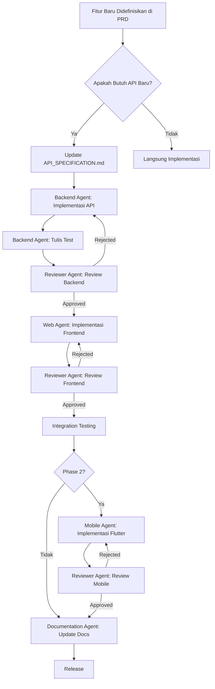

# AGENTS.md — AI Agent Governance & Standards

> **Sistem Informasi Laporan Pencegahan dan Penanganan Kekerasan Seksual (SILAPPKASAL)**
> Versi: 1.1.0 | Terakhir Diperbarui: 2026-06-09 | Status: BERLAKU

---

## Daftar Isi

1. [Pendahuluan](#1-pendahuluan)
2. [Hierarki Dokumentasi](#2-hierarki-dokumentasi)
3. [Daftar Agent & Scope](#3-daftar-agent--scope)
4. [Aturan Universal Agent](#4-aturan-universal-agent)
5. [Larangan Agent](#5-larangan-agent)
6. [Coding Standards](#6-coding-standards)
7. [Security Requirements](#7-security-requirements)
8. [Workflow Agent](#8-workflow-agent)
9. [Kewajiban Update Dokumentasi](#9-kewajiban-update-dokumentasi)
10. [Definition of Done (DoD)](#10-definition-of-done-dod)
11. [Lampiran](#11-lampiran)

---

## 1. Pendahuluan

Dokumen ini adalah **sumber kebenaran utama untuk aturan dan perilaku seluruh AI Coding Agent** yang beroperasi dalam ekosistem pengembangan SILAPPKASAL. Setiap agent **WAJIB** membaca, memahami, dan mematuhi seluruh ketentuan dalam dokumen ini sebelum melakukan pekerjaan apa pun.

### 1.1 Peran Dokumen Ini

| Dokumen | Peran sebagai Source of Truth |
|---------|-------------------------------|
| **AGENTS.md** (dokumen ini) | Aturan, perilaku, coding standards, dan workflow agent |
| **PROJECT_MASTER.md** | Blueprint proyek, arsitektur, stack final, dan keputusan yang dibekukan |
| **PRD.md** | Kebutuhan produk, fitur, business rules, dan non-functional requirements |

### 1.2 Tujuan Dokumen

- Menetapkan aturan main bagi seluruh agent.
- Menjaga konsistensi kode, arsitektur, dan kualitas di seluruh codebase.
- Melindungi keamanan data sensitif pengguna.
- Memastikan setiap perubahan terdokumentasi dan dapat diaudit.

### 1.3 Prinsip Dasar

| # | Prinsip | Deskripsi |
|---|---------|-----------|
| 1 | **Security First** | Setiap baris kode harus mempertimbangkan keamanan data korban dan pelapor. |
| 2 | **Backend is Source of Truth** | Tidak ada logika bisnis di frontend/mobile. Semua validasi dan otorisasi ada di backend. |
| 3 | **Documentation Driven** | Tidak ada fitur tanpa dokumentasi. Tidak ada perubahan tanpa catatan. |
| 4 | **Consistency Over Creativity** | Ikuti pola yang sudah ada. Jangan buat pola baru tanpa persetujuan. |
| 5 | **Least Privilege** | Setiap agent hanya mengakses apa yang diperlukan untuk scope-nya. |
| 6 | **Victim-Centered Design** | Setiap keputusan desain harus mempertimbangkan keselamatan dan kenyamanan korban. |

---

## 2. Hierarki Dokumentasi

Seluruh dokumentasi proyek mengikuti hierarki berikut. Jika terjadi konflik antar dokumen, **dokumen dengan tier lebih tinggi menang**.

```
Tier 1 (IMMUTABLE — Tidak Boleh Diubah oleh Agent)
├── AGENTS.md                    ← Aturan agent, standar koding, security
├── PROJECT_MASTER.md            ← Arsitektur, stack, keputusan final
└── PRD.md                       ← Requirements, business rules, fitur

Tier 2 (GOVERNED — Diubah dengan Persetujuan)
├── docs/MASTER_DATA.md          ← SOP bisnis, alur penanganan, ketentuan
├── docs/API_SPECIFICATION.md    ← Spesifikasi & kontrak API
├── docs/DATABASE_SCHEMA.md      ← Skema database dan relasi
├── docs/AUTH_FLOW.md             ← Alur autentikasi dan otorisasi
└── docs/SECURITY_POLICY.md      ← Kebijakan keamanan detail

Tier 3 (MANAGED — Dikelola Agent Sesuai Scope)
├── docs/CHANGELOG.md            ← Log perubahan per versi
├── docs/LOG.md                  ← Log aktivitas harian dan catatan teknis
├── docs/BUILD_NOTES.md          ← Catatan build, troubleshooting, keputusan teknis
├── docs/DEVELOPMENT_WORKFLOW.md ← Strategi pengujian dan workflow pengembangan
├── docs/FEATURE_REQUESTS.md     ← Permintaan fitur baru dan backlog
└── docs/AGENT_PROTOCOL.md       ← Protokol komunikasi dan koordinasi antar agent

Tier 4 (REFERENCE — Referensi Pendukung)
├── README.md                    ← Panduan umum proyek
└── docs/skills/                 ← Instruksi spesifik per agent
    ├── backend-agent.md
    ├── web-agent.md
    ├── mobile-agent.md
    ├── reviewer-agent.md
    └── documentation-agent.md
```

### 2.1 Aturan Hierarki

1. **Tier 1** hanya boleh diubah oleh Project Owner (manusia). Agent tidak boleh memodifikasi.
2. **Tier 2** boleh diusulkan perubahannya oleh agent, tetapi harus mendapatkan review dan persetujuan.
3. **Tier 3** dikelola langsung oleh agent sesuai scope masing-masing.
4. **Tier 4** boleh dibuat dan diupdate oleh agent mana pun yang relevan.
5. Jika agent menemukan inkonsistensi antar dokumen, **laporkan ke Project Owner** dan jangan membuat asumsi sendiri.

---

## 3. Daftar Agent & Scope

### 3.1 Backend Agent

| Atribut | Detail |
|---------|--------|
| **Stack** | Laravel 11+, PHP 8.2+, PostgreSQL 16+ |
| **Scope** | REST API, database migrations, business logic, authentication, authorization, file storage, notifikasi WhatsApp (Fonnte) |
| **Output** | API endpoints, migrations, seeders, tests, API documentation |
| **Tidak Boleh** | Menyentuh kode frontend/mobile, mengubah spesifikasi API tanpa koordinasi |
| **Skill File** | `docs/skills/backend-agent.md` |

**Tanggung Jawab Spesifik:**

- Implementasi seluruh endpoint REST API sesuai spesifikasi di `API_SPECIFICATION.md`.
- Membuat database migrations, seeders, dan factory.
- Implementasi RBAC (Role-Based Access Control) menggunakan Laravel Gates/Policies.
- Implementasi field-level encryption untuk data sensitif (AES-256).
- Integrasi WhatsApp Fonnte untuk notifikasi.
- Integrasi S3-compatible storage untuk file bukti.
- Menulis Feature Test dan Unit Test untuk setiap endpoint.
- Mengupdate `API_SPECIFICATION.md` setiap ada endpoint baru/berubah.

### 3.2 Web Agent

| Atribut | Detail |
|---------|--------|
| **Stack** | Ditentukan oleh `package.json` proyek Lovable (lihat Aturan 4.4) |
| **Scope** | Web Admin dashboard, Web Satgas dashboard, Web Pelapor testing interface |
| **Output** | React components, pages, hooks, API integration layer |
| **Tidak Boleh** | Membuat logika bisnis di frontend, mengubah API specification, menyentuh kode backend/mobile |
| **Skill File** | `docs/skills/web-agent.md` |

**Tanggung Jawab Spesifik:**

- Implementasi UI berdasarkan desain yang disetujui.
- Konsumsi API menggunakan TanStack Query (React Query).
- Implementasi state management client-side (form state, UI state).
- Routing menggunakan TanStack Router (file-based routing).
- Implementasi responsive design.
- Menangani error states, loading states, dan empty states.
- Accessibility (WCAG 2.1 AA minimum).

### 3.3 Mobile Agent

| Atribut | Detail |
|---------|--------|
| **Stack** | Flutter 3.x, Dart |
| **Scope** | Aplikasi mobile untuk pelapor (Android & iOS) |
| **Output** | Flutter widgets, screens, services, models |
| **Tidak Boleh** | Membuat logika bisnis di mobile, mengubah API specification, menyentuh kode backend/web |
| **Skill File** | `docs/skills/mobile-agent.md` |

**Tanggung Jawab Spesifik:**

- Implementasi UI mobile untuk fitur pelaporan.
- Konsumsi REST API dari backend.
- Implementasi secure storage untuk token.
- Push notification handling.
- Offline-first capability untuk draft laporan.
- Implementasi deep linking.

### 3.4 Reviewer Agent

| Atribut | Detail |
|---------|--------|
| **Stack** | Cross-platform (membaca semua codebase) |
| **Scope** | Code review, security audit, consistency check, quality assurance |
| **Output** | Review reports, issue lists, rekomendasi perbaikan |
| **Tidak Boleh** | Melakukan perubahan kode secara langsung, mengubah dokumen Tier 1 |
| **Skill File** | `docs/skills/reviewer-agent.md` |

**Tanggung Jawab Spesifik:**

- Review setiap PR/perubahan terhadap coding standards.
- Verifikasi kepatuhan terhadap `AGENTS.md`, `PROJECT_MASTER.md`, dan `PRD.md`.
- Security review: cek SQL injection, XSS, IDOR, mass assignment, dll.
- Cross-agent consistency check (API specification vs implementasi).
- Performance review.
- Memberikan laporan review terstruktur di `BUILD_NOTES.md`.

### 3.5 Documentation Agent

| Atribut | Detail |
|---------|--------|
| **Stack** | Markdown, Mermaid diagrams |
| **Scope** | Seluruh dokumentasi proyek (Tier 2, 3, 4) |
| **Output** | Dokumen teknis, diagram, changelog, API docs |
| **Tidak Boleh** | Mengubah dokumen Tier 1, membuat asumsi bisnis tanpa rujukan |
| **Skill File** | `docs/skills/documentation-agent.md` |

**Tanggung Jawab Spesifik:**

- Menjaga konsistensi seluruh dokumentasi.
- Membuat dan mengupdate diagram arsitektur (Mermaid).
- Mengupdate CHANGELOG.md setiap ada rilis.
- Memastikan setiap dokumen memiliki versi, tanggal update, dan status.
- Cross-referencing antar dokumen.

---

## 4. Aturan Universal Agent

Aturan berikut berlaku untuk **SELURUH** agent tanpa kecuali.

### 4.1 Sebelum Memulai Pekerjaan

```
WAJIB BACA (dalam urutan):
1. AGENTS.md              → Pahami aturan dan batasan
2. PROJECT_MASTER.md       → Pahami arsitektur dan keputusan
3. PRD.md                  → Pahami requirements dan business rules
4. API_SPECIFICATION.md    → Pahami spesifikasi API antar layer (jika sudah ada)
5. CHANGELOG.md            → Pahami perubahan terakhir
```

### 4.2 Selama Bekerja

| # | Aturan | Penjelasan |
|---|--------|------------|
| 1 | **Ikuti pola yang sudah ada** | Cek implementasi serupa sebelum membuat sesuatu baru. |
| 2 | **Satu fitur, satu scope** | Jangan mengerjakan fitur lintas-scope tanpa koordinasi. |
| 3 | **Validasi di backend** | Semua validasi bisnis HARUS ada di backend. Frontend/mobile hanya melakukan validasi UX (format, required field). |
| 4 | **Gunakan tipe data yang ketat** | TypeScript: `strict: true`. PHP: `declare(strict_types=1)`. Dart: null safety. |
| 5 | **Tidak ada hardcoded values** | Gunakan environment variables, config files, atau constants. |
| 6 | **Tidak ada console.log/print di production** | Gunakan logging framework yang sesuai. |
| 7 | **Penamaan konsisten** | Gunakan bahasa Inggris untuk seluruh kode. Bahasa Indonesia hanya untuk komentar penjelasan konteks lokal jika diperlukan. |
| 8 | **Error handling wajib** | Setiap operasi yang bisa gagal harus di-handle secara eksplisit. |
| 9 | **Commit message konvensional** | Gunakan format Conventional Commits. |
| 10 | **Jangan menghapus kode orang lain** | Kecuali ada alasan terdokumentasi dan disetujui. |

### 4.3 Setelah Selesai Bekerja

1. Pastikan semua test berjalan hijau.
2. Update dokumentasi yang relevan.
3. Tulis entry di `LOG.md` (aktivitas harian) atau `BUILD_NOTES.md` (keputusan teknis / troubleshooting).
4. Verifikasi tidak ada regresi.
5. Pastikan tidak ada secret/credential yang ter-commit.

### 4.4 Aturan Khusus: Verifikasi Versi Frontend

> **WAJIB**: Sebelum menyimpulkan atau menyebutkan versi library frontend (React, Vite, TailwindCSS, TanStack Router, TanStack Query, TanStack Start, dll.), agent **HARUS** membaca file `package.json` dari proyek frontend Lovable terlebih dahulu.

Alasan: Proyek frontend berasal dari Lovable-generated project. Versi library yang digunakan ditentukan oleh `package.json`, bukan oleh asumsi agent. Versi yang salah dapat menyebabkan inkonsistensi dokumentasi dan error pada implementasi.

```
WAJIB BACA sebelum menyebut versi frontend:
  → package.json (root proyek frontend)
  → Cek: react, vite, tailwindcss, @tanstack/react-router,
          @tanstack/react-query, @tanstack/react-start, typescript
```

---

## 5. Larangan Agent

Berikut adalah daftar larangan **ABSOLUT** yang tidak boleh dilanggar oleh agent mana pun.

### 5.1 Larangan Keamanan

| # | Larangan | Alasan |
|---|----------|--------|
| 1 | ❌ **Menyimpan credential di kode** | Gunakan `.env` dan jangan pernah commit `.env`. |
| 2 | ❌ **Menonaktifkan CSRF protection** | Kecuali untuk API endpoint yang menggunakan token auth. |
| 3 | ❌ **Mengekspos data korban di log** | Data sensitif tidak boleh ada di log level apa pun. |
| 4 | ❌ **Membuat endpoint tanpa authentication** | Kecuali endpoint publik yang sudah didefinisikan di `PRD.md`. |
| 5 | ❌ **Menggunakan `SELECT *`** | Selalu specify kolom yang dibutuhkan. |
| 6 | ❌ **Menyimpan password tanpa hashing** | Gunakan `bcrypt` atau `argon2id`. |
| 7 | ❌ **Mengirim data sensitif via query parameter** | Gunakan request body dengan HTTPS. |
| 8 | ❌ **Menonaktifkan rate limiting** | Semua endpoint harus memiliki rate limit. |

### 5.2 Larangan Arsitektur

| # | Larangan | Alasan |
|---|----------|--------|
| 1 | ❌ **Mengubah stack teknologi** | Stack sudah final. Lihat `PROJECT_MASTER.md`. |
| 2 | ❌ **Menambah dependency tanpa justifikasi** | Harus ada alasan kuat dan terdokumentasi. |
| 3 | ❌ **Membuat ORM query di controller** | Gunakan Repository/Service pattern. |
| 4 | ❌ **Menulis raw SQL** | Kecuali untuk query yang tidak bisa diekspresikan via Eloquent/Query Builder. |
| 5 | ❌ **Mengubah database schema tanpa migration** | Semua perubahan skema harus melalui migration. |
| 6 | ❌ **Membuat endpoint yang tidak ada di API_SPECIFICATION.md** | Tambahkan dulu ke spesifikasi, baru implementasi. |

### 5.3 Larangan Proses

| # | Larangan | Alasan |
|---|----------|--------|
| 1 | ❌ **Mengerjakan fitur di luar scope agent** | Setiap agent punya batas yang jelas. |
| 2 | ❌ **Skip testing** | Setiap fitur harus memiliki test. |
| 3 | ❌ **Mengubah dokumen Tier 1** | Hanya Project Owner yang boleh. |
| 4 | ❌ **Mengabaikan review feedback** | Semua feedback dari Reviewer Agent harus ditindaklanjuti. |
| 5 | ❌ **Membuat asumsi bisnis** | Jika tidak ada di PRD/MASTER_DATA, tanyakan ke Project Owner. |
| 6 | ❌ **Menggunakan placeholder/dummy** yang tidak akan diganti | Semua implementasi harus fungsional. |
| 7 | ❌ **Mengasumsikan versi library frontend** | Wajib baca `package.json` terlebih dahulu (lihat Aturan 4.4). |

---

## 6. Coding Standards

### 6.1 Standar Umum

```
Bahasa kode            : Inggris (variabel, fungsi, class, file)
Bahasa komentar        : Inggris (Bahasa Indonesia hanya untuk konteks lokal spesifik)
Indentasi              : 2 spaces (JS/TS/Dart), 4 spaces (PHP)
Max line length        : 120 karakter
Trailing comma         : Ya
Semicolons (JS/TS)     : Ya (mengikuti project config)
Quote style            : Single quote (JS/TS), Single quote (PHP)
```

### 6.2 Backend (Laravel/PHP)

#### Arsitektur Layer

```
Request → Controller → FormRequest (Validation)
                    → Service (Business Logic)
                    → Repository (Data Access)
                    → Model (Eloquent ORM)
                    → Resource (API Response Transform)
```

#### Penamaan

| Tipe | Konvensi | Contoh |
|------|----------|--------|
| Controller | PascalCase + `Controller` suffix | `ReportController` |
| Model | PascalCase, singular | `Report`, `CaseAssessment` |
| Migration | snake_case, deskriptif | `create_reports_table` |
| Service | PascalCase + `Service` suffix | `ReportService` |
| Repository | PascalCase + `Repository` suffix | `ReportRepository` |
| FormRequest | PascalCase + `Request` suffix | `StoreReportRequest` |
| Resource | PascalCase + `Resource` suffix | `ReportResource` |
| Event | PascalCase, past tense | `ReportSubmitted` |
| Listener | PascalCase, action | `SendReportNotification` |
| Policy | PascalCase + `Policy` suffix | `ReportPolicy` |
| Seeder | PascalCase + `Seeder` suffix | `RolePermissionSeeder` |
| Factory | PascalCase + `Factory` suffix | `ReportFactory` |
| Route naming | dot-separated, kebab-case | `reports.store`, `case-assessments.show` |
| Config key | snake_case | `fonnte_api_key` |
| Database table | snake_case, plural | `reports`, `case_assessments` |
| Database column | snake_case | `reporter_id`, `created_at` |

#### Struktur File Backend

```
app/
├── Http/
│   ├── Controllers/
│   │   └── Api/
│   │       └── V1/
│   │           ├── Auth/
│   │           ├── Report/
│   │           ├── Case/
│   │           ├── User/
│   │           └── Notification/
│   ├── Middleware/
│   ├── Requests/
│   └── Resources/
├── Models/
├── Services/
├── Repositories/
├── Events/
├── Listeners/
├── Notifications/
├── Policies/
├── Enums/
└── Exceptions/
```

#### API Response Format (Wajib)

```json
// Success Response
{
  "success": true,
  "message": "Report submitted successfully",
  "data": { ... },
  "meta": {
    "pagination": { ... }
  }
}

// Error Response
{
  "success": false,
  "message": "Validation failed",
  "errors": {
    "field_name": ["Error message"]
  }
}

// HTTP Status Codes
// 200 - OK
// 201 - Created
// 204 - No Content (Delete)
// 400 - Bad Request
// 401 - Unauthorized
// 403 - Forbidden
// 404 - Not Found
// 422 - Validation Error
// 429 - Too Many Requests
// 500 - Server Error
```

### 6.3 Frontend (React/TypeScript)

#### Penamaan

| Tipe | Konvensi | Contoh |
|------|----------|--------|
| Component | PascalCase | `ReportForm.tsx` |
| Hook | camelCase + `use` prefix | `useReports.ts` |
| Utility | camelCase | `formatDate.ts` |
| Type/Interface | PascalCase + deskriptif | `ReportFormData`, `CaseStatus` |
| Constant | SCREAMING_SNAKE_CASE | `MAX_FILE_SIZE`, `REPORT_STATUS` |
| Enum | PascalCase | `ReportType`, `CaseStage` |
| API service | camelCase + `Api` suffix | `reportApi.ts` |
| Page component | PascalCase + `Page` suffix | `DashboardPage.tsx` |

#### Struktur File Frontend

```
src/
├── components/
│   ├── ui/             ← shadcn/ui components (jangan edit manual)
│   ├── layout/         ← Layout components
│   ├── report/         ← Report-related components
│   ├── case/           ← Case management components
│   ├── dashboard/      ← Dashboard components
│   └── shared/         ← Shared/common components
├── hooks/
│   ├── api/            ← API query hooks (TanStack Query)
│   └── ui/             ← UI-related hooks
├── lib/
│   ├── api/            ← API client & service functions
│   ├── utils/          ← Utility functions
│   └── validators/     ← Zod schemas
├── routes/             ← TanStack Router file-based routes
├── types/              ← TypeScript type definitions
├── layouts/            ← Page layouts
└── styles.css          ← Global styles
```

#### Aturan Komponen

```typescript
// ✅ BENAR: Functional component dengan proper typing
interface ReportCardProps {
  report: Report;
  onViewDetail: (id: string) => void;
}

export function ReportCard({ report, onViewDetail }: ReportCardProps) {
  // Component logic
}

// ❌ SALAH: Default export, any type, tidak ada interface
export default function ReportCard(props: any) { ... }
```

#### Aturan API Integration

```typescript
// ✅ BENAR: Menggunakan TanStack Query
export function useReports(filters: ReportFilters) {
  return useQuery({
    queryKey: ['reports', filters],
    queryFn: () => reportApi.getReports(filters),
    staleTime: 5 * 60 * 1000,
  });
}

// ❌ SALAH: Fetch langsung di component
useEffect(() => {
  fetch('/api/reports').then(...)
}, []);
```

### 6.4 Mobile (Flutter/Dart)

#### Penamaan

| Tipe | Konvensi | Contoh |
|------|----------|--------|
| File | snake_case | `report_screen.dart` |
| Class | PascalCase | `ReportScreen`, `ReportService` |
| Variable | camelCase | `reportList`, `isLoading` |
| Constant | camelCase dengan `k` prefix | `kMaxFileSize`, `kApiBaseUrl` |
| Private | underscore prefix | `_reportService`, `_handleSubmit` |
| Widget | PascalCase | `ReportCard`, `CaseTimeline` |

#### Struktur File Mobile

```
lib/
├── core/
│   ├── config/         ← App configuration
│   ├── constants/      ← App-wide constants
│   ├── theme/          ← Theme data
│   └── utils/          ← Utility functions
├── data/
│   ├── models/         ← Data models
│   ├── repositories/   ← Repository implementations
│   └── services/       ← API services
├── domain/
│   ├── entities/       ← Domain entities
│   └── repositories/   ← Repository interfaces
├── presentation/
│   ├── screens/        ← Screen widgets
│   ├── widgets/        ← Reusable widgets
│   └── providers/      ← State management
└── main.dart
```

### 6.5 Git Conventions

#### Commit Messages (Conventional Commits)

```
Format: <type>(<scope>): <description>

Types:
  feat     → Fitur baru
  fix      → Bug fix
  docs     → Dokumentasi
  style    → Formatting (bukan CSS)
  refactor → Refactoring kode
  perf     → Optimasi performa
  test     → Menambah/memperbaiki test
  chore    → Maintenance task
  ci       → CI/CD changes
  security → Security fix/improvement

Scope:
  backend, web, mobile, docs, api, db, auth, report, case, notif

Contoh:
  feat(backend): implement report submission endpoint
  fix(web): resolve date picker timezone issue
  security(backend): add rate limiting to auth endpoints
  docs(api): update report endpoints documentation
```

#### Branch Naming

```
Format: <type>/<ticket-id>-<short-description>

Contoh:
  feature/SLP-001-report-submission
  bugfix/SLP-042-login-token-refresh
  hotfix/SLP-099-xss-vulnerability
  chore/SLP-010-update-dependencies
```

---

## 7. Security Requirements

### 7.1 Klasifikasi Data

| Klasifikasi | Contoh Data | Perlakuan |
|-------------|-------------|-----------|
| **CRITICAL** | Identitas korban, detail kronologi kekerasan, bukti digital | Field-level encryption (AES-256), akses sangat terbatas, audit log wajib |
| **CONFIDENTIAL** | Identitas pelapor, data terlapor, hasil investigasi | Encryption at rest, RBAC ketat, audit log wajib |
| **INTERNAL** | Data operasional Satgas, catatan internal | RBAC, akses internal saja |
| **PUBLIC** | Statistik agregat (tanpa identitas), info umum | Boleh diakses publik |

### 7.2 Enkripsi

> **Catatan**: Sistem ini menerapkan **encryption in transit** dan **encryption at rest**. Untuk kolom database yang mengandung data sensitif (kronologi, identitas korban, dsb.), diterapkan **field-level encryption**. Sistem ini **bukan** end-to-end encryption (E2EE).

| Layer | Standar | Implementasi |
|-------|---------|-------------|
| Encryption in Transit | TLS 1.3 | HTTPS wajib untuk semua komunikasi |
| Encryption at Rest (DB) | AES-256-GCM | Field-level encryption pada kolom sensitif di level aplikasi |
| Encryption at Rest (Storage) | AES-256 | Enkripsi file bukti sebelum upload ke S3 |
| Password | Argon2id / Bcrypt | Laravel Hash facade |
| Token | Opaque random | Laravel Sanctum / Personal Access Token |

### 7.3 Authentication & Authorization

```
Authentication:
├── Login → Email/NIM/NIP + Password
├── Token → Laravel Sanctum (Bearer Token)
├── Session → Stateless API, token-based
├── Token Expiry → 24 jam (configurable)
├── Refresh → Sliding window refresh
└── Logout → Token revocation

Authorization (RBAC):
├── super_admin     → Full system access
├── admin           → User management, report routing, statistics
├── satgas_ppks     → Case management, investigation, assessment
├── reporter        → Submit reports, track own cases
└── anonymous       → Submit anonymous report (limited)
```

### 7.4 Wajib Implementasi

| # | Requirement | Detail |
|---|-------------|--------|
| 1 | **Input Validation** | Semua input divalidasi di server. Gunakan Laravel FormRequest. |
| 2 | **SQL Injection Prevention** | Gunakan Eloquent ORM / parameterized queries. TIDAK ADA raw query tanpa binding. |
| 3 | **XSS Prevention** | Escape semua output. CSP headers. React auto-escapes by default. |
| 4 | **CSRF Protection** | Laravel CSRF token untuk web. Tidak berlaku untuk API (token auth). |
| 5 | **Rate Limiting** | Login: 5/menit. API umum: 60/menit. Report submission: 10/jam. |
| 6 | **CORS** | Whitelist origin yang diizinkan saja. |
| 7 | **Audit Logging** | Setiap aksi CRUD pada data kasus harus tercatat (who, what, when, from where). |
| 8 | **File Upload Validation** | Validasi MIME type, ukuran, ekstensi. Scan malware jika memungkinkan. |
| 9 | **Session Security** | HTTP-only cookies, Secure flag, SameSite=Lax. |
| 10 | **Error Handling** | Jangan expose stack trace ke client. Gunakan error codes. |
| 11 | **Dependency Security** | Rutin check `composer audit` dan `npm audit`. |
| 12 | **Data Masking** | Log tidak boleh berisi data sensitif. Mask nomor telepon, email, nama korban. |

### 7.5 Security Headers (Backend Wajib Set)

```
X-Content-Type-Options: nosniff
X-Frame-Options: DENY
X-XSS-Protection: 1; mode=block
Strict-Transport-Security: max-age=31536000; includeSubDomains
Content-Security-Policy: default-src 'self'; ...
Referrer-Policy: strict-origin-when-cross-origin
Permissions-Policy: camera=(), microphone=(), geolocation=()
```

---

## 8. Workflow Agent

### 8.1 Alur Pengembangan Fitur



### 8.2 Urutan Wajib per Fitur

```
FASE 1 (Saat Ini):
  1. Backend Agent → Implementasi API + Test
  2. Reviewer Agent → Review backend
  3. Web Agent → Implementasi UI + Integrasi API
  4. Reviewer Agent → Review frontend
  5. Documentation Agent → Update docs

FASE 2 (Berikutnya):
  6. Mobile Agent → Implementasi Flutter
  7. Reviewer Agent → Review mobile
  8. Documentation Agent → Update docs
```

### 8.3 Komunikasi Antar Agent

Agent berkomunikasi melalui **dokumen**, bukan secara langsung. Lihat juga `AGENT_PROTOCOL.md` untuk detail protokol.

| Dari | Ke | Media |
|------|----|-------|
| Backend Agent | Web/Mobile Agent | `API_SPECIFICATION.md` |
| Web Agent | Backend Agent | Issue di `LOG.md`, update `API_SPECIFICATION.md` |
| Reviewer Agent | Semua Agent | Review report di `BUILD_NOTES.md` |
| Documentation Agent | Semua Agent | Update ke dokumen terkait |
| Semua Agent | Project Owner | `CHANGELOG.md`, `LOG.md` |

### 8.4 Conflict Resolution

Jika agent menemukan konflik atau ambiguitas:

1. **STOP** — Jangan lanjutkan implementasi.
2. **DOCUMENT** — Catat konflik di `LOG.md`.
3. **ESCALATE** — Laporkan ke Project Owner dengan opsi solusi.
4. **WAIT** — Tunggu keputusan sebelum melanjutkan.

---

## 9. Kewajiban Update Dokumentasi

### 9.1 Kapan Wajib Update

| Trigger | Dokumen yang Diupdate | Agent Penanggung Jawab |
|---------|----------------------|----------------------|
| Endpoint API baru | `API_SPECIFICATION.md` | Backend Agent |
| Perubahan database schema | `DATABASE_SCHEMA.md` | Backend Agent |
| Fitur baru selesai | `CHANGELOG.md`, `LOG.md` | Agent yang mengerjakan |
| Bug fix | `CHANGELOG.md`, `LOG.md` | Agent yang memperbaiki |
| Security patch | `CHANGELOG.md`, `SECURITY_POLICY.md` | Agent terkait |
| Keputusan teknis penting | `BUILD_NOTES.md` | Agent terkait |
| Perubahan arsitektur | Escalate ke Project Owner | — |

### 9.2 Format Log Entry

```markdown
## [YYYY-MM-DD HH:mm] — <Agent Name>

### Action: <Tipe Aksi>
### Scope: <File/fitur yang terpengaruh>
### Summary:
<Ringkasan apa yang dilakukan>

### Files Changed:
- `path/to/file.ext` — <deskripsi perubahan>

### Tests:
- [ ] Unit test passing
- [ ] Integration test passing

### Dependencies Added/Removed:
- <Nama dependency> — <alasan>

### Notes:
<Catatan tambahan>

---
```

---

## 10. Definition of Done (DoD)

Sebuah fitur dianggap **DONE** jika dan hanya jika memenuhi SEMUA kriteria berikut:

### 10.1 Backend DoD

- [ ] Endpoint terimplementasi sesuai `API_SPECIFICATION.md`.
- [ ] FormRequest validation lengkap dengan error messages.
- [ ] Service layer mengandung business logic (bukan di controller).
- [ ] Policy/Gate untuk authorization terpasang.
- [ ] Feature test tersedia dengan minimum 80% code coverage untuk fitur tersebut.
- [ ] Test mencakup: happy path, validation errors, unauthorized access, edge cases.
- [ ] Tidak ada N+1 query (gunakan eager loading).
- [ ] Data sensitif menggunakan field-level encryption.
- [ ] Audit log terimplementasi untuk operasi pada data kasus.
- [ ] Rate limiting terpasang.
- [ ] API response mengikuti format standar.
- [ ] `API_SPECIFICATION.md` diupdate.
- [ ] Log entry ditulis di `LOG.md`.

### 10.2 Frontend DoD

- [ ] UI terimplementasi sesuai desain yang disetujui.
- [ ] Responsive di desktop (≥1024px) dan tablet (≥768px).
- [ ] Loading states ditangani.
- [ ] Error states ditangani dengan pesan yang user-friendly.
- [ ] Empty states ditangani.
- [ ] Form validation menggunakan Zod + react-hook-form.
- [ ] API integration menggunakan TanStack Query.
- [ ] Tidak ada `any` type di TypeScript.
- [ ] Accessibility: keyboard navigable, proper ARIA labels.
- [ ] Tidak ada console.log/console.error di production code.
- [ ] Log entry ditulis di `LOG.md`.

### 10.3 Mobile DoD

- [ ] UI terimplementasi sesuai desain yang disetujui.
- [ ] Responsive di berbagai ukuran layar.
- [ ] Loading dan error states ditangani.
- [ ] Token tersimpan di secure storage.
- [ ] Offline draft functionality berfungsi.
- [ ] Tidak ada hardcoded string (gunakan constants/l10n).
- [ ] Log entry ditulis di `LOG.md`.

### 10.4 Cross-Cutting DoD

- [ ] Reviewer Agent telah meng-approve.
- [ ] Tidak ada security vulnerability yang terdeteksi.
- [ ] Dokumentasi diupdate.
- [ ] Changelog entry ditulis.
- [ ] Tidak ada breaking change tanpa versi API baru.
- [ ] Tidak ada secret/credential yang ter-commit.

---

## 11. Lampiran

### 11.1 Referensi Regulasi

- Permendikbudristek No. 30 Tahun 2021 tentang Pencegahan dan Penanganan Kekerasan Seksual di Lingkungan Perguruan Tinggi.
- UU No. 12 Tahun 2022 tentang Tindak Pidana Kekerasan Seksual (UU TPKS).
- UU No. 27 Tahun 2022 tentang Pelindungan Data Pribadi (UU PDP).

### 11.2 Glosarium

| Istilah | Definisi |
|---------|----------|
| **PPKS** | Pencegahan dan Penanganan Kekerasan Seksual |
| **Satgas PPKS** | Satuan Tugas Pencegahan dan Penanganan Kekerasan Seksual |
| **RBAC** | Role-Based Access Control |
| **SLA** | Service Level Agreement |
| **DoD** | Definition of Done |
| **Pelapor** | Individu yang membuat laporan (bisa korban atau saksi) |
| **Terlapor** | Individu yang dilaporkan atas dugaan kekerasan seksual |
| **BAP** | Berita Acara Pemeriksaan |
| **SK** | Surat Keputusan |
| **Field-level Encryption** | Enkripsi per kolom pada database, bukan full-disk encryption |

### 11.3 Kontak & Eskalasi

| Situasi | Eskalasi Ke |
|---------|-------------|
| Konflik antar dokumen | Project Owner |
| Security vulnerability ditemukan | Project Owner (SEGERA) |
| Ambiguitas business rule | Project Owner |
| Dependency update major | Project Owner |
| Perubahan arsitektur | Project Owner |

---

> **Catatan**: Dokumen ini adalah **living document** yang dikelola oleh Project Owner. Versi terbaru selalu menjadi acuan. Agent TIDAK BOLEH memodifikasi dokumen ini.
