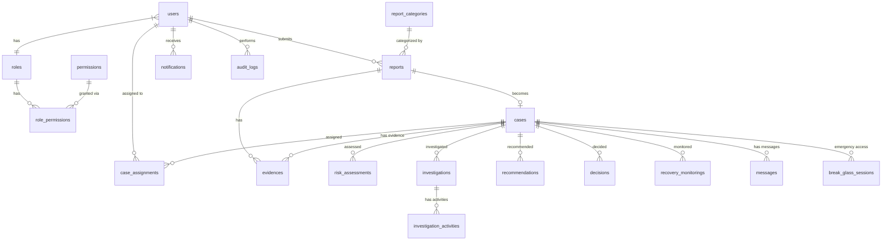

# DATABASE_SCHEMA.md — Database Design & Schema

> **Sistem Informasi Laporan Pencegahan dan Penanganan Kekerasan Seksual (SILAPPKASAL)**
> Versi: REV-WF-03-R2 | Terakhir Diperbarui: 2026-07-20 | Status: BERLAKU | Tier: 2 (GOVERNED)

---

## Daftar Isi

1. [Database Design Principles](#1-database-design-principles)
2. [Entity Relationship Overview](#2-entity-relationship-overview)
3. [Core Tables](#3-core-tables)
4. [Master Data Tables](#4-master-data-tables)
5. [Anonymous Report Handling](#5-anonymous-report-handling)
6. [Sensitive Data Design](#6-sensitive-data-design)
7. [File Storage Design](#7-file-storage-design)
8. [Audit Log Schema](#8-audit-log-schema)
9. [Indexing Strategy](#9-indexing-strategy)
10. [Migration Order](#10-migration-order)
11. [Seeding Strategy](#11-seeding-strategy)

---

## 1. Database Design Principles

### 1.1 Prinsip Utama

| # | Prinsip | Detail |
|---|---------|--------|
| 1 | **PostgreSQL sebagai database utama** | ACID compliance, JSON support, full-text search, enum types. Versi minimum: 16+. |
| 2 | **Bigint Auto-increment untuk Primary Key** | Default PK menggunakan `bigint` auto-increment. UUID hanya digunakan untuk entitas yang memerlukan unpredictable identifier (audit_logs, tracking codes, evidence filenames). |
| 3 | **Soft Delete selektif** | Hanya tabel yang memerlukan data retention: `users`, `reports`, `cases`. Tabel audit log **TIDAK** boleh soft delete. |
| 4 | **Audit Log Immutable** | Tabel `audit_logs` tidak memiliki `updated_at` atau `deleted_at`. Entry tidak boleh dimodifikasi atau dihapus. |
| 5 | **Field-level Encryption** | Kolom yang berisi data sensitif (kronologi, identitas korban, dll.) dienkripsi menggunakan Laravel `encrypted` cast (AES-256-GCM). |
| 6 | **Anonymous Privacy Protection** | Laporan anonim tidak menyimpan `user_id`, `IP address`, atau `device fingerprint` pada tabel bisnis. |
| 7 | **Konsistensi Penamaan** | Tabel: `snake_case`, plural. Kolom: `snake_case`. Foreign key: `{singular_table}_id`. |
| 8 | **Timestamps** | Semua tabel memiliki `created_at` dan `updated_at` kecuali audit_logs (hanya `created_at`). |
| 9 | **JSONB untuk Data Fleksibel** | Gunakan `jsonb` untuk metadata, konfigurasi, dan audit values. |
| 10 | **Foreign Key Constraints** | Semua relasi menggunakan FK constraint dengan appropriate `ON DELETE` behavior. |

### 1.2 Konvensi Tipe Data

| Penggunaan | Tipe PostgreSQL | Laravel Migration |
|------------|----------------|-------------------|
| Primary Key | `bigint` | `$table->id()` |
| UUID | `uuid` | `$table->uuid('column')` |
| String pendek | `varchar(n)` | `$table->string('column', n)` |
| Text panjang | `text` | `$table->text('column')` |
| Encrypted text | `text` | `$table->text('column')` + `encrypted` cast |
| Boolean | `boolean` | `$table->boolean('column')` |
| Integer | `integer` | `$table->integer('column')` |
| Timestamp | `timestamp` | `$table->timestamp('column')` |
| JSON flexible | `jsonb` | `$table->jsonb('column')` |
| IP Address | `inet` | `$table->ipAddress('column')` |
| Enum | `varchar` + check | `$table->string('column')` + validation |

> **Catatan**: Laravel enum migration (`$table->enum()`) tidak digunakan karena sulit di-alter di PostgreSQL. Gunakan `varchar` dengan validasi di aplikasi.

---

## 2. Entity Relationship Overview

### 2.1 Diagram Relasi



### 2.2 Ringkasan Relasi

| Tabel Induk | Tabel Anak | Relasi | FK |
|-------------|-----------|--------|-----|
| `roles` | `users` | 1:N | `users.role_id` |
| `roles` | `role_permissions` | N:M (pivot) | `role_permissions.role_id` |
| `permissions` | `role_permissions` | N:M (pivot) | `role_permissions.permission_id` |
| `users` | `reports` | 1:N | `reports.reporter_id` (nullable untuk anonim) |
| `users` | `personal_access_tokens` | 1:N (polymorphic) | `tokenable_id` |
| `reports` | `cases` | 1:1 | `cases.report_id` |
| `reports` | `evidences` | 1:N | `evidences.report_id` |
| `cases` | `evidences` | 1:N | `evidences.case_id` |
| `cases` | `case_assignments` | 1:N | `case_assignments.case_id` |
| `users` | `case_assignments` | 1:N | `case_assignments.satgas_id` |
| `cases` | `risk_assessments` | 1:1 | `risk_assessments.case_id` |
| `cases` | `investigations` | 1:1 | `investigations.case_id` |
| `investigations` | `investigation_activities` | 1:N | `investigation_activities.investigation_id` |
| `cases` | `recommendations` | 1:1 | `recommendations.case_id` |
| `cases` | `decisions` | 1:1 | `decisions.case_id` |
| `cases` | `recovery_monitorings` | 1:N | `recovery_monitorings.case_id` |
| `cases` | `messages` | 1:N | `messages.case_id` |
| `users` | `notifications` | 1:N | `notifications.user_id` |
| `cases` | `break_glass_sessions` | 1:N | `break_glass_sessions.case_id` |

---

## 3. Core Tables

### 3.1 `users`

| Kolom | Tipe | Constraint | Deskripsi |
|-------|------|-----------|-----------|
| `id` | `bigint` | PK, auto-increment | — |
| `role_id` | `bigint` | FK → `roles.id`, NOT NULL | Role pengguna |
| `name` | `varchar(255)` | NOT NULL | Nama lengkap |
| `email` | `varchar(255)` | UNIQUE, NOT NULL | Email (login identifier) |
| `nim` | `varchar(20)` | UNIQUE, NULLABLE | Nomor Induk Mahasiswa |
| `nip` | `varchar(20)` | UNIQUE, NULLABLE | Nomor Induk Pegawai |
| `phone_number` | `varchar(15)` | NULLABLE | Nomor WhatsApp (format: 628xxx) |
| `password` | `varchar(255)` | NOT NULL | Hashed (Argon2id) |
| `is_active` | `boolean` | NOT NULL, DEFAULT `true` | Status aktif akun |
| `email_verified_at` | `timestamp` | NULLABLE | Waktu verifikasi email |
| `remember_token` | `varchar(100)` | NULLABLE | Laravel default field — **tidak digunakan pada MVP** (lihat catatan) |
| `created_at` | `timestamp` | — | — |
| `updated_at` | `timestamp` | — | — |
| `deleted_at` | `timestamp` | NULLABLE | Soft delete |

> **Catatan**: `phone_number` tidak dienkripsi di tabel `users` karena diperlukan untuk notifikasi WhatsApp. Untuk pelapor confidential, `phone_number` pada konteks laporan dienkripsi di tabel `reports`.

> **Catatan MVP (Audit Patch v1.0.1)**: `remember_token` adalah kolom bawaan Laravel. Karena SILAPPKASAL menggunakan stateless Laravel Sanctum token API, kolom ini **tidak digunakan pada MVP** untuk session/login. Kolom tetap ada sebagai default Laravel field, tetapi tidak boleh dipakai sebagai mekanisme autentikasi.

### 3.2 `roles`

| Kolom | Tipe | Constraint | Deskripsi |
|-------|------|-----------|-----------|
| `id` | `bigint` | PK, auto-increment | — |
| `code` | `varchar(20)` | UNIQUE, NOT NULL | Kode role (e.g., `super_admin`) |
| `name` | `varchar(50)` | NOT NULL | Nama tampilan |
| `description` | `text` | NULLABLE | Deskripsi role |
| `is_active` | `boolean` | NOT NULL, DEFAULT `true` | — |
| `created_at` | `timestamp` | — | — |
| `updated_at` | `timestamp` | — | — |

### 3.3 `permissions`

| Kolom | Tipe | Constraint | Deskripsi |
|-------|------|-----------|-----------|
| `id` | `bigint` | PK, auto-increment | — |
| `code` | `varchar(50)` | UNIQUE, NOT NULL | Kode permission (e.g., `cases.read.metadata`) |
| `name` | `varchar(100)` | NOT NULL | Nama tampilan |
| `description` | `text` | NULLABLE | Deskripsi |
| `module` | `varchar(30)` | NOT NULL | Modul (Sistem, User, Laporan, Kasus, dll.) |
| `created_at` | `timestamp` | — | — |
| `updated_at` | `timestamp` | — | — |

### 3.4 `role_permissions` (Pivot)

| Kolom | Tipe | Constraint | Deskripsi |
|-------|------|-----------|-----------|
| `id` | `bigint` | PK, auto-increment | — |
| `role_id` | `bigint` | FK → `roles.id`, NOT NULL | — |
| `permission_id` | `bigint` | FK → `permissions.id`, NOT NULL | — |
| `created_at` | `timestamp` | — | — |

> UNIQUE constraint pada `(role_id, permission_id)`.

### 3.5 `personal_access_tokens`

Tabel bawaan Laravel Sanctum. Tidak dimodifikasi.

| Kolom | Tipe | Constraint | Deskripsi |
|-------|------|-----------|-----------|
| `id` | `bigint` | PK, auto-increment | — |
| `tokenable_type` | `varchar(255)` | NOT NULL | Polymorphic type (`App\Models\User`) |
| `tokenable_id` | `bigint` | NOT NULL | User ID |
| `name` | `varchar(255)` | NOT NULL | Nama token (e.g., `web-login`) |
| `token` | `varchar(64)` | UNIQUE, NOT NULL | SHA-256 hash |
| `abilities` | `text` | NULLABLE | JSON abilities |
| `last_used_at` | `timestamp` | NULLABLE | — |
| `expires_at` | `timestamp` | NULLABLE | — |
| `created_at` | `timestamp` | — | — |
| `updated_at` | `timestamp` | — | — |

### 3.6 `reports`

| Kolom | Tipe | Constraint | Deskripsi |
|-------|------|-----------|-----------|
| `id` | `bigint` | PK, auto-increment | — |
| `reporter_id` | `bigint` | FK → `users.id`, NULLABLE | NULL untuk anonim |
| `registration_number` | `varchar(30)` | UNIQUE, NOT NULL | Format: `SLP-YYYY-MMDD-XXXX` |
| `tracking_code` | `varchar(20)` | UNIQUE, NULLABLE | Untuk anonim: `A7X9-K2M4-P8Q3-R1W5` |
| `report_type` | `varchar(20)` | NOT NULL | `open`, `confidential`, `anonymous` |
| `category_code` | `varchar(10)` | NOT NULL | FK logis → `report_categories.code` |
| `chronology` | `text` | NOT NULL | **ENCRYPTED** — Kronologi kejadian |
| `incident_date` | `date` | NOT NULL | Tanggal kejadian |
| `incident_time` | `varchar(5)` | NULLABLE | Waktu kejadian (HH:mm) |
| `incident_location` | `text` | NOT NULL | **ENCRYPTED** — Lokasi kejadian |
| `location_type` | `varchar(10)` | NULLABLE | Kode lokasi (LOC-01 s/d LOC-04) |
| `respondent_name` | `text` | NULLABLE | **ENCRYPTED** — Nama terlapor |
| `respondent_campus_status` | `varchar(20)` | NULLABLE | Status kampus terlapor |
| `respondent_relation` | `varchar(20)` | NULLABLE | Kode relasi (REL-01 s/d REL-99) |
| `respondent_details` | `text` | NULLABLE | **ENCRYPTED** — Detail terlapor lainnya |
| `witness_info` | `text` | NULLABLE | **ENCRYPTED** — Informasi saksi |
| `reporter_phone_encrypted` | `text` | NULLABLE | **ENCRYPTED** — Nomor pelapor (khusus confidential) |
| `status` | `varchar(20)` | NOT NULL, DEFAULT `submitted` | Status laporan fase admin. Nilai valid: `submitted`, `under_review`, `need_info`, `rejected`, `forwarded`. |
| `priority` | `varchar(10)` | NULLABLE | Kode prioritas (PRIO-01 s/d PRIO-04) |
| `admin_notes` | `text` | NULLABLE | Catatan admin saat review |
| `rejection_reason` | `text` | NULLABLE | Alasan penolakan |
| `submitted_at` | `timestamp` | NOT NULL | Waktu submit |
| `reviewed_at` | `timestamp` | NULLABLE | Waktu admin mulai review (status → `under_review`) |
| `forwarded_at` | `timestamp` | NULLABLE | Waktu forward ke Satgas |
| `created_at` | `timestamp` | — | — |
| `updated_at` | `timestamp` | — | — |
| `deleted_at` | `timestamp` | NULLABLE | Soft delete |

> **PENTING**: Kolom `reporter_id` bernilai NULL untuk laporan anonim. Lihat Section 5 untuk detail.

### 3.6.1 Batas Status `reports.status` vs `cases.status` (Audit Patch v1.0.1)

> **PENTING**: `reports.status` dan `cases.status` memiliki domain nilai yang BERBEDA dan tidak boleh dicampur.

| Aspek | `reports.status` | `cases.status` |
|-------|-------------------|----------------|
| **Scope** | Fase awal/admin — sebelum kasus dibuat | Fase penanganan Satgas — setelah laporan diforward |
| **Nilai valid** | `submitted`, `under_review`, `need_info`, `rejected`, `forwarded` | `forwarded`, `assessment`, `investigation`, `mediation`, `recommendation`, `decision`, `decided`, `recovery`, `monitoring`, `closed`, `escalated` |
| **Siapa yang mengubah** | Admin / Super Admin | Satgas PPKS (assigned) |
| **Source of truth setelah case** | ❌ Tidak. Setelah case dibuat, `reports.status` tetap `forwarded` dan tidak mengikuti perubahan case. | ✅ Ya. `cases.status` menjadi satu-satunya sumber status kasus. |

```
Alur status:

1. Report dibuat → reports.status = "submitted"
2. Admin review  → reports.status = "under_review"
3. Admin minta info → reports.status = "need_info" → kembali ke "under_review"
4. Admin reject  → reports.status = "rejected" (terminal)
5. Admin forward  → reports.status = "forwarded" (FINAL, tidak berubah lagi)
                  → cases dibuat → cases.status = "forwarded"
6. Satgas proses  → cases.status berubah sesuai workflow (assessment → investigation → ...)
                  → reports.status tetap "forwarded" (immutable setelah forward)
```

> **Catatan**: Status `verified` **TIDAK** digunakan. Admin cukup melakukan review (`under_review`) sebelum forward, request-info, atau reject. Tidak ada status antara review dan forward.

### 3.7 `cases`

| Kolom | Tipe | Constraint | Deskripsi |
|-------|------|-----------|-----------|
| `id` | `bigint` | PK, auto-increment | — |
| `report_id` | `bigint` | FK → `reports.id`, UNIQUE, NOT NULL | 1:1 dengan report |
| `registration_number` | `varchar(30)` | NOT NULL | Disalin dari report |
| `status` | `varchar(20)` | NOT NULL, DEFAULT `forwarded` | Status kasus terkini |
| `risk_level` | `varchar(10)` | NULLABLE | `low`, `medium`, `high` |
| `priority` | `varchar(10)` | NULLABLE | Disalin dari report |
| `current_stage` | `integer` | NOT NULL, DEFAULT `2` | Tahap workflow (1-7) |
| `forwarded_at` | `timestamp` | NOT NULL | Waktu kasus dibuat (forward) |
| `assessment_at` | `timestamp` | NULLABLE | — |
| `investigation_started_at` | `timestamp` | NULLABLE | — |
| `recommendation_at` | `timestamp` | NULLABLE | — |
| `decision_at` | `timestamp` | NULLABLE | — |
| `closed_at` | `timestamp` | NULLABLE | — |
| `escalated_at` | `timestamp` | NULLABLE | — |
| `escalation_type` | `varchar(10)` | NULLABLE | Kode eskalasi (ESC-01 s/d ESC-06) |
| `escalation_notes` | `text` | NULLABLE | Catatan eskalasi |
| `created_at` | `timestamp` | — | — |
| `updated_at` | `timestamp` | — | — |
| `deleted_at` | `timestamp` | NULLABLE | Soft delete |

### 3.8 `case_assignments`

| Kolom | Tipe | Constraint | Deskripsi |
|-------|------|-----------|-----------|
| `id` | `bigint` | PK, auto-increment | — |
| `case_id` | `bigint` | FK → `cases.id`, NOT NULL | — |
| `satgas_id` | `bigint` | FK → `users.id`, NOT NULL | Satgas yang ditugaskan |
| `assigned_by` | `bigint` | FK → `users.id`, NOT NULL | Actor penugasan; sama dengan `satgas_id` untuk self-assignment |
| `is_lead` | `boolean` | NOT NULL, DEFAULT `false` | Kolom kompatibilitas legacy; tidak memberi kewenangan operasional dan selalu `false` untuk assignment baru |
| `is_active` | `boolean` | NOT NULL, DEFAULT `true` | Hanya baris aktif yang menjadi penugasan saat ini |
| `assigned_at` | `timestamp` | NOT NULL | — |
| `unassigned_at` | `timestamp` | NULLABLE | — |
| `created_at` | `timestamp` | — | — |
| `updated_at` | `timestamp` | — | — |

Baris lama tidak dihapus saat reassign. Assignment yang berakhir diubah menjadi `is_active=false` dengan `unassigned_at`, sedangkan assignment baru memakai baris baru. Tidak ada schema baru untuk optimistic locking: API memproyeksikan token `lock_version` opaque dari state Case dan assignment aktif; semua keputusan mutation tetap dilakukan setelah row lock Report → Case → pending Withdrawal.

### 3.9 `evidences`

| Kolom | Tipe | Constraint | Deskripsi |
|-------|------|-----------|-----------|
| `id` | `bigint` | PK, auto-increment | — |
| `report_id` | `bigint` | FK → `reports.id`, NULLABLE | Jika diupload saat laporan |
| `case_id` | `bigint` | FK → `cases.id`, NULLABLE | Jika diupload saat investigasi |
| `uploader_id` | `bigint` | FK → `users.id`, NULLABLE | NULL untuk anonim |
| `uuid_filename` | `uuid` | UNIQUE, NOT NULL | Nama file di storage |
| `original_filename` | `varchar(255)` | NOT NULL | Nama asli file (disimpan, tidak dipakai sebagai path) |
| `mime_type` | `varchar(100)` | NOT NULL | MIME type tervalidasi |
| `file_extension` | `varchar(10)` | NOT NULL | Ekstensi file |
| `file_size` | `bigint` | NOT NULL | Ukuran dalam bytes |
| `checksum` | `varchar(64)` | NOT NULL | SHA-256 hash dari file asli |
| `storage_disk` | `varchar(20)` | NOT NULL, DEFAULT `evidence` | Disk storage Laravel |
| `storage_path` | `varchar(500)` | NOT NULL | Path relatif di storage |
| `encryption_iv` | `varchar(32)` | NULLABLE | IV jika file dienkripsi |
| `is_encrypted` | `boolean` | NOT NULL, DEFAULT `true` | — |
| `evidence_type` | `varchar(10)` | NOT NULL | Kode tipe (EVID-01 s/d EVID-04) |
| `description` | `text` | NULLABLE | Deskripsi opsional |
| `created_at` | `timestamp` | — | — |
| `updated_at` | `timestamp` | — | — |

> Minimal satu dari `report_id` atau `case_id` harus terisi. Ditegakkan via aplikasi.

### 3.10 `risk_assessments`

| Kolom | Tipe | Constraint | Deskripsi |
|-------|------|-----------|-----------|
| `id` | `bigint` | PK, auto-increment | — |
| `case_id` | `bigint` | FK → `cases.id`, UNIQUE, NOT NULL | 1:1 |
| `assessor_id` | `bigint` | FK → `users.id`, NOT NULL | Satgas penilai |
| `risk_level` | `varchar(10)` | NOT NULL | `low`, `medium`, `high` |
| `justification` | `text` | NOT NULL | **ENCRYPTED** — Justifikasi level risiko |
| `protection_steps` | `text` | NOT NULL | **ENCRYPTED** — Langkah perlindungan |
| `emergency_protection_needed` | `boolean` | NOT NULL, DEFAULT `false` | — |
| `emergency_notes` | `text` | NULLABLE | **ENCRYPTED** — Catatan darurat |
| `assessed_at` | `timestamp` | NOT NULL | — |
| `created_at` | `timestamp` | — | — |
| `updated_at` | `timestamp` | — | — |

### 3.11 `investigations`

| Kolom | Tipe | Constraint | Deskripsi |
|-------|------|-----------|-----------|
| `id` | `bigint` | PK, auto-increment | — |
| `case_id` | `bigint` | FK → `cases.id`, UNIQUE, NOT NULL | 1:1 |
| `lead_investigator_id` | `bigint` | FK → `users.id`, NOT NULL | Satgas utama |
| `status` | `varchar(20)` | NOT NULL, DEFAULT `planning` | Status investigasi (INVS-01 s/d INVS-08) |
| `plan_summary` | `text` | NULLABLE | **ENCRYPTED** — Ringkasan rencana |
| `findings` | `text` | NULLABLE | **ENCRYPTED** — Temuan investigasi |
| `conclusion` | `text` | NULLABLE | **ENCRYPTED** — Kesimpulan |
| `started_at` | `timestamp` | NOT NULL | — |
| `completed_at` | `timestamp` | NULLABLE | — |
| `created_at` | `timestamp` | — | — |
| `updated_at` | `timestamp` | — | — |

### 3.12 `investigation_activities`

| Kolom | Tipe | Constraint | Deskripsi |
|-------|------|-----------|-----------|
| `id` | `bigint` | PK, auto-increment | — |
| `investigation_id` | `bigint` | FK → `investigations.id`, NOT NULL | — |
| `investigator_id` | `bigint` | FK → `users.id`, NOT NULL | Satgas pelaksana |
| `activity_type` | `varchar(30)` | NOT NULL | Tipe: `victim_interview`, `witness_interview`, `respondent_interview`, `evidence_analysis`, `document_collection` |
| `activity_date` | `date` | NOT NULL | Tanggal kegiatan |
| `description` | `text` | NOT NULL | **ENCRYPTED** — Deskripsi kegiatan |
| `findings` | `text` | NULLABLE | **ENCRYPTED** — Temuan |
| `notes` | `text` | NULLABLE | **ENCRYPTED** — Catatan tambahan |
| `created_at` | `timestamp` | — | — |
| `updated_at` | `timestamp` | — | — |

### 3.13 `recommendations`

| Kolom | Tipe | Constraint | Deskripsi |
|-------|------|-----------|-----------|
| `id` | `bigint` | PK, auto-increment | — |
| `case_id` | `bigint` | FK → `cases.id`, UNIQUE, NOT NULL | 1:1 |
| `author_id` | `bigint` | FK → `users.id`, NOT NULL | Satgas penyusun |
| `status` | `varchar(20)` | NOT NULL, DEFAULT `drafting` | Status rekomendasi (RECS-01 s/d RECS-07) |
| `conclusion` | `text` | NOT NULL | **ENCRYPTED** — Kesimpulan investigasi |
| `recommended_actions` | `text` | NOT NULL | **ENCRYPTED** — Rekomendasi tindakan |
| `sanction_recommendation` | `text` | NULLABLE | **ENCRYPTED** — Rekomendasi sanksi |
| `recovery_recommendation` | `text` | NULLABLE | **ENCRYPTED** — Rekomendasi pemulihan |
| `prevention_recommendation` | `text` | NULLABLE | Rekomendasi pencegahan |
| `submitted_at` | `timestamp` | NULLABLE | — |
| `created_at` | `timestamp` | — | — |
| `updated_at` | `timestamp` | — | — |

### 3.14 `decisions`

| Kolom | Tipe | Constraint | Deskripsi |
|-------|------|-----------|-----------|
| `id` | `bigint` | PK, auto-increment | — |
| `case_id` | `bigint` | FK → `cases.id`, UNIQUE, NOT NULL | 1:1 |
| `recorder_id` | `bigint` | FK → `users.id`, NOT NULL | Satgas pencatat |
| `decision_number` | `varchar(100)` | NOT NULL | Nomor SK |
| `decision_date` | `date` | NOT NULL | Tanggal keputusan |
| `decision_content` | `text` | NOT NULL | **ENCRYPTED** — Isi keputusan |
| `created_at` | `timestamp` | — | — |
| `updated_at` | `timestamp` | — | — |

### 3.15 `recovery_monitorings`

| Kolom | Tipe | Constraint | Deskripsi |
|-------|------|-----------|-----------|
| `id` | `bigint` | PK, auto-increment | — |
| `case_id` | `bigint` | FK → `cases.id`, NOT NULL | — |
| `monitor_id` | `bigint` | FK → `users.id`, NOT NULL | Satgas pemantau |
| `recovery_type` | `varchar(20)` | NOT NULL | `psychological`, `legal`, `academic`, `medical` |
| `activity_date` | `date` | NOT NULL | Tanggal kegiatan |
| `description` | `text` | NOT NULL | **ENCRYPTED** — Deskripsi |
| `status` | `varchar(15)` | NOT NULL, DEFAULT `ongoing` | `ongoing`, `completed` |
| `notes` | `text` | NULLABLE | **ENCRYPTED** — Catatan |
| `created_at` | `timestamp` | — | — |
| `updated_at` | `timestamp` | — | — |

### 3.16 `messages`

| Kolom | Tipe | Constraint | Deskripsi |
|-------|------|-----------|-----------|
| `id` | `bigint` | PK, auto-increment | — |
| `case_id` | `bigint` | FK → `cases.id`, NOT NULL | Konteks kasus |
| `sender_id` | `bigint` | FK → `users.id`, NULLABLE | NULL untuk pesan anonim |
| `sender_role` | `varchar(20)` | NOT NULL | Role pengirim saat mengirim |
| `is_anonymous` | `boolean` | NOT NULL, DEFAULT `false` | — |
| `content` | `text` | NOT NULL | **ENCRYPTED** — Isi pesan |
| `has_attachment` | `boolean` | NOT NULL, DEFAULT `false` | — |
| `read_at` | `timestamp` | NULLABLE | Waktu dibaca penerima |
| `created_at` | `timestamp` | — | — |
| `updated_at` | `timestamp` | — | — |

### 3.17 `notifications`

Tabel tunggal untuk notifikasi in-app DAN delivery tracking WhatsApp. Tidak ada tabel `notification_logs` terpisah — tracking delivery dilakukan langsung di tabel ini.

| Kolom | Tipe | Constraint | Deskripsi |
|-------|------|-----------|-----------|
| `id` | `bigint` | PK, auto-increment | — |
| `user_id` | `bigint` | FK → `users.id`, NULLABLE | NULL untuk in-app tanpa target spesifik |
| `type` | `varchar(30)` | NOT NULL | Kode notifikasi (NOTIF-01 s/d NOTIF-11) |
| `channel` | `varchar(15)` | NOT NULL | `whatsapp`, `in_app` |
| `title` | `varchar(255)` | NOT NULL | Judul notifikasi |
| `body` | `text` | NOT NULL | Isi notifikasi (tanpa data sensitif) |
| `data` | `jsonb` | NULLABLE | Metadata: `{report_id, case_id, registration_number}` |
| `delivery_status` | `varchar(15)` | NOT NULL, DEFAULT `pending` | Status delivery: `pending`, `queued`, `sent`, `delivered`, `failed` |
| `sent_at` | `timestamp` | NULLABLE | Waktu berhasil dikirim oleh provider |
| `failed_at` | `timestamp` | NULLABLE | Waktu kegagalan terakhir |
| `retry_count` | `integer` | NOT NULL, DEFAULT `0` | Jumlah percobaan kirim (maks 3) |
| `provider_response` | `text` | NULLABLE | Response dari provider (Fonnte) — tanpa data sensitif |
| `last_error` | `text` | NULLABLE | Pesan error terakhir jika gagal |
| `read_at` | `timestamp` | NULLABLE | Waktu dibaca oleh user (in-app) |
| `created_at` | `timestamp` | — | — |
| `updated_at` | `timestamp` | — | — |

> **Catatan (Audit Patch v1.0.1)**: Untuk MVP, hanya ada satu tabel `notifications` yang menangani notifikasi in-app dan tracking delivery WhatsApp. Tidak ada tabel `notification_logs` terpisah. Kolom `delivery_status`, `sent_at`, `failed_at`, `retry_count`, `provider_response`, dan `last_error` menggantikan konsep `notification_logs` yang disebutkan di dokumen Phase 2.

### 3.18 `system_settings`

| Kolom | Tipe | Constraint | Deskripsi |
|-------|------|-----------|-----------|
| `id` | `bigint` | PK, auto-increment | — |
| `key` | `varchar(100)` | UNIQUE, NOT NULL | Setting key (e.g., `sla.verification_days`) |
| `value` | `text` | NOT NULL | Nilai setting |
| `type` | `varchar(20)` | NOT NULL | `integer`, `boolean`, `string`, `json` |
| `description` | `text` | NULLABLE | Deskripsi setting |
| `is_public` | `boolean` | NOT NULL, DEFAULT `false` | Apakah bisa dibaca tanpa auth |
| `created_at` | `timestamp` | — | — |
| `updated_at` | `timestamp` | — | — |

### 3.19 `break_glass_sessions`

| Kolom | Tipe | Constraint | Deskripsi |
|-------|------|-----------|-----------|
| `id` | `uuid` | PK | UUID v4 |
| `case_id` | `bigint` | FK → `cases.id`, NOT NULL | Kasus yang diakses |
| `actor_id` | `bigint` | FK → `users.id`, NOT NULL | Super Admin yang mengaktifkan |
| `justification` | `text` | NOT NULL | Alasan tertulis (min 50 karakter) |
| `scope_requested` | `jsonb` | NOT NULL | `["investigation", "evidence", "identity"]` |
| `resources_accessed` | `jsonb` | NULLABLE | Log resource yang diakses |
| `is_active` | `boolean` | NOT NULL, DEFAULT `true` | — |
| `expires_at` | `timestamp` | NOT NULL | Waktu kedaluwarsa sesi (maks 4 jam) |
| `revoked_at` | `timestamp` | NULLABLE | Waktu dicabut manual |
| `created_at` | `timestamp` | — | — |

> Tabel ini **TIDAK** memiliki `updated_at` atau `deleted_at`. Immutable kecuali `is_active`, `resources_accessed`, dan `revoked_at`.

---

## 4. Master Data Tables

Semua master data tables mengikuti pola yang sama. Data di-seed dan jarang berubah.

### 4.1 `report_categories`

| Kolom | Tipe | Constraint | Deskripsi |
|-------|------|-----------|-----------|
| `id` | `bigint` | PK, auto-increment | — |
| `code` | `varchar(10)` | UNIQUE, NOT NULL | `RCAT-01` s/d `RCAT-99` |
| `name` | `varchar(100)` | NOT NULL | Nama kategori |
| `description` | `text` | NULLABLE | Deskripsi |
| `examples` | `text` | NULLABLE | Contoh kasus |
| `legal_basis` | `varchar(255)` | NULLABLE | Dasar hukum |
| `is_active` | `boolean` | NOT NULL, DEFAULT `true` | — |
| `sort_order` | `integer` | NOT NULL | Urutan tampilan |
| `created_at` | `timestamp` | — | — |
| `updated_at` | `timestamp` | — | — |

> Seed data: 12 kategori sesuai MASTER_DATA.md Section 3 (RCAT-01 s/d RCAT-99).

### 4.2 Master Data Tables Lainnya

Tabel-tabel berikut menggunakan pola yang **identik**: `id`, `code` (UNIQUE), `name`, `description`, `is_active`, `sort_order`, `created_at`, `updated_at`.

| Tabel | Kode Seed | Referensi MASTER_DATA.md |
|-------|-----------|--------------------------|
| `report_types` | `RTYP-01` s/d `RTYP-03` | Section 4 |
| `evidence_types` | `EVID-01` s/d `EVID-04` | Section 5 |
| `case_statuses` | `CSTS-01` s/d `CSTS-15` | Section 6 |
| `investigation_statuses` | `INVS-01` s/d `INVS-08` | Section 7 |
| `recommendation_statuses` | `RECS-01` s/d `RECS-07` | Section 8 |
| `risk_levels` | `RISK-01` s/d `RISK-03` | Section 10 |
| `priority_levels` | `PRIO-01` s/d `PRIO-04` | Section 11 |
| `notification_types` | `NOTIF-01` s/d `NOTIF-11` | Section 9 |
| `campus_statuses` | `CAMP-01` s/d `CAMP-05` | Section 14.1 |
| `relations` | `REL-01` s/d `REL-99` | Section 14.2 |
| `location_types` | `LOC-01` s/d `LOC-04` | Section 14.3 |
| `escalation_types` | `ESC-01` s/d `ESC-06` | Section 14.4 |
| `recovery_types` | `RCV-01` s/d `RCV-04` | Section 14.5 |
| `sanction_types` | `SANC-01` s/d `SANC-07` | Section 14.6 |

> Semua tabel master data di atas memiliki kolom tambahan sesuai kebutuhan masing-masing (misal: `case_statuses` memiliki `workflow_stage`, `is_terminal`; `notification_types` memiliki `channel`, `template_key`, `classification`).

### 4.3 Kolom Tambahan Tabel Status

#### `case_statuses` (kolom tambahan)

| Kolom | Tipe | Deskripsi |
|-------|------|-----------|
| `workflow_stage` | `integer` | Tahap workflow (1-7) |
| `stage_name` | `varchar(30)` | Nama tahap |
| `is_terminal` | `boolean` | `true` untuk `rejected`, `closed` |
| `responsible_role` | `varchar(20)` | Role penanggung jawab |
| `valid_transitions` | `jsonb` | Array status tujuan yang valid |

#### `notification_types` (kolom tambahan)

| Kolom | Tipe | Deskripsi |
|-------|------|-----------|
| `channel` | `varchar(15)` | `whatsapp`, `in_app`, `both` |
| `template_key` | `varchar(50)` | Key template pesan |
| `recipient_role` | `varchar(20)` | Role penerima |
| `classification` | `varchar(20)` | `mvp_extended`, `post_mvp` |

---

## 5. Anonymous Report Handling

### 5.1 Prinsip

```
Laporan anonim HARUS menjaga anonimitas pelapor secara absolut.

Aturan:
├── reporter_id = NULL pada tabel reports
├── tracking_code = generated 16-char alfanumerik (satu-satunya cara akses)
├── IP address TIDAK disimpan pada reports, cases, atau audit log bisnis
├── Device fingerprint TIDAK disimpan
├── audit_logs.actor_id = NULL untuk aksi anonim
├── audit_logs.actor_ip = NULL untuk aksi anonim
├── Notifikasi WhatsApp TIDAK dikirim (tidak ada nomor)
└── Jika tracking_code hilang, tidak bisa dipulihkan (by-design)
```

### 5.2 Skema Tracking Code

```
Format: XXXX-XXXX-XXXX-XXXX (16 karakter alfanumerik, grouped)
Contoh: A7X9-K2M4-P8Q3-R1W5

Penyimpanan: reports.tracking_code (plain text, case-insensitive lookup)
Index: UNIQUE index pada tracking_code
Pencarian: WHERE UPPER(tracking_code) = UPPER(:input)
```

### 5.3 Security Log untuk Anonymous

```
IP rate limiting → in-memory only (middleware level)
Security log (jika needed) → hashed IP: SHA-256(IP + daily_salt)
                           → atau masked: 192.168.xxx.xxx
Retention security log anonim → auto-purge 7 hari
Dilarang mengkorelasikan security log dengan laporan anonim tertentu
```

### 5.4 Tabel Opsional: `anonymous_security_logs`

| Kolom | Tipe | Constraint | Deskripsi |
|-------|------|-----------|-----------|
| `id` | `bigint` | PK, auto-increment | — |
| `hashed_ip` | `varchar(64)` | NOT NULL | SHA-256(IP + daily_salt) |
| `event_type` | `varchar(30)` | NOT NULL | `rate_limit_hit`, `suspicious_activity` |
| `endpoint` | `varchar(100)` | NOT NULL | Endpoint yang diakses |
| `metadata` | `jsonb` | NULLABLE | Data tambahan (tanpa PII) |
| `created_at` | `timestamp` | NOT NULL | — |

> **PENTING**: Tabel ini memiliki TTL job: entri lebih dari 7 hari WAJIB dihapus otomatis via scheduled task. Tidak ada `updated_at`, tidak ada `deleted_at`.

---

## 6. Sensitive Data Design

### 6.1 Kolom yang WAJIB Dienkripsi

Menggunakan Laravel `encrypted` cast (AES-256-GCM via APP_KEY).

| Tabel | Kolom | Klasifikasi | Alasan |
|-------|-------|-------------|--------|
| `reports` | `chronology` | CRITICAL | Kronologi kekerasan |
| `reports` | `incident_location` | CONFIDENTIAL | Lokasi kejadian |
| `reports` | `respondent_name` | CRITICAL | Identitas terlapor |
| `reports` | `respondent_details` | CRITICAL | Detail terlapor |
| `reports` | `witness_info` | CONFIDENTIAL | Data saksi |
| `reports` | `reporter_phone_encrypted` | CONFIDENTIAL | Nomor pelapor confidential |
| `risk_assessments` | `justification` | CONFIDENTIAL | Justifikasi risiko |
| `risk_assessments` | `protection_steps` | CONFIDENTIAL | Langkah perlindungan |
| `risk_assessments` | `emergency_notes` | CONFIDENTIAL | Catatan darurat |
| `investigations` | `plan_summary` | CONFIDENTIAL | Rencana investigasi |
| `investigations` | `findings` | CRITICAL | Temuan investigasi |
| `investigations` | `conclusion` | CRITICAL | Kesimpulan |
| `investigation_activities` | `description` | CRITICAL | Deskripsi kegiatan |
| `investigation_activities` | `findings` | CRITICAL | Temuan |
| `investigation_activities` | `notes` | CONFIDENTIAL | Catatan |
| `recommendations` | `conclusion` | CONFIDENTIAL | Kesimpulan |
| `recommendations` | `recommended_actions` | CONFIDENTIAL | Rekomendasi tindakan |
| `recommendations` | `sanction_recommendation` | CONFIDENTIAL | Rekomendasi sanksi |
| `recommendations` | `recovery_recommendation` | CONFIDENTIAL | Rekomendasi pemulihan |
| `decisions` | `decision_content` | CONFIDENTIAL | Isi keputusan |
| `recovery_monitorings` | `description` | CONFIDENTIAL | Deskripsi pendampingan |
| `recovery_monitorings` | `notes` | CONFIDENTIAL | Catatan |
| `messages` | `content` | CONFIDENTIAL | Isi pesan |

### 6.2 Implementasi Laravel

```php
// Model Report — encrypted casting
class Report extends Model
{
    protected $casts = [
        'chronology' => 'encrypted',
        'incident_location' => 'encrypted',
        'respondent_name' => 'encrypted',
        'respondent_details' => 'encrypted',
        'witness_info' => 'encrypted',
        'reporter_phone_encrypted' => 'encrypted',
    ];
}
```

### 6.3 Implikasi

- Kolom terenkripsi **tidak bisa di-query** langsung (WHERE, LIKE, ORDER BY).
- Full-text search pada kolom terenkripsi **tidak dimungkinkan**.
- Pencarian dilakukan pada kolom non-enkripsi (registration_number, status, tanggal).

---

## 7. File Storage Design

### 7.1 Prinsip

```
PENTING: File bukti TIDAK BOLEH disimpan di folder public.

├── File disimpan di: storage/app/private/evidence/{case_or_report_id}/
├── Nama file: UUID v4 + .enc (jika terenkripsi)
├── Original filename: disimpan di database (tabel evidences)
├── Akses: hanya via controller terproteksi (auth + policy)
├── Signed URL: opsional untuk streaming (expiry 15 menit)
└── Public URL: TIDAK ADA — tidak pernah direct access
```

### 7.2 Storage Layout

```
storage/
└── app/
    └── private/
        └── evidence/
            ├── report-{id}/          ← Bukti dari pelapor
            │   ├── {uuid1}.enc
            │   ├── {uuid2}.enc
            │   └── {uuid3}.enc
            ├── case-{id}/            ← Bukti dari investigasi
            │   ├── {uuid4}.enc
            │   └── {uuid5}.enc
            └── temp/                 ← Upload sementara
                └── {upload_session}/
```

### 7.3 Laravel Disk Config

```php
// config/filesystems.php
'disks' => [
    'evidence' => [
        'driver' => 'local',
        'root' => storage_path('app/private/evidence'),
        'visibility' => 'private',
    ],
    // Future: S3
    // 'evidence' => [
    //     'driver' => 's3',
    //     'key' => env('AWS_ACCESS_KEY_ID'),
    //     'secret' => env('AWS_SECRET_ACCESS_KEY'),
    //     'region' => env('AWS_DEFAULT_REGION'),
    //     'bucket' => env('AWS_BUCKET'),
    //     'visibility' => 'private',
    // ],
],
```

### 7.4 Metadata di Database

Semua metadata file disimpan di tabel `evidences` (lihat Section 3.9):
- `uuid_filename` — nama file di storage
- `original_filename` — nama asli file
- `mime_type` — tipe MIME tervalidasi
- `file_size` — ukuran bytes
- `checksum` — SHA-256 hash file asli
- `encryption_iv` — IV untuk dekripsi
- `storage_path` — path relatif di disk

---

## 8. Audit Log Schema

### 8.1 Tabel `audit_logs`

| Kolom | Tipe | Constraint | Deskripsi |
|-------|------|-----------|-----------|
| `id` | `uuid` | PK | UUID v4 — unpredictable identifier |
| `event` | `varchar(100)` | NOT NULL | Event code (e.g., `case.status_changed`) |
| `severity` | `varchar(10)` | NOT NULL | `INFO`, `WARNING`, `CRITICAL` |
| `actor_id` | `bigint` | NULLABLE | User ID (NULL untuk aksi anonim) |
| `actor_role` | `varchar(20)` | NULLABLE | Role saat aksi dilakukan |
| `actor_ip` | `inet` | NULLABLE | IP address (**NULL untuk anonim**) |
| `user_agent` | `text` | NULLABLE | Browser/client info |
| `resource_type` | `varchar(50)` | NULLABLE | Model class name |
| `resource_id` | `bigint` | NULLABLE | Resource primary key |
| `old_values` | `jsonb` | NULLABLE | Nilai sebelum perubahan (**masked**) |
| `new_values` | `jsonb` | NULLABLE | Nilai setelah perubahan (**masked**) |
| `metadata` | `jsonb` | NULLABLE | Data tambahan |
| `created_at` | `timestamp` | NOT NULL | Immutable timestamp |

### 8.2 Aturan Penting

```
AUDIT LOG RULES:
├── TIDAK ada updated_at → entry immutable
├── TIDAK ada deleted_at → entry tidak boleh dihapus
├── TIDAK ada soft delete → hard retention minimum 5 tahun
├── Data sensitif WAJIB di-mask:
│   ├── Nama korban → "K***n"
│   ├── Nama terlapor → "T***r"
│   ├── Nomor telepon → "6281****6789"
│   ├── Email → "j***@university.ac.id"
│   ├── Kronologi → TIDAK dicatat (hanya report_id)
│   └── Bukti → hanya file_id dan mime_type
├── actor_ip = NULL untuk aksi anonim
└── Akses: hanya super_admin (via system.audit_log.view)
```

### 8.3 Event Codes

Daftar lengkap event codes ada di `MASTER_DATA.md` Section 12 (`AUD-AUTH-*`, `AUD-USER-*`, `AUD-RPT-*`, `AUD-CASE-*`, `AUD-EVID-*`, `AUD-MSG-*`, `AUD-SYS-*`, `AUD-SEC-*`).

---

## 9. Indexing Strategy

### 9.1 Core Indexes

| Tabel | Kolom | Tipe Index | Alasan |
|-------|-------|-----------|--------|
| `users` | `email` | UNIQUE | Login lookup |
| `users` | `nim` | UNIQUE (filtered: NOT NULL) | Login lookup |
| `users` | `nip` | UNIQUE (filtered: NOT NULL) | Login lookup |
| `users` | `role_id` | B-tree | Filter by role |
| `users` | `is_active` | B-tree | Filter aktif |
| `reports` | `registration_number` | UNIQUE | Lookup |
| `reports` | `tracking_code` | UNIQUE (filtered: NOT NULL) | Anonim lookup |
| `reports` | `reporter_id` | B-tree | "My reports" query |
| `reports` | `status` | B-tree | Filter by status |
| `reports` | `report_type` | B-tree | Filter by type |
| `reports` | `submitted_at` | B-tree | Sort by date |
| `reports` | `(status, submitted_at)` | Composite | Admin inbox query |
| `cases` | `report_id` | UNIQUE | 1:1 lookup |
| `cases` | `registration_number` | B-tree | Lookup |
| `cases` | `status` | B-tree | Filter |
| `cases` | `risk_level` | B-tree | Filter |
| `cases` | `(status, forwarded_at)` | Composite | Satgas queue |
| `case_assignments` | `(case_id, satgas_id)` | Composite UNIQUE | Prevent duplicates |
| `case_assignments` | `satgas_id` | B-tree | "My cases" query |
| `case_assignments` | `(satgas_id, is_active)` | Composite | Active assignments |
| `evidences` | `report_id` | B-tree | Report evidence |
| `evidences` | `case_id` | B-tree | Case evidence |
| `evidences` | `uuid_filename` | UNIQUE | Storage lookup |
| `messages` | `case_id` | B-tree | Case messages |
| `messages` | `(case_id, created_at)` | Composite | Chronological |
| `notifications` | `user_id` | B-tree | User notifications |
| `notifications` | `(user_id, read_at)` | Composite (filtered) | Unread count |
| `notifications` | `status` | B-tree | Queue processing |

### 9.2 Audit Log Indexes

| Kolom | Tipe Index | Alasan |
|-------|-----------|--------|
| `event` | B-tree | Filter by event type |
| `actor_id` | B-tree | Filter by actor |
| `severity` | B-tree | Filter critical events |
| `resource_type, resource_id` | Composite | Resource history |
| `created_at` | B-tree | Time-range queries |
| `(event, created_at)` | Composite | Event timeline |

### 9.3 Full-Text Search (Post-MVP)

```sql
-- Pada kolom yang TIDAK terenkripsi saja:
CREATE INDEX idx_reports_registration_fts 
  ON reports USING gin(to_tsvector('simple', registration_number));
```

> **Catatan**: Full-text search pada kolom terenkripsi tidak dimungkinkan. Pencarian hanya bisa dilakukan pada kolom non-enkripsi seperti `registration_number`, `status`, dan tanggal.

---

## 9.1 `break_glass_requests` R2 Lifecycle Extension

REV-WF-03 R2 reuses `break_glass_requests`; no separate grant table is introduced.

| Column | Type | Null | Meaning |
|---|---|---:|---|
| `requested_duration_minutes` | unsigned integer | No | Requested grant duration; new requests use 30/60/240/1440, legacy default 480 |
| `grant_starts_at` | timestamp | Yes | Approval-time grant start |
| `expires_at` | timestamp | Yes | Authoritative grant end; distinct from any Audit Log expiry |
| `revoked_at` | timestamp | Yes | Immediate revocation time |
| `revoked_by` | FK `users.id` | Yes | Same-campus Admin that revoked the grant |
| `revocation_reason` | text | Yes | Authorized lifecycle narrative; excluded from audit metadata |
| `view_count` | unsigned integer | No | Successful reveal count, default 0 |
| `last_viewed_at` | timestamp | Yes | Most recent successful reveal |

Supported current statuses are `pending`, `approved`, `denied`, `revoked`, and `expired`; legacy
`viewed` remains read-compatible. Indexes cover requester/status, report/status, status/expiry,
expiry, and a partial unique `(report_id, requestor_id)` active/pending lookup for statuses
`pending`, `approved`, and legacy `viewed` where `revoked_at IS NULL`.

Migration backfill preserves every row. Legacy grants derive an eight-hour bounded window from
`viewed_at`, then `approved_at`, `requested_at`, or `created_at`; elapsed grants become `expired`.
No reveal audit event is fabricated.

## 10. Migration Order

Urutan migration Laravel yang menjaga integritas referential:

```
Phase 1 — Foundation (tidak ada FK antar tabel baru)
  001_create_roles_table
  002_create_permissions_table
  003_create_role_permissions_table
  004_create_users_table                      ← FK ke roles
  005_create_personal_access_tokens_table     ← Sanctum default

Phase 2 — Master Data (no FK dependencies, seed-ready)
  006_create_report_categories_table
  007_create_report_types_table
  008_create_evidence_types_table
  009_create_case_statuses_table
  010_create_investigation_statuses_table
  011_create_recommendation_statuses_table
  012_create_risk_levels_table
  013_create_priority_levels_table
  014_create_notification_types_table
  015_create_campus_statuses_table
  016_create_relations_table
  017_create_location_types_table
  018_create_escalation_types_table
  019_create_recovery_types_table
  020_create_sanction_types_table

Phase 3 — Core Business (FK dependencies resolved by order)
  021_create_reports_table                    ← FK ke users (nullable)
  022_create_cases_table                      ← FK ke reports
  023_create_case_assignments_table           ← FK ke cases, users
  024_create_evidences_table                  ← FK ke reports, cases, users
  025_create_risk_assessments_table           ← FK ke cases, users
  026_create_investigations_table             ← FK ke cases, users
  027_create_investigation_activities_table   ← FK ke investigations, users
  028_create_recommendations_table            ← FK ke cases, users
  029_create_decisions_table                  ← FK ke cases, users
  030_create_recovery_monitorings_table       ← FK ke cases, users
  031_create_messages_table                   ← FK ke cases, users (nullable)
  032_create_notifications_table              ← FK ke users
  033_create_break_glass_sessions_table       ← FK ke cases, users

Phase 4 — System & Audit
  034_create_audit_logs_table                 ← No FK (denormalized for immutability)
  035_create_system_settings_table
  036_create_anonymous_security_logs_table    ← Opsional

Phase 5 — Indexes (jika tidak inline di migration)
  037_add_composite_indexes

Phase 6 — Laravel Queue (built-in)
  038_create_jobs_table                       ← php artisan queue:table
  039_create_failed_jobs_table                ← php artisan queue:failed-table
  040_create_job_batches_table                ← php artisan queue:batches-table

Phase 7 — Laravel Cache (jika Redis tidak digunakan)
  041_create_cache_table                      ← php artisan cache:table
```

---

## 11. Seeding Strategy

### 11.1 Urutan Seeding

```
1. RoleSeeder                → 5 roles (super_admin, admin, satgas_ppks, reporter, anonymous)
2. PermissionSeeder          → 30+ permissions sesuai MASTER_DATA.md Section 2.1
3. RolePermissionSeeder      → Mapping role × permission sesuai matriks Section 2.2
4. MasterDataSeeder          → Semua tabel master data (categories, types, statuses, dll.)
5. SystemSettingSeeder       → Default system settings sesuai MASTER_DATA.md Section 13
6. SuperAdminSeeder          → 1 akun Super Admin default
```

### 11.2 Default Super Admin

```php
// SuperAdminSeeder
User::create([
    'role_id' => Role::where('code', 'super_admin')->first()->id,
    'name' => 'Super Administrator',
    'email' => env('SUPER_ADMIN_EMAIL', 'superadmin@silappkasal.ac.id'),
    'password' => Hash::make(env('SUPER_ADMIN_PASSWORD', 'ChangeMe!2026')),
    'is_active' => true,
    'email_verified_at' => now(),
]);
```

> **PENTING**: Password default HARUS diganti segera setelah deployment. Gunakan environment variables.

### 11.3 Seeding Environment

| Environment | Seed Data |
|-------------|-----------|
| `local` | Roles + Permissions + Master Data + System Settings + Super Admin + Test Users + Sample Reports |
| `testing` | Roles + Permissions + Master Data + System Settings + Super Admin |
| `production` | Roles + Permissions + Master Data + System Settings + Super Admin |

### 11.4 DatabaseSeeder

```php
class DatabaseSeeder extends Seeder
{
    public function run(): void
    {
        $this->call([
            RoleSeeder::class,
            PermissionSeeder::class,
            RolePermissionSeeder::class,
            MasterDataSeeder::class,
            SystemSettingSeeder::class,
            SuperAdminSeeder::class,
        ]);

        if (app()->environment('local')) {
            $this->call([
                TestUserSeeder::class,
                SampleReportSeeder::class,
            ]);
        }
    }
}
```

---

> **Catatan**: Dokumen ini adalah Tier 2 (GOVERNED). Perubahan memerlukan persetujuan Project Owner. Schema ini menjadi referensi wajib bagi Backend Agent untuk membuat migration Laravel.

## REV-CONTENT-01 C1 Constraint Repair Addendum

Migration `2026_07_21_020000_harden_content_publication_constraints.php` adds named PostgreSQL CHECK
constraints, with SQLite test-trigger equivalents, for:

- `content_categories`, `content_items`, and `featured_content`: global scope requires a null
  `university_id`, while campus scope requires a non-null university;
- `content_items.content_type`: `article`, `faq`, or `consultation`;
- `content_versions.lifecycle_status`: the eight defined publication lifecycle values;
- `featured_content.rank`: 1 through 5;
- `featured_content`: a nullable date window with `active_from <= active_until`.

Existing foreign keys prevent draft/published pointers from referencing nonexistent versions.
Pointer ownership cannot be expressed as a portable row-local CHECK, so locked publication services
and reader joins additionally require the pointed version to belong to the same item. The repair does
not rewrite content data.

## REV-CONTENT-01 Reporter Information Center Extension

Migration `2026_07_22_000000_extend_content_for_reporter_information_center.php` adds:

- nullable `content_items.category_name` (`varchar(100)`) and the
  `(content_type, section_id, category_name)` lookup index;
- nullable `consultation_version_contents.service_type` (`varchar(150)`);
- nullable `consultation_version_contents.procedure` and `confidentiality_info` text fields.

For existing Article rows with a legacy `category_id`, the migration backfills `category_name` from
`content_categories.name` in bounded chunks. The value is trimmed and limited to 100 characters.
`category_id`, `content_categories`, and the nullable Article Consultation CTA relation are retained
for backward-compatible reads; new Article authoring uses free-text `category_name`, falls back to the
legacy category name only when needed, and does not accept or project a per-Article Consultation CTA.
The item-level category columns remain compatibility/denormalized metadata. Version-authoritative
category metadata is defined below; reader projection does not use item category columns when a
published version exists.
All new columns are nullable so historical content remains readable. Reader queries continue to
project only the version referenced by `published_version_id`, require lifecycle `published` with a
non-future `published_at`, exclude archived content, and enforce global plus own-campus isolation.

`content_categories` is also the searchable Article category registry. The fixed
`content_sections.code` determines whether an entry belongs to Education or Policy; editor users
cannot create or remove sections. Campus Admin registry rows use `scope=campus` and their own
`university_id`, while Super Admin registry rows use `scope=global` and a null university. Removing a
registry suggestion sets `is_active=false` only after an in-scope usage check; it never deletes the
row or changes `content_items.category_name`/legacy `category_id`. Historical names that exist only
on `content_items.category_name`, plus rows with only legacy `category_id`, remain available as
read-only suggestions. Migration `2026_07_23_000000_add_campus_content_category_permission.php`
adds only the Campus Admin registry permission and does not alter content data.

Migration `2026_07_23_010000_add_normalized_name_to_content_categories.php` additively adds
`content_categories.normalized_name varchar(150)`, backfills it using trimmed/collapsed whitespace,
lowercase comparison, and NFC Unicode normalization when available, then adds the unique constraint
`content_categories_scope_normalized_name_unique` across
`(section_id, scope_key, normalized_name)`. The migration fails closed if pre-existing normalized
duplicates in the same section/scope are found, or if a Global row is not keyed `global` or a campus
row is not keyed `campus:{university_id}`. This preflight runs before the column/backfill changes. The
same normalized name is intentionally valid in Global and Campus scopes and in different campus
scopes. The migration never merges, deletes, or rewrites Article data. Its rollback removes only
that constraint and column.

Migration `2026_07_23_020000_add_versioned_category_metadata_to_content_versions.php` additively
adds nullable `content_versions.category_name varchar(100)` and nullable
`content_versions.category_id` with a restrictive foreign key to `content_categories`. Existing
versions whose two new fields are null are backfilled from their owning item's compatibility
metadata; a non-empty item name wins and clears the copied legacy ID. Existing populated version
metadata is never overwritten, and neither content pointers nor lifecycle states are changed.

For Article writes, a non-null version `category_name` is canonical and its `category_id` is null;
the ID is retained only as a legacy fallback when the version name is null. Draft/revision resources
use the editable/latest version. Published readers, category lists, filters, related Articles, and
featured projections use the exact `published_version_id` version. Publishing synchronizes the
item-level compatibility metadata to the newly published version but never mutates the old published
version. Registry usage counts distinct items referenced by active current-draft or published
pointers and does not consult stale item-level metadata. Rollback drops only the two version columns
and their foreign key; SQLite partial indexes and lifecycle integrity triggers are preserved across
the table alteration.

## REV-GOV-01 Editorial Attribution Addendum

Migration `2026_07_23_030000_add_editorial_attribution_to_content_versions.php` additively adds:

- nullable `content_versions.submitted_by`, foreign key to `users.id` with `ON DELETE SET NULL`;
- nullable `content_versions.published_by`, foreign key to `users.id` with `ON DELETE SET NULL`.

New submissions and publications write these fields in the same locked transaction as their
lifecycle timestamp, status transition, item lock-version update, and audit event. Existing
`content_items.creator_id` remains the authoritative creator. Reviewer and approver identity remains
authoritative in append-only `content_review_decisions.reviewer_id`. Reviewer attribution is the
latest `review_started`, `revision_requested`, or `rejected` decision; approver attribution is the
latest `approved` decision. Both use `(decided_at DESC, id DESC)`. Archive, direct-global-publish,
publish, and featured actions are excluded from reviewer/approver attribution. Audit logs remain the
ordered editorial history and are not substituted for these primary relations.

Both new columns are nullable so legacy rows and deleted user accounts remain readable without
inventing an actor. The migration does not backfill guesses, alter lifecycle values, or move
`current_draft_version_id`/`published_version_id`. Rollback drops only the two new foreign keys and
columns. Laravel schema operations remain compatible with PostgreSQL and the SQLite in-memory test
database. The PostgreSQL alteration path remains a direct additive schema change. The SQLite
snapshot, table mutation, dependent restoration, pointer restoration, partial-index recreation, and
lifecycle-trigger recreation run in one database transaction so restoration failure cannot commit a
partially rebuilt graph.

## REV-ED-01 Controlled Article Document Addendum

REV-ED-01 introduces no migration or parallel rich-text column. Each Article body remains owned by
one immutable lifecycle version in `article_version_contents.document_json`; its server-derived
`sanitized_html`, `search_text`, and `estimated_reading_minutes` remain on that same row. Admin
preview reads the editable version, while Reporter projection joins only the exact
`content_items.published_version_id`. Creating a revision copies and validates the published
version body into a new version row; publishing moves the pointer and never updates the prior
published row.

New writes store the normalized controlled-document node names `bulletList` and `horizontalRule`
and allow the `underline` mark. Historical `unorderedList`, `divider`, `heading_2`, `heading_3`,
`info`, `warning`, and `help` values remain readable and are normalized only when a new editable
version is explicitly written. `imageReference` remains a stable UUID reference backed by
version-owned attachment validation; no media URL, upload payload, HTML, or file data is stored
inside `document_json`.

## REV-MEDIA-01 Version-owned Article Media Addendum

REV-MEDIA-01 requires no migration. Existing `content_attachments.content_version_id` owns every PDF,
cover, and inline image; `article_version_contents.cover_attachment_id` selects one cover from that
same version. `purpose`, private disk/path, generated safe name, encrypted original name, detected
MIME, extension, byte size, SHA-256, dimensions, alt text, display order, and uploader attribution
already provide the required immutable-binary metadata.

The Article document stores only `imageReference.attrs.attachment_public_id` and `alt`. Runtime
validation requires every referenced UUID to be an `inline_image` attachment on the same editable
version. A selected cover must be a `cover` attachment on that version. Publication does not copy
draft paths into a public disk: authenticated readers resolve only media on the exact
`published_version_id`, and orphan cover/inline records are not readable to Reporter.

Revision creation copies private bytes to new UUID paths, verifies byte size and SHA-256, rewrites
the new document references and cover FK, and leaves prior-version rows and bytes unchanged. The
retention command `content:purge-orphan-media` considers only aged cover/inline rows on the current
editable pointer, rechecks the reference under row locks, and never targets submitted, reviewed,
rejected, published, archived, superseded, or historical versions. Its default is dry-run; the
scheduler executes it after the configured retention window. No lifecycle pointer or content schema
is changed by cleanup.

## REV-WF-03 R3 Schema Addendum

Migration `2026_07_20_020000_add_final_case_closure.php` adds:

- encrypted nullable `recoveries.discontinuation_reason`;
- one-to-one `case_final_summaries` with a unique `case_id` foreign key;
- final outcome and completion date;
- encrypted official, domain-summary, follow-up, action, and closure narratives;
- creator/updater/publisher references and publication timestamp.

The migration uses Laravel schema operations compatible with PostgreSQL and the SQLite test database. It does not backfill historical closed Cases and does not create business data. Apply through the normal deployment migration step; this document does not claim that any environment has been migrated.

## REV-WITHDRAW-01A Withdrawal Aggregate Addendum

Migration `2026_07_24_000000_create_report_withdrawal_foundation.php` is additive:

- `reports.cancelled_at` and `reports.withdrawn_at` are nullable lifecycle timestamps;
- `cases.withdrawn_at` is a nullable future formal-withdrawal timestamp;
- `report_withdrawals` owns a public UUID, Report/optional Case/requester references, request type,
  lifecycle status, encrypted reason and rejection reason, prior status snapshots, review fields,
  supersession, lifecycle timestamps, resubmission flag, and optimistic `lock_version`;
- `report_withdrawal_attachments` reserves versioned private-document metadata. Binary data remains
  on a storage disk and original names use the model's encrypted cast.

`request_type` supports `early_cancellation` and `formal_withdrawal`. The status foundation supports
`completed`, `draft`, `waiting_document`, `pending_review`, `approved`, `rejected`, and `cancelled`.
REV-WITHDRAW-01A writes only `early_cancellation` + `completed`.

PostgreSQL and SQLite receive the same partial unique index on `report_withdrawals(report_id)` for
`draft`, `waiting_document`, and `pending_review`, preventing more than one active formal request per
Report. Existing Report/Case rows are not backfilled or rewritten. Rollback removes the two new
tables and the three nullable timestamps only.

Migration `2026_07_24_010000_reconcile_report_withdrawal_foundation.php` additively registers the
three withdrawal permissions, future terminal Case status `withdrawn`, and notification type
`NOTIF-25`. Its role assignments are Reporter for own cancellation/withdrawal and campus Admin for
withdrawal review.

### REV-WITHDRAW-01B additive snapshot fields

Migration
`2026_07_24_020000_extend_report_withdrawals_for_reporter_formal_flow.php` adds only nullable fields
to `report_withdrawals`:

- `registration_number_snapshot` (`varchar(64)`) for the stable DRAFT document reference;
- encrypted-at-model `requester_display_name_snapshot` (`text`) for the Reporter-safe document name;
- `draft_document_viewed_at` (`timestamp`, nullable reserved audit projection); rendering the DRAFT
  does not mutate lifecycle state, timestamps, or `lock_version`
  transition and Reporter timeline.

It also registers non-colliding notification types `NOTIF-26` (formal request submitted) and
`NOTIF-27` (pending request cancelled). It does not rewrite Report/Case state or existing withdrawal
rows. Rollback deletes those two notification codes and drops only the three added columns. The
migration uses Laravel schema operations supported by PostgreSQL and SQLite; the SQLite
fresh/rollback/reapply behavior is covered by a behavioral test.

REV-WITHDRAW-01B actively uses `report_withdrawal_attachments` with
`document_type=signed_withdrawal_statement`. The existing unique key
`(withdrawal_id, document_type, version)` protects monotonically increasing versions while the
withdrawal row is locked. `disk`, UUID `path`, encrypted `original_name`, detected MIME, byte size,
SHA-256, uploader, and timestamps remain internal. Binary data is stored on the separate private
`withdrawal` disk; replacing a document creates a new row/file and never overwrites history.

### REV-WITHDRAW-01C review queue index and master data

Migration `2026_07_24_030000_add_report_withdrawal_review_support.php` is additive. It adds the
named index `report_withdrawals_review_queue_idx` on `(status, submitted_at, id)` for stable
oldest-first review pagination, the nullable unique index
`report_withdrawals_supersedes_unique` on `supersedes_id` to prevent history branching, and
notification types `NOTIF-28` (approved) and `NOTIF-29` (rejected). Existing nullable reviewer,
decision timestamp, encrypted rejection, `resubmission_allowed`, `supersedes_id`, and Report/Case
`withdrawn_at` columns from the 01A/01B foundation are reused; no lifecycle row is rewritten or
backfilled.

Rollback removes only `NOTIF-28`, `NOTIF-29`, and the two named 01C indexes. Laravel's schema
operation is valid for PostgreSQL and SQLite. The migration must be applied through the normal
additive deployment path and must not be run with `migrate:fresh`.
