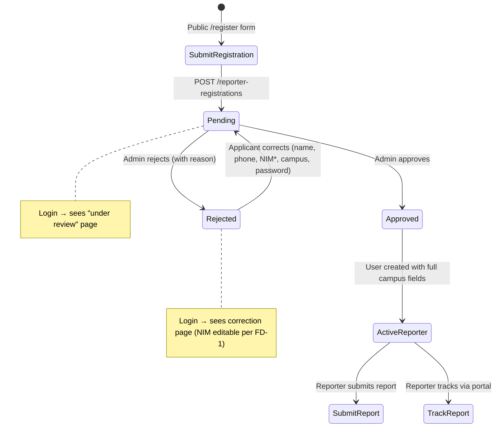

# M31-B — Reporter Registration, Portal Completion & Reporter Management

> Status: **FROZEN** — All decisions finalized, ready for implementation  
> Last Updated: 2026-06-24 (rev 3)  
> Prerequisite: M31-A (READY, committed)  
> Goal: Complete the reporter lifecycle from self-registration through report submission

---

## 0. Frozen Decisions Applied

| ID | Decision | Impact |
|---|---|---|
| **FD-1** | Rejected applicants **MAY edit NIM** during correction. All duplicate validations re-run. Audit log required. | Correction endpoint must accept `nim`, re-validate university-scoped NIM uniqueness, and log the change |
| **FD-2** | **Admin** can only view/manage registrations and reporters **from their own university**. **Super Admin** sees all. University filtering is a **security boundary**, not just a UI filter. | Policies must enforce `$actor->university_id === $target->university_id` for Admin. Service queries must apply `WHERE university_id = ?` for Admin. |
| **FD-3** | Manual reporter creation creates an **active reporter directly** (bypasses registration). | `POST /users/reporters` creates a `User` with `role = reporter`, `is_active = true`. No `ReporterRegistration` record created. |
| **FD-4** | Admin without `university_id` sees **no registration/reporter data**. Returns empty results or is denied. Super Admin remains unrestricted. | Service queries for Admin with NULL `university_id` return empty. Policies deny access to specific records. Frontend shows warning banner. |
| **FD-5** | **No welcome notifications** for manually-created reporters in M31-B. No SMTP, no email, no in-app notification. | Admin communicates credentials out-of-band. Can be revisited in a future milestone. |

---

## 0.1 Analysis: Should `users` Table Have `faculty_id` and `study_program_id`?

### Conclusion: **YES — new migration required.**

### Justification

| Factor | Without faculty/study_program on users | With faculty/study_program on users |
|---|---|---|
| **FD-3 (Manual creation)** | ❌ Manually-created reporters have NO registration record. Faculty/study_program has nowhere to be stored. | ✅ Fields stored directly on user. |
| **Reporter management filtering** | ❌ Must JOIN through `reporter_registrations` — fragile, excludes manually-created reporters, adds query complexity | ✅ Simple `WHERE faculty_id = ?` on users table |
| **FD-2 (Campus-scoped admin)** | 🟡 `university_id` on users is sufficient for the security boundary, but filtering by faculty/study_program requires a join | ✅ All campus fields queryable directly |
| **Approval data copy** | 🟡 Only `university_id` is copied — faculty/study_program lost unless admin looks up registration | ✅ Full campus context preserved on the user record |
| **Reporter profile display** | ❌ Portal "My Profile" cannot show faculty/study_program without joining to registration | ✅ Available directly on user |
| **Non-reporter users (Admin, Satgas)** | Faculty/study_program are irrelevant for non-reporter roles | Columns are nullable — non-reporter users simply have NULL |

### Key Argument

FD-3 is the decisive factor. When Admin manually creates a reporter, there is **no `reporter_registrations` record** at all. If the admin interface asks for faculty and study program during manual creation (which it should, per the user's scope), those values must go on the `users` table. Joining to `reporter_registrations` is not an option because the record doesn't exist.

### Migration Required

```
2026_06_24_030000_add_faculty_and_study_program_to_users.php
```

Add:
- `faculty_id` — nullable FK → `faculties`, `nullOnDelete`, after `university_id`
- `study_program_id` — nullable FK → `study_programs`, `nullOnDelete`, after `faculty_id`

---

## 1. Context

M31-A established the multi-campus master data foundation:
- `universities`, `faculties`, `study_programs` tables
- `users.university_id` (nullable FK)
- `reporter_registrations.{university_id, faculty_id, study_program_id}` (nullable FKs)
- Public endpoints: `GET /universities`, `GET /faculties`, `GET /study-programs`
- NIM uniqueness is DB-scoped by `(university_id, nim)`
- Rejected registration retains `password_hash`
- Service-level duplicate checks are still global (must be fixed here)

M31-B will build everything on top of that foundation.

---

## 2. Phase Breakdown

| Phase | Scope | Effort | Dependency |
|---|---|---|---|
| **M31-B1** | Backend: Migration + registration validation + campus fields + duplicate scoping | Medium | M31-A |
| **M31-B2** | Backend: Limited auth for pending/rejected applicants | Medium | M31-B1 |
| **M31-B3** | Backend: Correction/resubmission endpoint (NIM editable per FD-1) | Medium | M31-B2 |
| **M31-B4** | Backend: Campus-scoped policies + reporter management | Medium | M31-B1 |
| **M31-B5** | Frontend: Public `/register` page + login page links | Large | M31-B1 |
| **M31-B6** | Frontend: Admin registration review + reporter management | Large | M31-B3, M31-B4 |
| **M31-B7** | Frontend: Report submission form + portal updates | Large | M31-B2 |
| **M31-B8** | Frontend: Tracking lookup `/track` + pending/correction states | Medium | M31-B2, M31-B3 |

---

## 3. Auth Flow Design

### 3.1 Current State

The existing [AuthService::login()](file:///d:/PROJECT%20CODING/SILAPPKASAL/backend/api/app/Services/AuthService.php#L11-L46) only searches the `users` table. Pending and rejected applicants have no `User` record, so they cannot authenticate at all.

### 3.2 Proposed Design: Registration-Aware Login

Modify the login flow to handle 3 distinct outcomes:

```
Login attempt (email/NIM + password)
  ├─ Found in `users` table
  │   ├─ Active → Full access (existing behavior)
  │   └─ Inactive → 403 "Account deactivated" (existing behavior)
  │
  ├─ NOT in `users`, found in `reporter_registrations` with valid password_hash
  │   ├─ Status = pending → 200 with registration_state: "pending"
  │   ├─ Status = rejected → 200 with registration_state: "rejected" + rejection_reason
  │   └─ Status = approved → should not happen (password_hash cleared on approval)
  │
  └─ Not found anywhere → 401 "Invalid credentials"
```

### 3.3 Stateless Registration Session (Alternative B — Chosen)

No Sanctum token issued for pending/rejected applicants. Login returns two possible shapes:

**For approved users (existing):**
```json
{ "type": "bearer", "token": "...", "user": {...} }
```

**For pending/rejected registrations (new):**
```json
{
  "type": "registration",
  "registration": {
    "id": 1,
    "registration_number": "REG-...",
    "status": "pending|rejected",
    "rejection_reason": "...",
    "name": "...",
    "email": "...",
    "nim": "...",
    "phone_number": "...",
    "university_id": 1,
    "faculty_id": 2,
    "study_program_id": 3,
    "university": { "id": 1, "name": "..." },
    "faculty": { "id": 2, "name": "..." },
    "study_program": { "id": 3, "name": "...", "degree_level": "S1" }
  }
}
```

The correction endpoint re-verifies credentials (`email + password`) on each request instead of using a bearer token.

### 3.4 Frontend Auth State

```typescript
type AuthState =
  | { type: "unauthenticated" }
  | { type: "user"; user: User; token: string }           // existing
  | { type: "registration"; registration: Registration }   // new
```

Portal layout routing:
- `type: "user"` + `role = reporter` → full portal
- `type: "registration"` + `status = pending` → pending review page
- `type: "registration"` + `status = rejected` → correction page

---

## 4. Reporter Registration Lifecycle



---

## 5. Database Changes

### 5.1 NEW Migration: `add_faculty_and_study_program_to_users`

```php
Schema::table('users', function (Blueprint $table): void {
    $table->foreignId('faculty_id')
        ->nullable()
        ->after('university_id')
        ->constrained()
        ->nullOnDelete();
    $table->foreignId('study_program_id')
        ->nullable()
        ->after('faculty_id')
        ->constrained('study_programs')
        ->nullOnDelete();
});
```

**Rollback:**
```php
Schema::table('users', function (Blueprint $table): void {
    $table->dropConstrainedForeignId('study_program_id');
    $table->dropConstrainedForeignId('faculty_id');
});
```

### 5.2 User Model Updates

Add to `$fillable`:
```php
'faculty_id',
'study_program_id',
```

Add relationships:
```php
public function faculty(): BelongsTo
{
    return $this->belongsTo(Faculty::class);
}

public function studyProgram(): BelongsTo
{
    return $this->belongsTo(StudyProgram::class);
}
```

### 5.3 No other schema changes

All other required columns already exist from M31-A.

---

## 6. Backend Scope

### Phase M31-B1: Registration Validation, Campus Fields & Duplicate Scoping

#### MODIFY [ReporterRegistrationStoreRequest](file:///d:/PROJECT%20CODING/SILAPPKASAL/backend/api/app/Http/Requests/ReporterRegistrationStoreRequest.php)

Add campus field validation:

```php
'university_id'     => ['required', 'integer', Rule::exists('universities', 'id')->where('is_active', true)],
'faculty_id'        => ['nullable', 'integer', Rule::exists('faculties', 'id')->where('is_active', true)],
'study_program_id'  => ['required', 'integer', Rule::exists('study_programs', 'id')->where('is_active', true)],
'phone_number'      => ['required', 'string', 'max:30'],  // changed from nullable
```

Add `after()` validation hook:
- If `faculty_id` provided → verify it belongs to `university_id`
- Verify `study_program_id` belongs to `university_id`
- If `faculty_id` provided → verify `study_program_id` belongs to that `faculty_id`

#### MODIFY [ReporterRegistrationService::submit()](file:///d:/PROJECT%20CODING/SILAPPKASAL/backend/api/app/Services/ReporterRegistrationService.php#L26-L58)

1. **Save campus fields** on create:
   ```php
   'university_id'    => $data['university_id'],
   'faculty_id'       => $data['faculty_id'] ?? null,
   'study_program_id' => $data['study_program_id'],
   ```

2. **Scope duplicate checks by university:**
   - `ensureNoActiveUserDuplicate()`:
     - **Email** → remains globally unique (`WHERE LOWER(email) = ? AND is_active = true`)
     - **NIM** → scoped by university (`WHERE LOWER(nim) = ? AND university_id = ? AND is_active = true`)
   - `ensureNoPendingRegistrationDuplicate()`:
     - **Email** → remains globally unique
     - **NIM** → scoped by university (`WHERE LOWER(nim) = ? AND university_id = ? AND status = pending`)

3. **Save `phone_number`** as required

#### MODIFY [ReporterRegistrationService::approve()](file:///d:/PROJECT%20CODING/SILAPPKASAL/backend/api/app/Services/ReporterRegistrationService.php#L72-L126)

Copy ALL campus fields to User on approval:

```php
$user = User::query()->create([
    'role_id'          => $role->id,
    'university_id'    => $registration->university_id,
    'faculty_id'       => $registration->faculty_id,        // NEW
    'study_program_id' => $registration->study_program_id,  // NEW
    'name'             => $registration->name,
    'email'            => $registration->email,
    'nim'              => $registration->nim,
    'phone_number'     => $registration->phone_number,
    'password'         => $registration->password_hash,
    'is_active'        => true,
]);
```

#### MODIFY [ReporterRegistrationResource](file:///d:/PROJECT%20CODING/SILAPPKASAL/backend/api/app/Http/Resources/ReporterRegistrationResource.php)

Add campus fields + eager-loaded relationships:

```php
'university_id'    => $this->university_id,
'faculty_id'       => $this->faculty_id,
'study_program_id' => $this->study_program_id,
'university'       => $this->whenLoaded('university', fn () => [...]),
'faculty'          => $this->whenLoaded('faculty', fn () => [...]),
'study_program'    => $this->whenLoaded('studyProgram', fn () => [...]),
```

#### MODIFY [ReporterRegistrationService::list()](file:///d:/PROJECT%20CODING/SILAPPKASAL/backend/api/app/Services/ReporterRegistrationService.php#L64-L70)

- Eager load `university`, `faculty`, `studyProgram`
- Add search filter (name, email, nim)
- Add `university_id` filter

#### MODIFY [ReporterRegistrationIndexRequest](file:///d:/PROJECT%20CODING/SILAPPKASAL/backend/api/app/Http/Requests/ReporterRegistrationIndexRequest.php)

Add new filter parameters:

```php
'search'        => ['nullable', 'string', 'max:100'],
'university_id' => ['nullable', 'integer', 'exists:universities,id'],
```

---

### Phase M31-B2: Limited Auth for Pending/Rejected

#### MODIFY [AuthService::login()](file:///d:/PROJECT%20CODING/SILAPPKASAL/backend/api/app/Services/AuthService.php#L11-L46)

After existing user lookup fails, before returning 401, check `reporter_registrations`:

```php
$registration = ReporterRegistration::query()
    ->with(['university', 'faculty', 'studyProgram'])
    ->whereRaw('LOWER(email) = ?', [mb_strtolower($identifier)])
    ->whereIn('status', [
        ReporterRegistrationStatus::Pending->value,
        ReporterRegistrationStatus::Rejected->value,
    ])
    ->whereNotNull('password_hash')
    ->first();

if ($registration && Hash::check($password, $registration->password_hash)) {
    return [
        'type' => 'registration',
        'registration' => [/* all safe fields + campus info */],
    ];
}
```

#### MODIFY AuthController response handling

Detect `type: "registration"` and return appropriate shape.

---

### Phase M31-B3: Correction/Resubmission (FD-1: NIM editable)

#### NEW Endpoint: `PATCH /api/v1/reporter-registrations/correct`

- **Auth:** Re-authenticate via `email + password` in request body
- **Throttle:** `throttle:5,1`
- **Precondition:** Registration `status = rejected`

#### NEW `ReporterRegistrationCorrectRequest`

```php
'email'                     => ['required', 'email'],
'password'                  => ['required', 'string'],          // current password for re-auth
'name'                      => ['required', 'string', 'max:255'],
'nim'                       => ['required', 'string', 'max:50'], // EDITABLE per FD-1
'phone_number'              => ['required', 'string', 'max:30'],
'university_id'             => ['required', 'integer', Rule::exists('universities', 'id')->where('is_active', true)],
'faculty_id'                => ['nullable', 'integer', Rule::exists('faculties', 'id')->where('is_active', true)],
'study_program_id'          => ['required', 'integer', Rule::exists('study_programs', 'id')->where('is_active', true)],
'new_password'              => ['nullable', 'string', 'min:8', 'confirmed'],
```

Plus `after()` hook for faculty-belongs-to-university and study-program-belongs-to-university/faculty validation (same as store).

> [!IMPORTANT]
> ### FD-1: NIM Editable During Correction
> 
> - `nim` is an editable field on the correction form
> - **Email remains non-editable** (used for re-authentication; changing email would require email verification which is out of scope)
> - On correction, all duplicate validations are re-run:
>   - `ensureNoActiveUserDuplicate(email, nim, university_id)` — NIM uniqueness scoped by new `university_id`
>   - `ensureNoPendingRegistrationDuplicate(email, nim, university_id)` — excluding the current registration ID
> - If NIM changed, audit log metadata includes `nim_changed: true` and `previous_nim`

#### MODIFY [ReporterRegistrationService](file:///d:/PROJECT%20CODING/SILAPPKASAL/backend/api/app/Services/ReporterRegistrationService.php)

New `correct()` method:

```php
public function correct(array $data): ReporterRegistration
{
    $registration = ReporterRegistration::query()
        ->whereRaw('LOWER(email) = ?', [mb_strtolower($data['email'])])
        ->where('status', ReporterRegistrationStatus::Rejected->value)
        ->whereNotNull('password_hash')
        ->firstOrFail();

    if (!Hash::check($data['password'], $registration->password_hash)) {
        throw $this->unprocessable('Invalid credentials');
    }

    $newNim = $this->normalizeNim($data['nim']);
    $nimChanged = $newNim !== $registration->nim;

    // Re-run ALL duplicate checks with the new values
    $this->ensureNoActiveUserDuplicate($registration->email, $newNim, $data['university_id']);
    $this->ensureNoPendingRegistrationDuplicate(
        $registration->email, $newNim, $data['university_id'], $registration->id
    );

    return DB::transaction(function () use ($registration, $data, $newNim, $nimChanged) {
        $updates = [
            'name'             => trim($data['name']),
            'nim'              => $newNim,
            'phone_number'     => trim($data['phone_number']),
            'university_id'    => $data['university_id'],
            'faculty_id'       => $data['faculty_id'] ?? null,
            'study_program_id' => $data['study_program_id'],
            'status'           => ReporterRegistrationStatus::Pending->value,
            'rejection_reason' => null,
            'reviewed_by'      => null,
            'reviewed_at'      => null,
        ];

        if (!empty($data['new_password'])) {
            $updates['password_hash'] = Hash::make($data['new_password']);
        }

        $previousNim = $registration->nim;
        $registration->forceFill($updates)->save();

        $this->auditLogService->record(
            action: AuditAction::ReporterRegistrationCorrected,
            category: AuditCategory::System,
            severity: AuditSeverity::Info,
            subject: $registration,
            metadata: [
                'registration_number' => $registration->registration_number,
                'status' => ReporterRegistrationStatus::Pending->value,
                'nim_changed' => $nimChanged,
                'previous_nim' => $nimChanged ? $previousNim : null,
            ]
        );

        return $registration->refresh();
    });
}
```

#### Updated duplicate check signatures

```php
// NIM scoped by university; email global
private function ensureNoActiveUserDuplicate(string $email, string $nim, ?int $universityId = null): void
private function ensureNoPendingRegistrationDuplicate(string $email, string $nim, ?int $universityId = null, ?int $excludeId = null): void
```

#### NEW `AuditAction` case

```php
case ReporterRegistrationCorrected = 'reporter_registration.corrected';
```

---

### Phase M31-B4: Campus-Scoped Policies + Reporter Management

#### 4.1 Campus-Scoped Admin Authorization (FD-2)

> [!IMPORTANT]
> ### FD-2: Security Boundary
> 
> - **Super Admin** → sees and manages ALL registrations and reporters across all universities
> - **Admin** → can ONLY see and manage registrations and reporters where `target.university_id === admin.university_id`
> - This is enforced at the **policy level** (authorization) AND the **service level** (query filtering), not just the UI

#### MODIFY [ReporterRegistrationPolicy](file:///d:/PROJECT%20CODING/SILAPPKASAL/backend/api/app/Policies/ReporterRegistrationPolicy.php)

```php
private function canReview(User $user): bool
{
    return $user->is_active
        && $this->allowPermission($user, 'users.create')
        && $this->allowRole($user, 'admin', 'super_admin');
}

// NEW: campus-scoped check for Admin
private function canReviewRegistration(User $user, ReporterRegistration $registration): bool
{
    if (!$this->canReview($user)) return false;
    if ($this->allowRole($user, 'super_admin')) return true;
    // Admin: must share university
    return $registration->university_id !== null
        && $user->university_id === $registration->university_id;
}

public function view(User $user, ReporterRegistration $registration): bool
{
    return $this->canReviewRegistration($user, $registration);
}

public function approve(User $user, ReporterRegistration $registration): bool
{
    return $this->canReviewRegistration($user, $registration);
}

public function reject(User $user, ReporterRegistration $registration): bool
{
    return $this->canReviewRegistration($user, $registration);
}
```

#### MODIFY [ReporterRegistrationService::list()](file:///d:/PROJECT%20CODING/SILAPPKASAL/backend/api/app/Services/ReporterRegistrationService.php#L64-L70)

Accept `$actor` parameter. Apply campus scope:

```php
public function list(User $actor, array $filters = []): LengthAwarePaginator
{
    return ReporterRegistration::query()
        ->with(['university', 'faculty', 'studyProgram'])
        // FD-2: Admin can only see own university
        ->when(
            $actor->hasRole('admin') && $actor->university_id,
            fn ($q) => $q->where('university_id', $actor->university_id)
        )
        ->when(!empty($filters['status']), fn ($q) => $q->where('status', $filters['status']))
        ->when(!empty($filters['search']), fn ($q) => $this->applyRegistrationSearch($q, $filters['search']))
        ->when(!empty($filters['university_id']), fn ($q) => $q->where('university_id', $filters['university_id']))
        ->latest()
        ->paginate((int) ($filters['per_page'] ?? 15));
}
```

#### MODIFY [UserPolicy](file:///d:/PROJECT%20CODING/SILAPPKASAL/backend/api/app/Policies/UserPolicy.php)

Add campus-scoped check for Admin:

```php
public function view(User $user, User $target): bool
{
    if (!$this->canReadUsers($user)) return false;
    if ($this->allowRole($user, 'super_admin')) return true;
    // Admin: target must be in same university (or university is null = legacy)
    return $target->university_id !== null
        && $user->university_id === $target->university_id;
}

public function activate(User $user, User $target): bool
{
    if (!$this->canManageActivation($user)) return false;
    if ($this->allowRole($user, 'super_admin')) return true;
    return $target->university_id !== null
        && $user->university_id === $target->university_id;
}

public function deactivate(User $user, User $target): bool
{
    // same pattern as activate
}
```

#### MODIFY [UserManagementService::list()](file:///d:/PROJECT%20CODING/SILAPPKASAL/backend/api/app/Services/UserManagementService.php#L24-L33)

Accept `$actor`, apply campus scope:

```php
public function list(User $actor, array $filters): LengthAwarePaginator
{
    return User::query()
        ->with(['role', 'university', 'faculty', 'studyProgram'])
        // FD-2: Admin can only see own university
        ->when(
            $actor->hasRole('admin') && $actor->university_id,
            fn ($q) => $q->where('university_id', $actor->university_id)
        )
        ->when(!empty($filters['university_id']), ...)
        ->when(!empty($filters['faculty_id']), fn ($q) => $q->where('faculty_id', $filters['faculty_id']))
        ->when(!empty($filters['study_program_id']), fn ($q) => $q->where('study_program_id', $filters['study_program_id']))
        // ... existing search and role filters
        ->latest()
        ->paginate(...);
}
```

#### 4.2 Manual Reporter Creation (FD-3)

##### NEW Endpoint: `POST /api/v1/users/reporters`

- **Auth:** `auth:sanctum`
- **Gate:** `users.create` + `admin|super_admin`
- **FD-2 scope:** If Admin, created reporter must be in Admin's university

Request body:
```json
{
  "name": "Mahasiswa Manual",
  "email": "manual@example.test",
  "nim": "230999",
  "phone_number": "081234567890",
  "university_id": 1,
  "faculty_id": 2,
  "study_program_id": 3,
  "password": "TempPassword123"
}
```

##### NEW `ReporterCreateRequest`

```php
'name'             => ['required', 'string', 'max:255'],
'email'            => ['required', 'email', 'max:255', 'unique:users,email'],
'nim'              => ['required', 'string', 'max:50'],
'phone_number'     => ['required', 'string', 'max:30'],
'university_id'    => ['required', 'integer', Rule::exists('universities', 'id')->where('is_active', true)],
'faculty_id'       => ['nullable', 'integer', Rule::exists('faculties', 'id')->where('is_active', true)],
'study_program_id' => ['required', 'integer', Rule::exists('study_programs', 'id')->where('is_active', true)],
'password'         => ['required', 'string', 'min:8'],
```

Plus `after()` hook:
- Faculty belongs to university
- Study program belongs to university (and faculty if provided)
- **FD-2:** If actor is Admin, `university_id` must equal `actor->university_id`

Service logic:
1. Validate campus field relationships
2. Check global email uniqueness (already in request rules)
3. Check university-scoped NIM uniqueness (service-level)
4. Create user with `role = reporter`, `is_active = true`, all campus fields
5. Audit log: `AuditAction::ReporterCreatedManually`

##### NEW `AuditAction` cases

```php
case ReporterCreatedManually = 'reporter.created_manually';
```

#### 4.3 Reporter Management: Filtering

##### MODIFY [UserIndexRequest](file:///d:/PROJECT%20CODING/SILAPPKASAL/backend/api/app/Http/Requests/UserIndexRequest.php)

Add campus filters:

```php
'university_id'    => ['nullable', 'integer', 'exists:universities,id'],
'faculty_id'       => ['nullable', 'integer', 'exists:faculties,id'],
'study_program_id' => ['nullable', 'integer', 'exists:study_programs,id'],
```

##### MODIFY [UserManagementResource](file:///d:/PROJECT%20CODING/SILAPPKASAL/backend/api/app/Http/Resources/UserManagementResource.php)

Add campus info:

```php
'university' => $this->whenLoaded('university', fn () => [
    'id' => $this->university->id,
    'name' => $this->university->name,
    'abbreviation' => $this->university->abbreviation,
]),
'faculty' => $this->whenLoaded('faculty', fn () => [
    'id' => $this->faculty->id,
    'name' => $this->faculty->name,
]),
'study_program' => $this->whenLoaded('studyProgram', fn () => [
    'id' => $this->studyProgram->id,
    'name' => $this->studyProgram->name,
    'degree_level' => $this->studyProgram->degree_level,
]),
```

---

## 7. Frontend Scope

### Phase M31-B5: Public Registration Page

#### NEW Route: `/register`

- Public page, no auth
- Mobile-first responsive
- Bilingual (ID default)

##### Registration Form

| Field | Type | Required | Notes |
|---|---|---|---|
| Full name | Text | ✅ | max 255 |
| NIM / NPM | Text | ✅ | max 50 |
| Email | Email | ✅ | max 255 |
| Phone number | Tel | ✅ | max 30 |
| University | Select (cascading) | ✅ | `GET /api/v1/universities` |
| Faculty | Select (cascading) | ⬜ | `GET /api/v1/faculties?university_id=`. Hidden if `has_faculties = false` |
| Study Program | Select (cascading) | ✅ | `GET /api/v1/study-programs?university_id=&faculty_id=` |
| Password | Password | ✅ | min 8 |
| Confirm password | Password | ✅ | must match |

##### Cascading Select Logic

1. User selects University → Faculty and Study Program reset
2. If university `has_faculties = true` → show Faculty select (optional)
3. Faculty selected → Study Program fetches filtered by faculty
4. Faculty blank → Study Program shows all for university

##### MODIFY `/login` Page

Add links:
- "Belum punya akun? Daftar sebagai Pelapor" → `/register`
- "Lacak laporan anonim" → `/track`

---

### Phase M31-B6: Admin Registration Review & Reporter Management

#### NEW Route: `/dashboard/registrations`

- Admin and Super Admin only
- Paginated table
- Filters: status, search, university (Super Admin only — Admin auto-filtered)
- Columns: Name, NIM, Email, University, Study Program, Status, Date

#### NEW Route: `/dashboard/registrations/:id`

- Detail view with all campus info
- Approve / Reject actions
- Reject requires `rejection_reason` (min 10 chars)

#### MODIFY Route: `/dashboard/users` (replace placeholder)

- Paginated table with filters: role, university (SA only), faculty, study_program, search, is_active
- Activate/Deactivate toggle
- **"Create Reporter" button** (Admin/SA) → dialog with campus cascading fields
- Admin sees only own university reporters (enforced by API, not just UI)

#### University filter visibility

- **Super Admin:** sees university filter dropdown
- **Admin:** university filter is hidden (auto-scoped by API). Show Admin's university name as a label instead

---

### Phase M31-B7: Report Submission Form

#### NEW Route: `/portal/reports/new`

- Reporter only (approved, active)
- Mobile-first, multi-step wizard (3 steps)
- Bilingual

##### Step 1: Report Type & Category

| Field | Type | Required |
|---|---|---|
| Report type | Radio group | ✅ |
| Category | Select | ✅ |

Content warning banner: "Informasi yang Anda berikan bersifat rahasia dan akan ditangani oleh Satgas PPKS."

##### Step 2: Incident Details

| Field | Type | Required |
|---|---|---|
| Chronology | Textarea (min 50, max 10000) | ✅ |
| Incident date | Date picker (≤ today) | ✅ |
| Incident time | Time input | ⬜ |
| Incident location | Text (max 500) | ✅ |
| Location type | Select | ⬜ |

##### Step 3: Respondent & Additional Info

| Field | Type | Required |
|---|---|---|
| Respondent name | Text | ⬜ |
| Campus status | Select | ⬜ |
| Relation | Select | ⬜ |
| Respondent details | Textarea (max 2000) | ⬜ |
| Witness info | Textarea (max 2000) | ⬜ |
| Reporter phone | Text | ⬜ (confidential only) |

##### Submission → success page with registration number + tracking code (anonymous).

---

### Phase M31-B8: Tracking Lookup & Registration Status Pages

#### NEW Route: `/track`

- Public, mobile-first, bilingual
- Tracking code input → `GET /api/v1/reports/track/{code}`
- Shows safe status info or 404

#### Pending Registration Page

When login returns `type: "registration"` + `status: "pending"`:
- "Pendaftaran Anda Sedang Ditinjau"
- Registration number
- Logout button

#### Rejected Correction Page

When login returns `type: "registration"` + `status: "rejected"`:
- Rejection reason displayed prominently
- Correction form pre-filled with registration data
- Editable: name, **NIM** (per FD-1), phone, university, faculty, study_program, password (optional)
- Non-editable: email (used for auth)
- Submit → `PATCH /api/v1/reporter-registrations/correct`
- Success → switch to pending state

---

## 8. API Changes Summary

| Endpoint | Method | Auth | Status | Changes |
|---|---|---|---|---|
| `POST /reporter-registrations` | POST | Public | Existing | Add campus fields, phone required |
| `GET /reporter-registrations` | GET | Admin/SA | Existing | Add search, university filter, eager load, **FD-2 campus scope** |
| `GET /reporter-registrations/{id}` | GET | Admin/SA | Existing | Add campus info, **FD-2 campus scope** |
| `PATCH /reporter-registrations/{id}/approve` | PATCH | Admin/SA | Existing | Copy all campus fields to user, **FD-2 campus scope** |
| `PATCH /reporter-registrations/{id}/reject` | PATCH | Admin/SA | Existing | **FD-2 campus scope** |
| `PATCH /reporter-registrations/correct` | PATCH | Re-auth | 🆕 NEW | **FD-1: NIM editable**, full re-validation |
| `POST /auth/login` | POST | Public | Existing | Handle pending/rejected registrations |
| `POST /users/reporters` | POST | Admin/SA | 🆕 NEW | **FD-3: direct creation**, **FD-2: campus scope** |
| `GET /users` | GET | Admin/SA | Existing | Add university/faculty/study_program filters, **FD-2 campus scope** |
| `PATCH /users/{user}/activate` | PATCH | Admin/SA | Existing | **FD-2: campus scope** |
| `PATCH /users/{user}/deactivate` | PATCH | Admin/SA | Existing | **FD-2: campus scope** |
| `POST /reports` | POST | Reporter | Existing | No backend changes |
| `GET /reports/track/{code}` | GET | Public | Existing | No changes |

---

## 9. Validation Rules

### Registration Store (updated)

| Field | Rules |
|---|---|
| `name` | required, string, max:255 |
| `email` | required, email, max:255 |
| `nim` | required, string, max:50 |
| `phone_number` | required, string, max:30 |
| `university_id` | required, integer, exists:universities (active) |
| `faculty_id` | nullable, integer, exists:faculties (active), belongs to university |
| `study_program_id` | required, integer, exists:study_programs (active), belongs to university+faculty |
| `password` | required, string, min:8, confirmed |

### Correction (FD-1 updated)

| Field | Rules |
|---|---|
| `email` | required, email (re-auth, NOT editable) |
| `password` | required, string (current password for re-auth) |
| `name` | required, string, max:255 |
| `nim` | required, string, max:50 **(EDITABLE per FD-1)** |
| `phone_number` | required, string, max:30 |
| `university_id` | required, integer, exists (active) |
| `faculty_id` | nullable, integer, belongs to university |
| `study_program_id` | required, integer, belongs to university+faculty |
| `new_password` | nullable, string, min:8, confirmed |

### Manual Reporter Creation (FD-3)

| Field | Rules |
|---|---|
| `name` | required, string, max:255 |
| `email` | required, email, max:255, unique:users |
| `nim` | required, string, max:50 |
| `phone_number` | required, string, max:30 |
| `university_id` | required, integer, exists (active), **must match actor's university if Admin (FD-2)** |
| `faculty_id` | nullable, integer, belongs to university |
| `study_program_id` | required, integer, belongs to university+faculty |
| `password` | required, string, min:8 |

---

## 10. Permissions / RBAC

### No new permission codes needed

| Action | Permission | Admin | Super Admin |
|---|---|---|---|
| Submit registration | Public | — | — |
| Review registrations | `users.create` | Own university only (FD-2) | All |
| Approve/reject | `users.create` | Own university only (FD-2) | All |
| List reporters | `users.read` | Own university only (FD-2) | All |
| Create reporter | `users.create` | Own university only (FD-2) | All |
| Activate/deactivate | `users.deactivate` | Own university only (FD-2) | All |
| Submit report | `reports.create` | — | — |
| Track report | Public | — | — |
| Correct registration | Re-auth (self-service) | — | — |

### FD-2 Enforcement Points

| Layer | Admin Behavior | Super Admin Behavior |
|---|---|---|
| **Policy** (authorization) | `view/approve/reject/activate/deactivate` check `target.university_id === actor.university_id` | Always allowed |
| **Service** (query filtering) | `list()` auto-appends `WHERE university_id = actor.university_id` | No scope filter |
| **Request** (manual creation) | `university_id` must equal `actor.university_id` | Any university allowed |

---

## 11. Localization

### New locale keys (~80–100 keys)

| File | Scope |
|---|---|
| `id/auth.json` | Registration links, pending/rejected messages |
| `en/auth.json` | English equivalents |
| `id/portal.json` | Registration form, correction form, report submission, tracking |
| `en/portal.json` | English equivalents |

Dashboard pages (registration review, reporter management) remain English-only, consistent with all existing dashboard pages.

---

## 12. Tests

### M31-B1: Registration Campus Validation

```
- test_registration_requires_campus_fields
- test_registration_validates_university_is_active
- test_registration_validates_faculty_belongs_to_university
- test_registration_validates_study_program_belongs_to_university_and_faculty
- test_registration_saves_campus_fields
- test_nim_duplicate_check_is_scoped_by_university
- test_email_duplicate_check_remains_global
- test_same_nim_different_university_registration_succeeds
- test_registration_resource_includes_campus_info
- test_approval_copies_all_campus_fields_to_user
```

### M31-B2: Limited Auth

```
- test_pending_applicant_login_returns_registration_state
- test_rejected_applicant_login_returns_registration_with_rejection_reason_and_campus_info
- test_approved_applicant_cannot_login_with_registration
- test_invalid_registration_credentials_returns_401
- test_registration_login_does_not_create_user_or_issue_bearer_token
```

### M31-B3: Correction (FD-1)

```
- test_rejected_applicant_can_correct_and_resubmit
- test_correction_allows_nim_edit
- test_correction_with_changed_nim_reruns_all_duplicate_checks
- test_correction_with_duplicate_nim_in_same_university_fails
- test_correction_with_same_nim_different_university_succeeds
- test_correction_audit_log_records_nim_change
- test_correction_resets_status_clears_rejection_and_reviewer
- test_correction_requires_valid_current_password
- test_correction_validates_campus_fields
- test_correction_does_not_change_email
- test_correction_optionally_updates_password
- test_pending_applicant_cannot_correct
- test_correction_is_rate_limited
```

### M31-B4: Campus-Scoped Policies (FD-2, FD-4) + Reporter Management (FD-3, FD-5)

```
- test_admin_can_only_list_registrations_from_own_university
- test_super_admin_can_list_all_registrations
- test_admin_cannot_approve_registration_from_other_university
- test_admin_can_only_list_users_from_own_university
- test_admin_cannot_view_user_from_other_university
- test_admin_cannot_activate_user_from_other_university
- test_super_admin_can_manage_users_from_any_university
- test_admin_can_create_reporter_in_own_university_only
- test_super_admin_can_create_reporter_in_any_university
- test_manual_reporter_creation_validates_campus_fields
- test_manual_reporter_creation_checks_university_scoped_nim_duplicate
- test_user_list_filters_by_university_faculty_study_program
- test_admin_without_university_id_sees_empty_registration_list (FD-4)
- test_admin_without_university_id_cannot_approve_any_registration (FD-4)
- test_admin_without_university_id_sees_empty_user_list (FD-4)
- test_admin_without_university_id_cannot_create_reporter (FD-4)
- test_manual_reporter_creation_does_not_create_notification (FD-5)
```

### Frontend

```bash
npm run build
```

---

## 13. Risks

| Risk | Severity | Mitigation |
|---|---|---|
| Login response shape change may break existing frontend auth | 🔴 High | Frontend `useAuth()` must handle both `type: "bearer"` and `type: "registration"`. All existing auth tests must pass |
| FD-2 policy changes may break existing admin workflows | 🔴 High | Ensure Super Admin behavior is unchanged. Only Admin gets campus scope. Extensive test coverage for both roles |
| Admin without `university_id` sees empty data (FD-4) | 🟡 Medium | By frozen decision, Admin with NULL `university_id` sees no registration/reporter data. Service returns empty results, policies deny access. Frontend shows warning: "Hubungi Super Admin untuk menetapkan universitas Anda." DemoDataSeeder already assigns universities to demo admins |
| FD-1 NIM edit during correction could enable identity fraud | 🟡 Medium | Audit log records `nim_changed` + `previous_nim`. Admin manually verifies on re-review. Re-run all duplicate checks |
| Correction re-auth via email+password could be brute-forced | 🟡 Medium | Rate limit `throttle:5,1`. Constant-time bcrypt comparison |
| New migration adds columns to `users` table | 🟢 Low | All nullable FKs, no data backfill needed. Existing users unaffected |
| Cascading select UX complexity on mobile | 🟡 Medium | Loading states per select, native `<select>` for mobile compatibility |

---

## 14. Resolved Questions

All open questions have been resolved by frozen decisions.

> [!TIP]
> ### Q1: Admin without university_id — RESOLVED (FD-4)
>
> **Decision:** Admin without `university_id` sees **no registration/reporter data**. Service queries return empty results. Policies deny access to specific records. Frontend displays a warning banner: "Hubungi Super Admin untuk menetapkan universitas Anda" ("Contact Super Admin to assign your university"). Super Admin remains unrestricted.
>
> **Implementation:**
> - Service `list()` methods: when actor is Admin with `university_id = NULL`, query appends `WHERE 1 = 0` (returns empty) or equivalent
> - Policies: `canReviewRegistration()` / `view()` / `activate()` return `false` if Admin's `university_id` is NULL
> - Frontend: Admin dashboard shows a warning card if `user.university_id` is null, explaining they need Super Admin to assign their university
> - DemoDataSeeder already assigns demo admins to `DEMO-UNIV`, so this only affects manually-created or legacy admins

> [!TIP]
> ### Q2: Manual reporter welcome notification — RESOLVED (FD-5)
>
> **Decision:** No welcome notification of any kind in M31-B. No SMTP, no email, no in-app notification. Admin communicates credentials to the reporter out-of-band (verbally, printed, etc.). Can be revisited in a future milestone.

---

## 15. Acceptance Criteria

### M31-B1 (Registration Campus Validation + Migration)
- [ ] New migration adds `faculty_id` and `study_program_id` to `users`
- [ ] User model has `faculty()` and `studyProgram()` relationships
- [ ] Registration requires `university_id`, `study_program_id`, `phone_number`
- [ ] Campus field relationships validated (faculty ∈ university, study_program ∈ university+faculty)
- [ ] NIM duplicate check scoped by university
- [ ] Email duplicate check remains global
- [ ] Registration resource includes campus info
- [ ] Approval copies all campus fields (university, faculty, study_program) to user
- [ ] `php artisan test` passes, no regressions

### M31-B2 (Limited Auth)
- [ ] Pending applicant login returns `type: "registration"` with `status: "pending"`
- [ ] Rejected applicant login returns `type: "registration"` with campus info and `rejection_reason`
- [ ] No User record or bearer token for pending/rejected
- [ ] Existing user login unchanged
- [ ] `php artisan test` passes

### M31-B3 (Correction — FD-1)
- [ ] Rejected applicant can correct data including NIM
- [ ] All duplicate checks re-run with new NIM + university
- [ ] Audit log records NIM change with previous value
- [ ] Status resets to pending, rejection fields cleared
- [ ] Email is NOT editable
- [ ] Password update is optional
- [ ] Rate-limited
- [ ] `php artisan test` passes

### M31-B4 (Campus-Scoped Policies + Reporter Management — FD-2, FD-3, FD-4, FD-5)
- [ ] Admin sees only own-university registrations and reporters
- [ ] Super Admin sees all
- [ ] Admin cannot approve/reject registration from another university
- [ ] Admin cannot activate/deactivate user from another university
- [ ] Admin can create reporter only in own university
- [ ] Super Admin can create reporter in any university
- [ ] Manual creation validates campus fields and NIM uniqueness
- [ ] User list filterable by university, faculty, study_program
- [ ] Admin with NULL `university_id` sees empty registration list (FD-4)
- [ ] Admin with NULL `university_id` sees empty user list (FD-4)
- [ ] Admin with NULL `university_id` cannot approve/reject any registration (FD-4)
- [ ] Admin with NULL `university_id` cannot create reporter (FD-4)
- [ ] Manual reporter creation does not generate any notification (FD-5)
- [ ] `php artisan test` passes

### M31-B5 (Registration Frontend)
- [ ] `/register` page with cascading university → faculty → study program
- [ ] Faculty hidden when `has_faculties = false`
- [ ] Login page has register and track links
- [ ] Bilingual, mobile-responsive
- [ ] `npm run build` passes

### M31-B6 (Admin Review + Reporter Management Frontend)
- [ ] `/dashboard/registrations` with campus-aware filtering
- [ ] Registration detail shows campus info
- [ ] Approve/reject work with toast feedback
- [ ] `/dashboard/users` functional with campus filters
- [ ] Create Reporter dialog with campus cascading
- [ ] Admin university filter auto-applied, Super Admin sees dropdown
- [ ] `npm run build` passes

### M31-B7 (Report Submission)
- [ ] `/portal/reports/new` multi-step wizard
- [ ] Master data selects load from backend
- [ ] Character counter, conditional phone field, content warning
- [ ] Success page with registration number + tracking code
- [ ] Bilingual, mobile-responsive
- [ ] `npm run build` passes

### M31-B8 (Tracking + Registration States)
- [ ] `/track` page with tracking code lookup
- [ ] Pending registration page after login
- [ ] Rejected correction page with NIM editable, email read-only
- [ ] All pages bilingual and mobile-responsive
- [ ] `npm run build` passes

---

## 16. Verification Plan

### Automated Tests

```bash
cd backend/api && php artisan test
cd frontend && npm run build
```

### Manual Verification

1. Register with all campus fields → verify pending status
2. Login with pending credentials → verify "under review" page
3. Admin rejects → login shows correction page with NIM editable
4. Change NIM during correction → verify duplicate check re-runs
5. Correct and resubmit → verify pending status restored
6. Login as Admin → verify only own-university registrations visible
7. Login as Super Admin → verify all registrations visible
8. Login as Admin without university_id → verify empty results + warning banner (FD-4)
9. Admin approves → verify user created with all campus fields
10. Login as approved reporter → verify full portal
11. Admin creates reporter manually → verify immediate access, no notification created (FD-5)
12. Submit report → verify success
13. Submit anonymous report → verify tracking code
14. `/track` → verify status lookup
15. Test all flows on mobile viewport (375px)
16. Test all flows in both ID and EN languages
