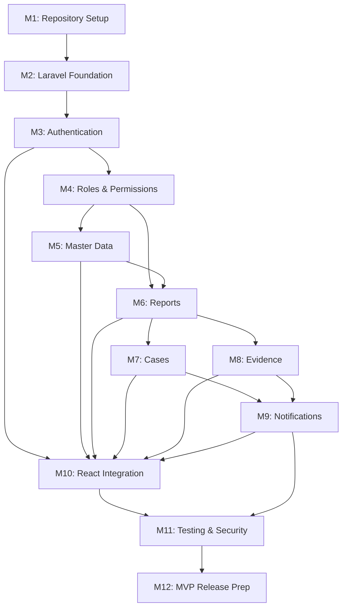

# PHASE_4_PLANNING.md — Implementation Roadmap

> **Sistem Informasi Laporan Pencegahan dan Penanganan Kekerasan Seksual (SILAPPKASAL)**
> Versi: 1.0.0 | Terakhir Diperbarui: 2026-06-10 | Status: BERLAKU | Tier: 3 (MANAGED)

---

## Daftar Isi

1. [Executive Summary](#1-executive-summary)
2. [Development Strategy](#2-development-strategy)
3. [Dependency Map](#3-dependency-map)
4. [Milestone Breakdown](#4-milestone-breakdown)
5. [Backend Agent Roadmap](#5-backend-agent-roadmap)
6. [Web Agent Roadmap](#6-web-agent-roadmap)
7. [Future Mobile Agent Roadmap](#7-future-mobile-agent-roadmap)
8. [Recommended Development Order](#8-recommended-development-order)
9. [Recommended Git Branch Strategy](#9-recommended-git-branch-strategy)
10. [Human Review Checkpoints](#10-human-review-checkpoints)

---

## 1. Executive Summary

### 1.1 Status Proyek

| Phase | Status | Artefak |
|-------|--------|---------|
| Phase 1 — Governance | ✅ PASS / FROZEN | `AGENTS.md`, `PROJECT_MASTER.md`, `PRD.md` |
| Phase 2 — Policy & SOP | ✅ PASS / FROZEN | `MASTER_DATA.md`, `AUTH_FLOW.md`, `SECURITY_POLICY.md` |
| Phase 3 — Technical Spec | ✅ PASS / FROZEN | `DATABASE_SCHEMA.md`, `API_SPECIFICATION.md`, `DEVELOPMENT_WORKFLOW.md` |
| **Phase 4 — Implementation** | 🔄 **CURRENT** | **Dokumen ini** |

### 1.2 Tujuan Phase 4

Phase 4 adalah tahap **coding implementation** — mentransformasi seluruh dokumentasi teknis (Phase 1–3) menjadi sistem yang berjalan. Tujuan utama:

1. **Membangun backend Laravel REST API** yang sepenuhnya sesuai dengan `API_SPECIFICATION.md` dan `DATABASE_SCHEMA.md`.
2. **Mengintegrasikan frontend React** (Lovable-generated) dengan backend API secara bertahap tanpa rewrite total.
3. **Menverifikasi keamanan dan kepatuhan** terhadap `SECURITY_POLICY.md` dan `AUTH_FLOW.md`.
4. **Menghasilkan MVP yang deployable** dengan seluruh fitur MVP Core berfungsi.

### 1.3 Stack Final (Referensi)

| Layer | Teknologi | Versi |
|-------|-----------|-------|
| Backend Framework | Laravel | 11+ |
| Backend Language | PHP | 8.2+ |
| Database | PostgreSQL | 16+ |
| Auth | Laravel Sanctum | Latest |
| Frontend Framework | React | ^19.2.0 |
| Frontend Language | TypeScript | ^5.8.3 |
| Frontend Routing | TanStack Router | ^1.168.25 |
| Frontend Data | TanStack Query | ^5.83.0 |
| Frontend SSR | TanStack Start | ^1.167.50 |
| Frontend UI | shadcn/ui + Radix UI | Per `package.json` |
| Frontend Styling | TailwindCSS | ^4.2.1 |
| Frontend Forms | React Hook Form + Zod | ^7.71.2 / ^3.24.2 |
| Frontend Charts | Recharts | ^2.15.4 |
| Frontend Build | Vite | ^7.3.1 |
| Mobile (Post-MVP) | Flutter | 3.x |
| Notification | Fonnte API (WhatsApp) | — |
| Storage | Local private (MVP) → S3-compatible (future) | — |

> **Penting**: Versi frontend di atas berasal dari `package.json` proyek Lovable per 2026-06-10. Web Agent **WAJIB** membaca `package.json` sebelum memulai pekerjaan (sesuai `AGENTS.md` Aturan 4.4).

### 1.4 Apa yang TIDAK Boleh Dilakukan

| ❌ Larangan | Alasan |
|-------------|--------|
| Mengubah dokumen Phase 1 & 2 | Sudah PASS dan FROZEN |
| Rewrite total frontend React | Frontend Lovable sudah ada — integrasikan bertahap |
| Membuat migration tanpa mengikuti `DATABASE_SCHEMA.md` | Schema sudah dibekukan |
| Membuat endpoint tanpa mengikuti `API_SPECIFICATION.md` | API contract sudah dibekukan |
| Mengerjakan Flutter mobile | Ditunda sampai API stabil (Post-MVP) |
| Deployment ke staging/production | Fokus localhost-first |

---

## 2. Development Strategy

### 2.1 Prinsip Pengembangan

```
1. Backend First          → API dibangun dan diuji sebelum frontend mengonsumsi
2. API Contract First     → API_SPECIFICATION.md menjadi kontrak wajib
3. Frontend Integrates    → Frontend ganti mock data ke API — bukan rewrite
4. Security by Default    → Security checklist wajib per milestone
5. Small Commits          → Satu fitur per branch, conventional commits
6. Test Everything        → Feature test + unit test, min 80% coverage
7. Document Every Change  → LOG.md / BUILD_NOTES.md setiap sesi kerja
8. Local Storage Default  → storage/app/private/evidence/ (bukan S3 saat dev)
```

### 2.2 Urutan Prioritas Klasifikasi

| Tier | Label | Definisi | Referensi |
|------|-------|----------|-----------|
| **MVP Core** | P0 — Must Have | Sistem tidak berfungsi tanpa ini | `API_SPECIFICATION.md` Section 15.1 |
| **MVP Extended** | P1 — Should Have | Operasional penuh, tapi sistem bisa berjalan tanpa ini | `API_SPECIFICATION.md` Section 15.2 |
| **Post-MVP** | P2 — Could Have | Enhancement setelah MVP stabil | `API_SPECIFICATION.md` Section 15.3 |

### 2.3 Alur Kerja per Fitur

```
┌────────────────────────────────────────────────────────────┐
│              ALUR DEVELOPMENT PER FITUR                     │
│                                                             │
│  1. Backend Agent                                           │
│     ├── Baca API_SPECIFICATION.md + DATABASE_SCHEMA.md      │
│     ├── Buat migration (jika belum ada)                     │
│     ├── Buat Model, Service, Repository, Controller         │
│     ├── Buat FormRequest (validasi)                         │
│     ├── Buat Policy (otorisasi)                             │
│     ├── Buat Resource (response transform)                  │
│     ├── Buat Event + Listener (side effects)                │
│     ├── Tulis Feature Test + Unit Test                      │
│     └── Update LOG.md / BUILD_NOTES.md                      │
│                                                             │
│  2. Reviewer Agent                                          │
│     ├── Review code vs API_SPECIFICATION.md                 │
│     ├── Security audit (IDOR, injection, mass assign)       │
│     ├── Performance check (N+1, query plan)                 │
│     └── Tulis review report di BUILD_NOTES.md               │
│                                                             │
│  3. Web Agent (setelah backend approved)                    │
│     ├── Baca API_SPECIFICATION.md                           │
│     ├── Buat/update API client hook (TanStack Query)        │
│     ├── Integrasikan ke existing React component            │
│     ├── Handle loading, error, empty states                 │
│     ├── Test integrasi via dev server                       │
│     └── Update LOG.md                                       │
│                                                             │
│  4. Reviewer Agent                                          │
│     ├── Review frontend vs API contract                     │
│     ├── UX review (states, responsiveness)                  │
│     └── Tulis review report                                 │
│                                                             │
│  5. Documentation Agent                                     │
│     ├── Update CHANGELOG.md                                 │
│     ├── Cross-verify docs vs implementation                 │
│     └── Update BUILD_NOTES.md jika ada keputusan teknis     │
│                                                             │
└────────────────────────────────────────────────────────────┘
```

### 2.4 Keputusan Teknis yang Sudah Dibekukan

Berikut keputusan dari Phase 1–3 yang **TIDAK BOLEH** diubah selama Phase 4:

| ADR | Keputusan | Source |
|-----|-----------|--------|
| ADR-007 | Backend is Source of Truth — semua validasi di backend | `PROJECT_MASTER.md` |
| ADR-008 | API-first development | `PROJECT_MASTER.md` |
| ADR-009 | Localhost-first development | `PROJECT_MASTER.md` |
| ADR-012 | Stateless API with Sanctum token auth | `PROJECT_MASTER.md` |
| ADR-013 | Field-level encryption AES-256 untuk data sensitif | `PROJECT_MASTER.md` |
| ADR-014 | RBAC via Laravel Gates/Policies | `PROJECT_MASTER.md` |
| — | `reports.status` hanya fase admin (submitted → forwarded) | `DATABASE_SCHEMA.md` 3.6.1 |
| — | `cases.status` hanya fase Satgas (forwarded → closed) | `DATABASE_SCHEMA.md` 3.6.1 |
| — | Status `verified` **TIDAK** digunakan | `DATABASE_SCHEMA.md` 3.6.1 |
| — | Satu tabel `notifications` (tanpa `notification_logs` terpisah) | `DATABASE_SCHEMA.md` 3.17 |
| — | `users.remember_token` tidak digunakan pada MVP | `DATABASE_SCHEMA.md` 3.1 |
| — | Super Admin tidak otomatis akses evidence | `SECURITY_POLICY.md` |
| — | Admin tidak akses detail investigasi kasus | `SECURITY_POLICY.md` |
| — | Break-glass emergency-only dengan audit CRITICAL | `SECURITY_POLICY.md` |

---

## 3. Dependency Map

### 3.1 Diagram Dependensi Antar Milestone



### 3.2 Dependensi Detail

| Milestone | Depends On | Blocks |
|-----------|-----------|--------|
| M1: Repository Setup | — | M2 |
| M2: Laravel Foundation | M1 | M3 |
| M3: Authentication | M2 | M4, M10 |
| M4: Roles & Permissions | M3 | M5, M6 |
| M5: Master Data | M4 | M6, M10 |
| M6: Reports | M4, M5 | M7, M8, M10 |
| M7: Cases | M6 | M9, M10 |
| M8: Evidence | M6 | M9, M10 |
| M9: Notifications | M7, M8 | M10, M11 |
| M10: React Integration | M3, M5, M6, M7, M8, M9 | M11 |
| M11: Testing & Security | M10, M9 | M12 |
| M12: MVP Release Prep | M11 | — |

### 3.3 Paralelisme

```
Sequential (wajib berurutan):
  M1 → M2 → M3 → M4 → M5 → M6 → M7

Paralel (bisa dikerjakan bersamaan):
  M7 (Cases) ‖ M8 (Evidence)  — setelah M6 selesai
  M10 (React Auth) bisa dimulai segera setelah M3 selesai
  M10 (React Master Data) bisa dimulai segera setelah M5 selesai
```

---

## 4. Milestone Breakdown

### Milestone 1: Repository Setup

| Aspek | Detail |
|-------|--------|
| **Objective** | Menyiapkan repository monorepo dengan struktur folder yang benar, konfigurasi Git, dan dokumen awal Phase 4. |
| **Scope** | Git init, `.gitignore`, folder structure (`backend/api/`, `docs/`), `README.md` update, `.env.example`. |
| **Dependencies** | Tidak ada — milestone pertama. |
| **Deliverables** | Repository dengan struktur sesuai `DEVELOPMENT_WORKFLOW.md` Section 2.1. `.gitignore` mencakup `.env`, `vendor/`, `node_modules/`, `storage/`. `README.md` diperbarui dengan instruksi setup. |
| **Definition of Done** | ✅ Struktur folder `silappkasal/` sesuai `DEVELOPMENT_WORKFLOW.md` 2.1. ✅ `.gitignore` lengkap. ✅ `README.md` berisi instruksi setup lokal. ✅ Docs Phase 1–3 tersalin di folder `docs/`. ✅ Tidak ada file sensitif ter-commit. |
| **Risks** | Rendah. Risiko utama: penamaan folder tidak konsisten. |
| **Estimated Complexity** | **Low** |

---

### Milestone 2: Laravel Foundation

| Aspek | Detail |
|-------|--------|
| **Objective** | Instalasi Laravel 11+, konfigurasi PostgreSQL, Sanctum, hashing, CORS, filesystem, queue, security headers, dan base middleware. |
| **Scope** | `composer create-project laravel/laravel` di `backend/api/`. Konfigurasi: `database.php` (pgsql), `auth.php` (sanctum), `hashing.php` (argon2id), `cors.php` (whitelist frontend), `filesystems.php` (evidence disk private), `queue.php` (database driver). Custom middleware: `SecurityHeadersMiddleware`. Base exception handler dengan format error standar. |
| **Dependencies** | M1 (Repository Setup). |
| **Deliverables** | Laravel project berjalan di `localhost:8000`. `.env.example` lengkap sesuai `PROJECT_MASTER.md` 10.2. `php artisan migrate` berjalan tanpa error (tabel default Sanctum). Middleware security headers terpasang. Response error format seragam sesuai `AGENTS.md` 6.2. |
| **Definition of Done** | ✅ `php artisan serve` berjalan. ✅ Koneksi PostgreSQL berhasil. ✅ `config/sanctum.php` — expiration: 1440 menit. ✅ `config/hashing.php` — Argon2id. ✅ CORS whitelist `http://localhost:5173`. ✅ Filesystem `evidence` disk → `storage/app/private/evidence/`. ✅ Security headers middleware terpasang (X-Content-Type-Options, X-Frame-Options, dll). ✅ Base exception handler menghasilkan format `{success, message, errors}`. |
| **Risks** | Sedang. Risiko: miskonfigurasi PostgreSQL, CORS blocking frontend. Mitigasi: test koneksi manual. |
| **Estimated Complexity** | **Medium** |

---

### Milestone 3: Authentication

| Aspek | Detail |
|-------|--------|
| **Objective** | Implementasi seluruh auth endpoint sesuai `API_SPECIFICATION.md` Section 3 dan `AUTH_FLOW.md`. |
| **Scope** | Endpoint: `POST /auth/login`, `POST /auth/logout`, `POST /auth/logout-all`, `GET /auth/me`, `POST /auth/register`. Migration: `users` table sesuai `DATABASE_SCHEMA.md` 3.1. Login dengan identifier (email/NIM/NIP) + password. Sanctum token generation dengan expiry. Rate limiting: 5/menit login, 3/menit register. Audit log event: AUD-AUTH-01 s/d AUD-AUTH-04. |
| **Dependencies** | M2 (Laravel Foundation). |
| **Deliverables** | 5 auth endpoint berfungsi dan teruji. `users` migration + model. `LoginRequest`, `RegisterRequest` FormRequest. `AuthController` + `AuthService`. Feature test untuk: happy path, validation error, rate limit, inactive user, wrong password. |
| **Definition of Done** | ✅ Login dengan email/NIM/NIP berfungsi. ✅ Token returned dan valid 24 jam. ✅ Logout revoke current token. ✅ Logout-all revoke semua token. ✅ `GET /auth/me` return user + role. ✅ Register create user dengan role `reporter`. ✅ Rate limit 5/menit untuk login. ✅ Akun inactive (`is_active = false`) tidak bisa login. ✅ Password hashed Argon2id. ✅ Feature test: ≥10 test cases, semua green. |
| **Risks** | Sedang. Risiko: identifier lookup collision (email vs NIM format), token expiry timezone. Mitigasi: validasi format identifier. |
| **Estimated Complexity** | **Medium** |

---

### Milestone 4: Roles & Permissions

| Aspek | Detail |
|-------|--------|
| **Objective** | Implementasi RBAC lengkap sesuai `AUTH_FLOW.md` Section 9 dan `SECURITY_POLICY.md`. |
| **Scope** | Migration: `roles`, `permissions`, `role_permission` tables sesuai `DATABASE_SCHEMA.md` 3.2–3.4. Seeder: `RolePermissionSeeder` dengan 4 role (super_admin, admin, satgas_ppks, reporter) dan 40+ permissions dari `AUTH_FLOW.md`. Middleware: `CheckRole`, `CheckPermission`. Base Policy class. Gate registration di `AuthServiceProvider`. User management endpoints: `API_SPECIFICATION.md` Section 4 (list, create, detail, update, deactivate, assign role). |
| **Dependencies** | M3 (Authentication). |
| **Deliverables** | 3 migrations (roles, permissions, role_permission). `RolePermissionSeeder` dengan data lengkap dari `AUTH_FLOW.md` 9.3. `CheckRole` dan `CheckPermission` middleware. `UserController` + `UserService` + `UserPolicy`. 6 user management endpoints teruji. |
| **Definition of Done** | ✅ 4 role terseed dengan permission yang benar. ✅ Middleware `role:admin,super_admin` berfungsi. ✅ Middleware `permission:reports.create` berfungsi. ✅ User CRUD oleh admin/super_admin berfungsi. ✅ Deactivate user = soft-deactivate + revoke semua token. ✅ Role assignment hanya oleh super_admin. ✅ Feature test: role-based access control, unauthorized access returns 403. |
| **Risks** | Sedang. Risiko: permission typo menyebabkan akses salah. Mitigasi: validasi seeder vs AUTH_FLOW.md checklist. |
| **Estimated Complexity** | **High** |

---

### Milestone 5: Master Data

| Aspek | Detail |
|-------|--------|
| **Objective** | Implementasi master data tables, seeders, dan endpoint read-only sesuai `API_SPECIFICATION.md` Section 5 dan `MASTER_DATA.md`. |
| **Scope** | Migration: 11 master data tables (`report_categories`, `report_types`, `evidence_types`, `case_statuses`, `risk_levels`, `priority_levels`, `campus_statuses`, `relations`, `location_types`, `escalation_types`, `recovery_types`) sesuai `DATABASE_SCHEMA.md` 3.5. Seeders: data dari `MASTER_DATA.md` (kategori kekerasan, tipe laporan, dll). 11 GET endpoints — read-only, authenticated, cached. |
| **Dependencies** | M4 (Roles & Permissions) — butuh auth dan role middleware. |
| **Deliverables** | 11 migrations. 11 seeders dengan data lengkap. `MasterDataController` (satu controller, multiple methods). 11 endpoints berfungsi dan teruji. Response format seragam: `{code, name, description, is_active, sort_order}`. |
| **Definition of Done** | ✅ Semua 11 master data tables terseed. ✅ Semua endpoint return data yang benar. ✅ Endpoint memerlukan auth tapi tidak perlu role tertentu. ✅ Data tidak dipaginasi (jumlah kecil). ✅ `case_statuses` mengandung `valid_transitions` JSON. ✅ Feature test: data seeded, endpoint return correct data, unauthorized returns 401. |
| **Risks** | Rendah. Risiko: data seeder tidak sinkron dengan `MASTER_DATA.md`. Mitigasi: cross-check seeder data. |
| **Estimated Complexity** | **Low** |

---

### Milestone 6: Reports

| Aspek | Detail |
|-------|--------|
| **Objective** | Implementasi seluruh report workflow sesuai `API_SPECIFICATION.md` Section 6 dan status flow `DATABASE_SCHEMA.md` 3.6.1. |
| **Scope** | Migration: `reports` table sesuai `DATABASE_SCHEMA.md` 3.6. Field-level encryption: `chronology`, `respondent_name`, `respondent_details`, `witness_info`, `reporter_phone_encrypted`. Endpoints (9 total): create report (auth), create anonymous, list reports (role-scoped), detail report, review/verify, reject, request-info, forward-to-satgas (creates Case), track anonymous. Registration number generator: `SLP-YYYY-MMDD-XXXX`. Tracking code generator: `XXXX-XXXX-XXXX-XXXX` (16 chars). Status flow: `submitted → under_review → need_info/rejected/forwarded`. Forward creates `Case` record. `ReportPolicy`: ownership check, role-based field visibility. Audit events: AUD-RPT-01 s/d AUD-RPT-05. |
| **Dependencies** | M4 (RBAC), M5 (Master Data — categories, types, locations). |
| **Deliverables** | `reports` migration dengan encryption markers. `Report` model dengan `$casts` dan encryption accessors. `ReportController`, `ReportService`, `ReportRepository`. 5+ FormRequests. `ReportPolicy` (view, verify, reject, requestInfo, forward). `ReportResource` (field visibility berdasarkan role). Audit log integration. Feature test: ≥20 test cases. |
| **Definition of Done** | ✅ Pelapor dapat submit laporan (auth + anonymous). ✅ Nomor registrasi ter-generate otomatis. ✅ Tracking code ter-generate untuk anonymous. ✅ Field sensitif terenkripsi di database. ✅ Admin list: semua reports. Reporter list: own reports saja. Satgas: TIDAK ada akses langsung. ✅ Admin verify → status = `under_review`. ✅ Admin reject → status = `rejected` (terminal). ✅ Admin request-info → status = `need_info`. ✅ Forward-to-satgas → status = `forwarded`, Case dibuat. ✅ Anonymous track: hanya return status minimal (no PII). ✅ Rate limit: anonymous submit 3/menit, track 10/menit. ✅ Audit log: semua operasi tercatat. ✅ Feature test: semua status transitions, RBAC, privacy. |
| **Risks** | Tinggi. Risiko: field-level encryption complexity, status transition bugs, anonymous privacy leaks. Mitigasi: encryption unit test, transition state machine test, IP logging audit. |
| **Estimated Complexity** | **High** |

---

### Milestone 7: Cases

| Aspek | Detail |
|-------|--------|
| **Objective** | Implementasi seluruh case lifecycle (7 tahap penanganan) sesuai `API_SPECIFICATION.md` Section 7 dan SOP `MASTER_DATA.md`. |
| **Scope** | Migration: `cases`, `case_assignments`, `risk_assessments`, `investigation_activities`, `recommendations`, `decisions`, `recovery_monitoring`, `case_status_history` tables. Endpoints (11): list cases, detail case, assign satgas, update status, risk assessment, investigation activity, recommendation, decision, recovery monitoring, close, escalate. Status flow: `forwarded → assessment → investigation → mediation → recommendation → decision → decided → recovery → monitoring → closed`. Eskalasi: dari tahap mana pun → `escalated`. `CasePolicy`: metadata-only untuk Admin/Super Admin, full data untuk assigned Satgas. Role-scoped response: Admin sees metadata; Satgas sees full data. |
| **Dependencies** | M6 (Reports — Case dibuat saat forward). |
| **Deliverables** | 8 migrations. `CaseController`, `CaseService`, `CasePolicy`. Status transition validator (state machine). 11 endpoints berfungsi. Role-scoped responses. Audit events: AUD-CASE-01 s/d AUD-CASE-09. Feature test: ≥25 test cases. |
| **Definition of Done** | ✅ Case otomatis dibuat saat report di-forward. ✅ Admin/Super Admin: hanya metadata (no chronology, no respondent, no investigation). ✅ Satgas assigned: full data. ✅ Satgas non-assigned: TIDAK bisa akses. ✅ Status transition divalidasi (no skip). ✅ Risk assessment: level, justification, emergency flag. ✅ Investigation activities: multiple entries per case. ✅ Close case: hanya Satgas assigned. ✅ Escalate: dari tahap mana pun. ✅ Audit log: semua operasi tercatat dengan severity. ✅ SLA timestamps tercatat per status change. |
| **Risks** | Tinggi. Risiko: state machine complexity, data isolation bugs, SLA calculation errors. Mitigasi: unit test per transition, policy test per role. |
| **Estimated Complexity** | **High** |

---

### Milestone 8: Evidence

| Aspek | Detail |
|-------|--------|
| **Objective** | Implementasi upload, download, dan management bukti digital sesuai `API_SPECIFICATION.md` Section 8 dan `SECURITY_POLICY.md`. |
| **Scope** | Migration: `evidences` table sesuai `DATABASE_SCHEMA.md` 3.11. Endpoints: upload to report, upload to case, download, delete, metadata. Local private storage: `storage/app/private/evidence/`. File validation: MIME type (jpg, png, gif, mp4, mov, pdf, doc, docx), max 25MB, max 10 files/report. UUID filename, SHA-256 checksum. Optional file-at-rest encryption. Stream download (no public URL). `EvidencePolicy`: uploader, assigned Satgas, NO auto-access for Super Admin. Break-glass required for Super Admin evidence access. |
| **Dependencies** | M6 (Reports — evidence belongs to report/case). |
| **Deliverables** | `evidences` migration. `EvidenceController`, `EvidenceService`, `EvidencePolicy`. Upload with validation (mime, size, count). Stream download controller. UUID filename + checksum. Feature test: upload, download, unauthorized access, file size limit, mime type validation. |
| **Definition of Done** | ✅ Upload file berfungsi (multipart/form-data). ✅ File disimpan di `storage/app/private/evidence/` dengan UUID name. ✅ SHA-256 checksum disimpan. ✅ MIME type dan ukuran divalidasi server-side. ✅ Download via stream (bukan public URL). ✅ Super Admin TIDAK otomatis akses evidence. ✅ Hanya uploader dan assigned Satgas bisa download. ✅ Delete hanya oleh uploader. ✅ Rate limit: upload 5/menit, download 10/menit. ✅ Feature test: all scenarios. |
| **Risks** | Sedang. Risiko: MIME type spoofing, file too large crashing server, storage path traversal. Mitigasi: magic byte validation, chunked upload, path sanitization. |
| **Estimated Complexity** | **Medium** |

---

### Milestone 9: Notifications

| Aspek | Detail |
|-------|--------|
| **Objective** | Implementasi notification system: in-app notifications, WhatsApp via Fonnte queue job, dan delivery tracking. |
| **Scope** | Migration: `notifications` table sesuai `DATABASE_SCHEMA.md` 3.17 (tabel tunggal dengan delivery tracking). Queue: database driver. `SendWhatsAppNotification` job. `FonnteService`: HTTP client ke Fonnte API. Template-based messages (11 template dari `PRD.md` 8.3). Retry: 3x exponential backoff. Fail gracefully: proses utama tidak terganggu. Endpoints: list notifications, mark read, mark all read. Delivery tracking: `delivery_status`, `retry_count`, `provider_response`. Trigger: Laravel Events pada status change, report submission, etc. |
| **Dependencies** | M7 (Cases — status change triggers notification), M8 (Evidence — optional notification). |
| **Deliverables** | `notifications` migration. `NotificationController`, `NotificationService`. `FonnteService` (HTTP client). `SendWhatsAppNotification` queue job. 11 notification templates. Laravel Event listeners binding. 3 API endpoints (list, read, read-all). Feature test: notification creation, delivery tracking, retry logic, template rendering. |
| **Definition of Done** | ✅ In-app notification berfungsi (list, read, read-all). ✅ WhatsApp job dispatched pada status change. ✅ FonnteService: POST ke Fonnte API dengan template. ✅ Retry 3x dengan exponential backoff. ✅ `delivery_status`: pending → queued → sent/failed. ✅ `retry_count` dan `last_error` terupdate. ✅ Anonymous reporter: TIDAK menerima WhatsApp. ✅ Notifikasi TIDAK mengandung data sensitif (no PII). ✅ Jika Fonnte down, proses utama tetap berjalan. ✅ Feature test: job dispatch, mock Fonnte, retry logic. |
| **Risks** | Sedang. Risiko: Fonnte API instability, template mismatch, PII leakage in message. Mitigasi: mock Fonnte di test, template review checklist, PII scanner. |
| **Estimated Complexity** | **Medium** |

---

### Milestone 10: React Integration

| Aspek | Detail |
|-------|--------|
| **Objective** | Mengintegrasikan frontend React (Lovable-generated) dengan backend API secara bertahap sesuai `DEVELOPMENT_WORKFLOW.md` Section 5. |
| **Scope** | **BUKAN rewrite total** — ganti mock data ke API. Step 1: API client layer (axios instance, interceptors, TypeScript types). Step 2: Auth context (login, logout, me, in-memory token, protected routes). Step 3: Dashboard integration (admin, satgas, reporter). Step 4: Report workflow (list, detail, create, anonymous, verify, reject, forward, track). Step 5: Case workflow (list, detail, assign, risk assessment, investigation, close). Step 6: Evidence (upload, download). Step 7: Notifications (list, read). Step 8: Messages (list, send). |
| **Dependencies** | M3 (Auth), M5 (Master Data), M6 (Reports), M7 (Cases), M8 (Evidence), M9 (Notifications). Note: Web Agent dapat mulai integrasi per-fitur segera setelah backend fitur tersebut selesai. |
| **Deliverables** | `lib/api/client.ts`: axios instance dengan Bearer token interceptor. `hooks/api/`: TanStack Query hooks per endpoint. `AuthContext`: login flow, token management (in-memory), role-based routing. TypeScript types matching API response format. Updated pages: LoginPage, DashboardPage, ReportsPage, CasesPage, etc. Loading, error, dan empty states di setiap halaman. |
| **Definition of Done** | ✅ Login → token disimpan in-memory → redirect sesuai role. ✅ Unauthorized (401) → auto-redirect ke login. ✅ Dashboard menampilkan data real dari API (bukan mock). ✅ Report list, detail, create — berfungsi end-to-end. ✅ Anonymous report + tracking berfungsi. ✅ Case list, detail — role-scoped (metadata vs full). ✅ Evidence upload dan download berfungsi. ✅ Notification badge dan list berfungsi. ✅ Tidak ada `any` type di TypeScript. ✅ Loading/error/empty states di setiap page. ✅ Responsive: desktop ≥1024px, tablet ≥768px. |
| **Risks** | Tinggi. Risiko: Lovable component structure mismatch, TanStack Start SSR complications, state management conflicts. Mitigasi: audit existing component structure sebelum mulai, disable SSR untuk API calls jika perlu. |
| **Estimated Complexity** | **High** |

---

### Milestone 11: Testing & Security Verification

| Aspek | Detail |
|-------|--------|
| **Objective** | Melakukan comprehensive testing dan security audit sesuai `SECURITY_POLICY.md` dan `AGENTS.md` Section 7. |
| **Scope** | Backend: Feature test coverage ≥80%. Security test: IDOR, SQL injection, XSS, mass assignment, rate limiting, token expiry, RBAC bypass. Privacy test: anonymous IP not logged, PII not in audit log, field encryption verified. Integration test: end-to-end flow (register → login → submit report → admin verify → forward → satgas process → close). Performance: no N+1 queries, API response <500ms. Frontend: TypeScript strict mode, no console.log, loading/error states, accessibility (WCAG 2.1 AA). |
| **Dependencies** | M10 (React Integration), M9 (Notifications). |
| **Deliverables** | Test suite: ≥100 feature tests. Security audit report di `BUILD_NOTES.md`. Performance benchmark report. Bug fix branch(es) untuk issues ditemukan. Final documentation sync (API_SPECIFICATION.md vs actual implementation). |
| **Definition of Done** | ✅ `php artisan test` — semua green, ≥80% coverage. ✅ Security checklist dari `DEVELOPMENT_WORKFLOW.md` 10 — semua ✅. ✅ No IDOR: user A tidak bisa akses data user B. ✅ No SQL injection: parameterized queries only. ✅ No mass assignment: `$fillable` / `$guarded` pada semua model. ✅ Rate limiting berfungsi pada semua protected endpoints. ✅ Token expiry setelah 24 jam. ✅ Anonymous privacy: no IP in business audit log. ✅ Field encryption: chronology, respondent data encrypted in DB. ✅ Super Admin cannot access evidence without break-glass. ✅ Admin cannot see case investigation details. ✅ Semua bug yang ditemukan sudah diperbaiki. |
| **Risks** | Sedang. Risiko: security vulnerability ditemukan di late stage, test coverage gap. Mitigasi: Reviewer Agent check di setiap milestone, not just M11. |
| **Estimated Complexity** | **High** |

---

### Milestone 12: MVP Release Preparation

| Aspek | Detail |
|-------|--------|
| **Objective** | Mempersiapkan sistem untuk deployment awal (staging) dan handover ke Project Owner. |
| **Scope** | Documentation finalization: `CHANGELOG.md`, `README.md`, `BUILD_NOTES.md`. Production `.env.example` (sanitized). Seeder: `DatabaseSeeder` untuk production (roles, permissions, master data, super admin account). `composer audit` + `npm audit` — clean. Performance final check. CORS final configuration. Final git tag: `v1.0.0-mvp`. Deployment checklist document. |
| **Dependencies** | M11 (Testing & Security). |
| **Deliverables** | `CHANGELOG.md` untuk v1.0.0-mvp. `README.md` dengan instruksi deployment lengkap. Production `DatabaseSeeder` (tidak mengandung test data). Git tag `v1.0.0-mvp`. Deployment checklist (Nginx, PHP-FPM, PostgreSQL, queue worker, SSL, env vars). Known issues / technical debt document. |
| **Definition of Done** | ✅ `CHANGELOG.md` lengkap. ✅ `README.md` deploy instructions. ✅ `composer audit` — no critical vulnerabilities. ✅ `npm audit` — no critical vulnerabilities. ✅ Production seeder: roles, permissions, master data, 1 super admin. ✅ Git tag `v1.0.0-mvp`. ✅ Deployment checklist reviewed oleh Project Owner. ✅ Technical debt documented. |
| **Risks** | Rendah. Risiko: deployment miskonfigurasi, missing environment variable. Mitigasi: deployment checklist. |
| **Estimated Complexity** | **Low** |

---

## 5. Backend Agent Roadmap

### 5.1 Scope & Tanggung Jawab

Backend Agent bertanggung jawab atas seluruh **server-side implementation**: Laravel REST API, database migrations, business logic, authentication, authorization, file storage, dan integrasi WhatsApp Fonnte.

### 5.2 Milestone Assignment

| Milestone | Backend Agent Role | Priority |
|-----------|-------------------|:--------:|
| M1: Repository Setup | **Lead** — setup monorepo, backend folder | P0 |
| M2: Laravel Foundation | **Lead** — full ownership | P0 |
| M3: Authentication | **Lead** — full ownership | P0 |
| M4: Roles & Permissions | **Lead** — full ownership | P0 |
| M5: Master Data | **Lead** — full ownership | P0 |
| M6: Reports | **Lead** — full ownership | P0 |
| M7: Cases | **Lead** — full ownership | P0 |
| M8: Evidence | **Lead** — full ownership | P0 |
| M9: Notifications | **Lead** — full ownership | P1 |
| M10: React Integration | **Support** — API debugging, CORS fixes | — |
| M11: Testing & Security | **Lead** (backend testing) | P0 |
| M12: MVP Release Prep | **Contributor** — backend docs, seeder | P0 |

### 5.3 Urutan Pekerjaan Backend

```
BACKEND AGENT WORK ORDER:

Phase A — Foundation (M1 + M2)
├── Setup repo structure
├── Install Laravel 11+
├── Configure: PostgreSQL, Sanctum, Argon2id, CORS, filesystem, queue
├── Security headers middleware
├── Base exception handler (standard error format)
└── Verify: php artisan serve + DB connection

Phase B — Auth & RBAC (M3 + M4)
├── users migration + model
├── Auth endpoints (login, logout, logout-all, me, register)
├── roles, permissions, role_permission migrations + seeders
├── CheckRole + CheckPermission middleware
├── User management endpoints (CRUD + deactivate + role assign)
├── UserPolicy
└── Feature tests (auth + RBAC)

Phase C — Core Data (M5 + M6)
├── 11 master data migrations + seeders
├── MasterDataController (read-only endpoints)
├── reports migration (with encryption markers)
├── Field-level encryption (EncryptedCast or accessor)
├── ReportController + ReportService + ReportPolicy
├── Registration number + tracking code generators
├── 9 report endpoints
├── Forward-to-satgas → Case creation
└── Feature tests (master data + reports + anonymous flow)

Phase D — Case Lifecycle (M7)
├── 8 case-related migrations
├── CaseController + CaseService + CasePolicy
├── Status transition state machine
├── Role-scoped responses (metadata vs full)
├── 11 case endpoints
├── Audit log integration
└── Feature tests (case lifecycle, RBAC, transitions)

Phase E — Evidence + Notifications (M8 + M9)
├── evidences migration
├── EvidenceController (upload, download, delete)
├── UUID filename, checksum, private storage
├── notifications migration (single table + delivery tracking)
├── FonnteService + SendWhatsAppNotification job
├── 11 notification templates
├── Event listeners binding
├── 3 notification endpoints
└── Feature tests (evidence + notifications)

Phase F — Finalization (M11 + M12)
├── Coverage audit (target ≥80%)
├── Security test suite (IDOR, injection, RBAC bypass)
├── Privacy verification (anonymous, encryption)
├── composer audit
├── Production seeder
├── CHANGELOG.md + deployment checklist
└── Git tag v1.0.0-mvp
```

### 5.4 Referensi Wajib Backend Agent

| Dokumen | Untuk |
|---------|-------|
| `API_SPECIFICATION.md` | Kontrak endpoint (request/response) |
| `DATABASE_SCHEMA.md` | Skema tabel dan relasi |
| `AUTH_FLOW.md` | Login flow, token strategy, permission list |
| `SECURITY_POLICY.md` | Encryption, RBAC, audit, break-glass |
| `MASTER_DATA.md` | Data seeder (kategori, SOP, SLA) |
| `AGENTS.md` Section 6.2 | Coding standards (naming, architecture layer) |
| `DEVELOPMENT_WORKFLOW.md` Section 4 | Build steps detail |

---

## 6. Web Agent Roadmap

### 6.1 Scope & Tanggung Jawab

Web Agent bertanggung jawab atas **integrasi frontend React dengan backend API**. Frontend Lovable sudah ada — Web Agent TIDAK melakukan rewrite total, melainkan mengganti mock data ke API secara bertahap.

### 6.2 Milestone Assignment

| Milestone | Web Agent Role | Priority |
|-----------|---------------|:--------:|
| M1–M9 | **Tidak terlibat** (backend-only) | — |
| M10: React Integration | **Lead** — full ownership | P0 |
| M11: Testing & Security | **Contributor** — frontend testing | P1 |
| M12: MVP Release Prep | **Contributor** — frontend docs | P1 |

### 6.3 Kapan Web Agent Mulai Bekerja

Web Agent **BOLEH** mulai bekerja segera setelah backend milestone terkait selesai dan di-approve oleh Reviewer Agent:

```
TRIGGER:
  M3 done → Web Agent mulai: Auth context, login page, protected routes
  M5 done → Web Agent mulai: Master data hooks (dropdown options)
  M6 done → Web Agent mulai: Report list, detail, create, tracking
  M7 done → Web Agent mulai: Case list, detail, workflow actions
  M8 done → Web Agent mulai: Evidence upload/download
  M9 done → Web Agent mulai: Notification list, badge, read
```

### 6.4 Urutan Pekerjaan Web Agent

```
WEB AGENT WORK ORDER:

Step 1: API Client Layer
├── Buat src/lib/api/client.ts (axios instance)
├── Request interceptor: Bearer token dari AuthContext
├── Response interceptor: 401 → redirect login, 403 → error page
├── Error handler: map API error format ke toast/sonner
└── TypeScript types: src/types/ matching API response format

Step 2: Auth Context
├── Buat AuthContext provider (React Context)
├── In-memory token storage (React state, NOT localStorage)
├── Login flow: POST /auth/login → store token → GET /auth/me
├── Logout flow: POST /auth/logout → clear → redirect
├── Auto-check: on mount, GET /auth/me (jika token ada)
├── Protected routes: TanStack Router beforeLoad
└── Role-based routing: admin → /admin, satgas → /satgas, reporter → /reporter

Step 3: Master Data Hooks
├── Buat hooks: useReportCategories, useReportTypes, etc.
├── TanStack Query with staleTime (data jarang berubah)
└── Integrasikan ke dropdown/select components

Step 4: Dashboard Integration
├── Admin dashboard → useAdminDashboard hook → GET /dashboard/admin
├── Satgas dashboard → useSatgasDashboard hook
├── Reporter dashboard → useReporterDashboard hook
└── Loading/error/empty states

Step 5: Report Workflow
├── Report list → useReports hook (role-scoped)
├── Report detail → useReport hook
├── Create report form → useCreateReport mutation
├── Anonymous report → useCreateAnonymousReport mutation
├── Tracking page → useTrackReport hook
├── Admin actions: verify, reject, request-info, forward
└── Evidence upload: useUploadEvidence mutation

Step 6: Case Workflow
├── Case list → useCases hook (role-scoped)
├── Case detail → useCase hook (metadata vs full based on role)
├── Assign satgas, risk assessment, investigation forms
├── Recommendation, decision, recovery monitoring forms
└── Close/escalate actions

Step 7: Notifications
├── useNotifications hook → badge count + list
├── Mark read → useMarkNotificationRead mutation
└── Mark all read

Step 8: Polish
├── Responsive verification (≥1024px desktop, ≥768px tablet)
├── Accessibility audit (keyboard nav, ARIA labels)
├── Remove all console.log
├── Verify no `any` types
└── Loading skeletons, error boundaries
```

### 6.5 Aturan Wajib Web Agent

| # | Aturan | Referensi |
|---|--------|-----------|
| 1 | **Baca `package.json` sebelum menyebut versi library** | `AGENTS.md` 4.4 |
| 2 | **Token in-memory, BUKAN localStorage** | `AUTH_FLOW.md` 12.2 |
| 3 | **TanStack Query untuk semua API calls** | `AGENTS.md` 6.3 |
| 4 | **React Hook Form + Zod untuk forms** | `AGENTS.md` 6.3 |
| 5 | **Tidak ada business logic di frontend** | `AGENTS.md` 4.2 Rule 3 |
| 6 | **TypeScript strict: true, no `any`** | `AGENTS.md` 6.3 |
| 7 | **Jangan rewrite total — integrasikan bertahap** | `DEVELOPMENT_WORKFLOW.md` 5.1 |

### 6.6 Referensi Wajib Web Agent

| Dokumen | Untuk |
|---------|-------|
| `API_SPECIFICATION.md` | Endpoint contract (request/response format) |
| `AUTH_FLOW.md` Section 12 | React auth flow detail |
| `AGENTS.md` Section 6.3 | Frontend coding standards |
| `DEVELOPMENT_WORKFLOW.md` Section 5 | Web integration steps |
| `package.json` | Actual library versions |

---

## 7. Future Mobile Agent Roadmap

### 7.1 Status: DITUNDA

Mobile Agent (Flutter) **TIDAK** dikerjakan di Phase 4. Dikerjakan setelah:
1. Backend API stabil (semua MVP Core endpoints tested).
2. Web frontend terintegrasi dan berfungsi.
3. Project Owner memberikan lampu hijau.

### 7.2 Scope Ketika Dimulai

```
MOBILE AGENT WORK ORDER (FUTURE):

Prerequisite:
├── API_SPECIFICATION.md sudah final
├── Backend semua endpoint tested
├── Auth flow verified (Sanctum + Bearer)
└── Project Owner approval

Step 1: Flutter Project Setup
├── flutter create
├── Project structure (clean architecture)
├── Dependencies: dio, flutter_secure_storage, etc.
└── Environment config

Step 2: Auth Module
├── Login screen
├── Token storage (flutter_secure_storage)
├── Auto-login (stored token → GET /auth/me)
└── Logout

Step 3: Report Module
├── Report form (multi-step)
├── Evidence capture (camera + gallery)
├── Anonymous report flow
├── Tracking by code
└── My reports list

Step 4: Case Tracking
├── Case timeline view
├── Status updates
└── Messages with Satgas

Step 5: Notifications
├── In-app notification list
├── Push notification (FCM/APNs)
└── Deep linking from notification

Step 6: Polish
├── Offline draft support
├── Biometric auth (optional)
├── Dark mode
└── Accessibility
```

### 7.3 Referensi Mobile Agent

| Dokumen | Untuk |
|---------|-------|
| `API_SPECIFICATION.md` | Endpoint contract |
| `AUTH_FLOW.md` Section 11 | Flutter auth flow |
| `AGENTS.md` Section 6.4 | Mobile coding standards |
| `DEVELOPMENT_WORKFLOW.md` Section 6 | Mobile development workflow |

---

## 8. Recommended Development Order

### 8.1 Timeline Visual

```
WEEK 1-2:  ████████████████  M1 + M2 (Repo + Laravel Foundation)
WEEK 2-3:  ████████████████  M3 (Authentication)
WEEK 3-4:  ████████████████  M4 (Roles & Permissions)
WEEK 4:    ████████          M5 (Master Data)
WEEK 5-6:  ████████████████  M6 (Reports)
WEEK 7-8:  ████████████████  M7 (Cases)    ← paralel → M8 (Evidence)
WEEK 8-9:  ████████████████  M8 (Evidence) ← paralel → M7 (Cases)
WEEK 9-10: ████████████████  M9 (Notifications)
WEEK 10-13:████████████████  M10 (React Integration) — phased, mulai dari auth
WEEK 13-14:████████████████  M11 (Testing & Security)
WEEK 14-15:████████          M12 (MVP Release Prep)
```

> **Catatan**: Timeline di atas adalah estimasi. Durasi aktual tergantung pada kecepatan agent dan temuan audit.

### 8.2 Sprint Breakdown

| Sprint | Durasi | Milestone(s) | Focus Agent |
|--------|--------|-------------|-------------|
| Sprint 1 | Week 1–2 | M1 + M2 | Backend |
| Sprint 2 | Week 2–3 | M3 | Backend |
| Sprint 3 | Week 3–4 | M4 | Backend |
| Sprint 4 | Week 4–5 | M5 + M6 (start) | Backend |
| Sprint 5 | Week 5–6 | M6 (complete) | Backend |
| Sprint 6 | Week 7–8 | M7 + M8 (parallel) | Backend |
| Sprint 7 | Week 8–9 | M8 (complete) + M9 | Backend |
| Sprint 8 | Week 9–10 | M9 (complete) + M10 (start auth) | Backend + Web |
| Sprint 9 | Week 10–11 | M10 (dashboard + reports) | Web |
| Sprint 10 | Week 11–12 | M10 (cases + evidence + notifications) | Web |
| Sprint 11 | Week 13–14 | M11 (testing + security) | Backend + Web + Reviewer |
| Sprint 12 | Week 14–15 | M12 (release prep) | All |

### 8.3 Optimal Parallelism

```
Backend Agent dan Web Agent BISA bekerja paralel setelah M3:

Backend working on M6 (Reports)
                    ↓ M6 done
Web Agent starts M10-Step 5 (Report Integration)
                    meanwhile Backend continues M7 (Cases)
                    ↓ M7 done
Web Agent starts M10-Step 6 (Case Integration)
                    meanwhile Backend continues M8+M9

Dengan pola ini, M10 (React Integration) tidak perlu menunggu
sampai SEMUA backend selesai — integrasi dilakukan per-fitur.
```

---

## 9. Recommended Git Branch Strategy

### 9.1 Branch Model

```
main (production-ready)
  │
  ├── develop (integration branch)
  │     │
  │     ├── feature/M1-repo-setup
  │     ├── feature/M2-laravel-foundation
  │     ├── feature/M3-authentication
  │     ├── feature/M4-roles-permissions
  │     ├── feature/M5-master-data
  │     ├── feature/M6-reports
  │     │     ├── feature/M6-report-model
  │     │     ├── feature/M6-report-endpoints
  │     │     ├── feature/M6-report-anonymous
  │     │     └── feature/M6-report-forward
  │     ├── feature/M7-cases
  │     ├── feature/M8-evidence
  │     ├── feature/M9-notifications
  │     ├── feature/M10-web-auth
  │     ├── feature/M10-web-reports
  │     ├── feature/M10-web-cases
  │     ├── feature/M11-security-audit
  │     └── feature/M12-release-prep
  │
  ├── bugfix/SLP-XXX-description
  ├── hotfix/SLP-XXX-description
  └── release/v1.0.0-mvp
```

### 9.2 Aturan Branching

| Aturan | Detail |
|--------|--------|
| **Feature branch per milestone** | Satu branch per milestone, bisa di-split ke sub-branches untuk milestone besar (M6, M7, M10). |
| **Merge ke `develop`** | Setiap feature branch di-merge ke `develop` setelah Reviewer Agent approve. |
| **Release branch** | Dibuat dari `develop` saat M11 selesai. Bug fixes ke release branch, back-merge ke develop. |
| **Tag** | `v1.0.0-mvp` pada `main` setelah release branch stable. |
| **No direct commits** | Tidak boleh commit langsung ke `main` atau `develop`. Selalu via feature branch. |
| **Squash merge** | Gunakan squash merge untuk feature branches ke develop (clean history). |

### 9.3 Commit Message Convention

```
Format: <type>(<scope>): <description>

Types: feat, fix, docs, style, refactor, perf, test, chore, ci, security
Scope: backend, web, mobile, docs, api, db, auth, report, case, notif, evidence

Examples:
  feat(backend): implement report submission endpoint
  feat(backend): add field-level encryption for chronology
  feat(web): integrate auth context with login page
  fix(backend): resolve token expiry timezone issue
  test(backend): add RBAC bypass security tests
  security(backend): add rate limiting to anonymous endpoints
  docs(api): update report endpoints after implementation
  chore(backend): update composer dependencies
```

### 9.4 PR Review Rules

| Rule | Detail |
|------|--------|
| Reviewer Agent **WAJIB** review setiap PR | Sebelum merge ke `develop` |
| Security checklist di PR description | Checklist dari `DEVELOPMENT_WORKFLOW.md` 10 |
| Tests must pass | CI/CD (jika ada) atau manual `php artisan test` |
| No secrets in diff | Reviewer wajib check tidak ada credential |
| Documentation updated | Reviewer check `LOG.md` / `BUILD_NOTES.md` diperbarui |

---

## 10. Human Review Checkpoints

### 10.1 Definisi

Human Review Checkpoints adalah titik-titik di mana **Project Owner (manusia)** harus melakukan review dan memberikan persetujuan sebelum pengembangan bisa dilanjutkan.

### 10.2 Checkpoint Schedule

| # | Checkpoint | Setelah Milestone | Yang Di-review | Blocking? |
|---|-----------|-------------------|---------------|:---------:|
| HRC-01 | **Foundation Review** | M2 (Laravel Foundation) | Laravel berjalan, DB connected, config correct | ✅ Yes |
| HRC-02 | **Auth & RBAC Review** | M4 (Roles & Permissions) | Login berfungsi, 4 role + permissions benar, RBAC test | ✅ Yes |
| HRC-03 | **Core Workflow Review** | M6 (Reports) | Submit, verify, reject, forward berfungsi. Encryption verified. Anonymous privacy. | ✅ Yes |
| HRC-04 | **Case Lifecycle Review** | M7 (Cases) | 7 tahap berfungsi, RBAC (metadata vs full), status transitions correct | ✅ Yes |
| HRC-05 | **Evidence & Privacy Review** | M8 (Evidence) | Upload/download, no public URL, Super Admin blocked, break-glass | ✅ Yes |
| HRC-06 | **Frontend Integration Review** | M10 (React Integration) | End-to-end: login → submit → admin verify → satgas process | ✅ Yes |
| HRC-07 | **Security Audit Signoff** | M11 (Testing & Security) | Security report clean, IDOR/injection/RBAC tests pass | ✅ Yes |
| HRC-08 | **MVP Release Approval** | M12 (MVP Release Prep) | Deployment checklist, CHANGELOG, known issues reviewed | ✅ Yes |

### 10.3 Format Review

Setiap checkpoint harus menghasilkan dokumen review di `BUILD_NOTES.md`:

```markdown
## HRC-XX: [Checkpoint Name] — [Date]

### Reviewer: Project Owner
### Status: APPROVED / NEEDS REVISION / BLOCKED

### Checklist:
- [x] Item yang sudah verified
- [ ] Item yang belum atau perlu revision

### Findings:
- [Finding 1] — severity, action required
- [Finding 2] — severity, action required

### Decision:
[Keputusan: lanjut / revisi dulu / blocked]

### Next Steps:
[Apa yang harus dilakukan selanjutnya]
```

### 10.4 Escalation Path

```
Jika HRC menghasilkan BLOCKED:

1. Agent STOP development pada milestone yang blocked
2. Agent bisa lanjut milestone lain yang tidak depend on blocked milestone
3. Project Owner memberikan revision notes
4. Agent melakukan revision
5. Project Owner re-review
6. Jika APPROVED → lanjut
7. Jika BLOCKED lagi → schedule meeting (jika applicable)
```

### 10.5 Kapan TIDAK Perlu Human Review

| Situasi | Alasan |
|---------|--------|
| Bug fix kecil setelah HRC approved | Tidak mengubah arsitektur |
| Refactoring tanpa behavior change | Tidak mengubah kontrak |
| Test tambahan | Meningkatkan kualitas |
| Documentation update | Tidak mengubah code |

> Untuk situasi di atas, Reviewer Agent review sudah cukup. Project Owner hanya perlu di-notify via `LOG.md`.

---

## Lampiran

### A. Referensi Dokumen

| Dokumen | Tier | Status | Lokasi |
|---------|:----:|--------|--------|
| `AGENTS.md` | 1 | FROZEN | `docs/AGENTS.md` |
| `PROJECT_MASTER.md` | 1 | FROZEN | `docs/PROJECT_MASTER.md` |
| `PRD.md` | 1 | FROZEN | `docs/PRD.md` |
| `MASTER_DATA.md` | 2 | FROZEN | `docs/MASTER_DATA.md` |
| `AUTH_FLOW.md` | 2 | FROZEN | `docs/AUTH_FLOW.md` |
| `SECURITY_POLICY.md` | 2 | FROZEN | `docs/SECURITY_POLICY.md` |
| `DATABASE_SCHEMA.md` | 2 | FROZEN | `docs/DATABASE_SCHEMA.md` |
| `API_SPECIFICATION.md` | 2 | FROZEN | `docs/API_SPECIFICATION.md` |
| `DEVELOPMENT_WORKFLOW.md` | 2 | FROZEN | `docs/DEVELOPMENT_WORKFLOW.md` |
| `PHASE_4_PLANNING.md` | 3 | ACTIVE | `docs/PHASE_4_PLANNING.md` (dokumen ini) |

### B. Glossary

| Istilah | Definisi |
|---------|----------|
| **MVP Core** | Minimum Viable Product — fitur wajib agar sistem beroperasi |
| **MVP Extended** | Fitur tambahan untuk operasional penuh |
| **Post-MVP** | Enhancement setelah MVP stabil |
| **RBAC** | Role-Based Access Control |
| **IDOR** | Insecure Direct Object Reference — kerentanan akses data orang lain |
| **HRC** | Human Review Checkpoint |
| **DoD** | Definition of Done |
| **SLA** | Service Level Agreement |
| **PII** | Personally Identifiable Information |
| **Break-Glass** | Emergency access protocol dengan audit CRITICAL |

### C. Kontak & Eskalasi

| Situasi | Eskalasi Ke |
|---------|------------|
| Konflik antar dokumen | Project Owner via `LOG.md` |
| Security vulnerability ditemukan | Project Owner + `SECURITY_POLICY.md` update proposal |
| Keputusan arsitektur baru | Project Owner via `BUILD_NOTES.md` |
| HRC blocked | Project Owner langsung |

---

> **Catatan**: Dokumen ini adalah Tier 3 (MANAGED) dan dapat diperbarui oleh agent selama Phase 4 berlangsung. Perubahan signifikan (milestone tambahan, perubahan dependensi) harus disetujui Project Owner.
