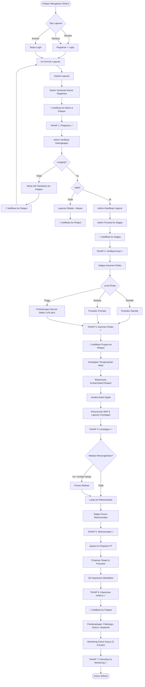

# PROJECT_MASTER.md — Master Project Blueprint

> **Sistem Informasi Laporan Pencegahan dan Penanganan Kekerasan Seksual (SILAPPKASAL)**
> Versi: 1.1.0 | Terakhir Diperbarui: 2026-06-09 | Status: BERLAKU

---

## Daftar Isi

1. [Visi Proyek](#1-visi-proyek)
2. [Scope Proyek](#2-scope-proyek)
3. [Stack Teknologi Final](#3-stack-teknologi-final)
4. [Arsitektur Tingkat Tinggi](#4-arsitektur-tingkat-tinggi)
5. [Role Pengguna](#5-role-pengguna)
6. [Workflow Bisnis](#6-workflow-bisnis)
7. [Keputusan Arsitektur yang Dibekukan](#7-keputusan-arsitektur-yang-dibekukan)
8. [Roadmap Pengembangan](#8-roadmap-pengembangan)
9. [Prioritas Pengembangan](#9-prioritas-pengembangan)
10. [Lingkungan Pengembangan](#10-lingkungan-pengembangan)
11. [Strategi Deployment](#11-strategi-deployment)
12. [Referensi](#12-referensi)

---

## 1. Visi Proyek

### 1.1 Pernyataan Visi

> Mewujudkan platform digital yang **aman, transparan, dan terpercaya** untuk pelaporan serta penanganan kekerasan seksual di lingkungan perguruan tinggi, dengan mengutamakan **perlindungan korban**, **kerahasiaan data**, dan **akuntabilitas proses**.

### 1.2 Misi

1. Menyediakan kanal pelaporan digital yang mudah diakses oleh seluruh sivitas akademika.
2. Memastikan setiap laporan diproses secara terstruktur, adil, dan tepat waktu sesuai SLA.
3. Memberikan transparansi kepada pelapor mengenai status dan progres kasusnya.
4. Mendukung operasional Satgas PPKS dengan sistem manajemen kasus yang komprehensif.
5. Melindungi data pribadi seluruh pihak sesuai regulasi yang berlaku (UU PDP, UU TPKS).
6. Menyediakan data statistik untuk pengambilan kebijakan pencegahan kekerasan seksual.

### 1.3 Peran Dokumen Ini

| Dokumen | Peran sebagai Source of Truth |
|---------|-------------------------------|
| **AGENTS.md** | Aturan, perilaku, coding standards, dan workflow agent |
| **PROJECT_MASTER.md** (dokumen ini) | Blueprint proyek, arsitektur, stack final, dan keputusan yang dibekukan |
| **PRD.md** | Kebutuhan produk, fitur, business rules, dan non-functional requirements |

### 1.4 Problem Statement

| Masalah | Dampak | Solusi SILAPPKASAL |
|---------|--------|-------------------|
| Pelaporan masih manual (surat, tatap muka) | Korban enggan melapor, proses lambat | Pelaporan digital 24/7 dengan opsi anonim |
| Tidak ada tracking progres kasus | Pelapor tidak tahu perkembangan | Dashboard tracking real-time |
| Data kasus tersebar di berbagai format | Sulit diaudit, rawan kehilangan | Sistem terpusat dengan audit trail |
| Kerahasiaan sulit dijaga | Korban merasa tidak aman | Encryption in transit, encryption at rest, field-level encryption, RBAC ketat |
| Satgas bekerja tanpa sistem terintegrasi | Koordinasi lambat, SLA terlewat | Dashboard operasional Satgas |
| Tidak ada data statistik terstruktur | Kebijakan pencegahan tidak berbasis data | Reporting & analytics terintegrasi |

### 1.5 Estimasi Kapasitas

| Metrik | Nilai |
|--------|-------|
| Total pengguna potensial | 3.000+ |
| Estimasi laporan per hari | ±30 |
| Estimasi laporan per bulan | ±900 |
| Concurrent users (peak) | ~300 |
| Data retention | Minimum 5 tahun |

---

## 2. Scope Proyek

### 2.1 Dalam Scope (In Scope)

| # | Fitur/Kapabilitas | Deskripsi |
|---|-------------------|-----------|
| 1 | Pelaporan Digital | Formulir laporan multi-jenis (terbuka, rahasia, anonim) |
| 2 | Manajemen Kasus | Lifecycle penuh dari laporan masuk hingga pemulihan |
| 3 | Dashboard Admin | Manajemen pengguna, verifikasi laporan, statistik |
| 4 | Dashboard Satgas | Manajemen kasus, asesmen, investigasi, rekomendasi |
| 5 | Tracking Kasus | Pelapor dapat memantau status kasusnya |
| 6 | Notifikasi | WhatsApp notification via Fonnte untuk status update |
| 7 | Manajemen Pengguna | CRUD pengguna, role assignment, akses kontrol |
| 8 | Audit Trail | Log seluruh aktivitas pada data kasus |
| 9 | File Management | Upload, penyimpanan, dan akses bukti digital |
| 10 | Statistik & Reporting | Dashboard statistik untuk pengambilan kebijakan |
| 11 | Komunikasi Internal | Pesan anonim antara pelapor dan Satgas |
| 12 | Aplikasi Mobile | Aplikasi Flutter untuk pelapor (Phase 2) |

### 2.2 Di Luar Scope (Out of Scope)

| # | Item | Alasan |
|---|------|--------|
| 1 | Video call / konsultasi online | Di luar kebutuhan MVP, pertimbangkan untuk versi mendatang |
| 2 | Integrasi ke SIA kampus | Membutuhkan koordinasi antar-sistem yang kompleks |
| 3 | AI-powered risk assessment | Pertimbangkan untuk versi mendatang |
| 4 | Multi-tenant (multi-kampus) | Fokus pada satu kampus terlebih dahulu |
| 5 | Payment gateway | Tidak relevan dengan proses pelaporan |
| 6 | Social media login | Security concern — hanya login institusional |

---

## 3. Stack Teknologi Final

> ⚠️ **KEPUTUSAN FINAL** — Stack berikut sudah dibekukan dan TIDAK BOLEH diubah tanpa persetujuan Project Owner.

> **Catatan untuk Web Agent**: Versi pasti library frontend (React, Vite, TailwindCSS, TanStack, dll.) ditentukan oleh `package.json` proyek Lovable. Selalu baca `package.json` sebelum menyimpulkan versi yang digunakan.

### 3.1 Diagram Stack

```
┌─────────────────────────────────────────────────────────────────────┐
│                         CLIENT LAYER                                │
│                                                                     │
│  ┌──────────────────────┐    ┌──────────────────────┐               │
│  │     Web Admin/Satgas  │    │    Mobile App         │              │
│  │  React + TypeScript   │    │    Flutter (Dart)     │              │
│  │  TanStack Router      │    │    Android & iOS      │              │
│  │  TanStack Query       │    │    Phase 2             │              │
│  │  shadcn/ui + Radix    │    │                       │              │
│  │  TailwindCSS          │    │                       │              │
│  └──────────┬───────────┘    └──────────┬────────────┘              │
│             │                           │                            │
└─────────────┼───────────────────────────┼────────────────────────────┘
              │         HTTPS/REST        │
              ▼                           ▼
┌─────────────────────────────────────────────────────────────────────┐
│                         API LAYER                                   │
│                                                                     │
│  ┌──────────────────────────────────────────────────────────┐       │
│  │              Laravel REST API (PHP 8.2+)                  │      │
│  │                                                           │      │
│  │  ├── Authentication (Sanctum)                             │      │
│  │  ├── Authorization (Gates/Policies)                       │      │
│  │  ├── Rate Limiting                                        │      │
│  │  ├── Input Validation (FormRequest)                       │      │
│  │  ├── Business Logic (Services)                            │      │
│  │  ├── Data Access (Repositories)                           │      │
│  │  └── API Versioning (/api/v1/...)                         │      │
│  └──────────────────────────────────────────────────────────┘       │
│                                                                     │
└──────────┬──────────────────┬────────────────────┬──────────────────┘
           │                  │                    │
           ▼                  ▼                    ▼
┌──────────────────┐ ┌────────────────┐ ┌─────────────────────┐
│   PostgreSQL 16  │ │ S3 Compatible  │ │  WhatsApp Fonnte    │
│                  │ │    Storage     │ │                     │
│  - User data     │ │  - Bukti foto  │ │  - Notifikasi       │
│  - Report data   │ │  - Bukti video │ │  - Status update    │
│  - Case data     │ │  - Dokumen     │ │  - Reminder SLA     │
│  - Audit logs    │ │  - Backup      │ │                     │
│  - Encrypted     │ │                │ │                     │
└──────────────────┘ └────────────────┘ └─────────────────────┘
```

### 3.2 Detail Stack

#### Backend

| Komponen | Teknologi | Versi | Justifikasi |
|----------|-----------|-------|-------------|
| Framework | Laravel | 11+ | Ecosystem matang, ORM kuat, middleware built-in |
| Language | PHP | 8.2+ | Type system modern, performance baik |
| Database | PostgreSQL | 16+ | ACID compliance, JSON support, full-text search |
| Auth | Laravel Sanctum | Latest | Token-based auth, lightweight, sesuai SPA/mobile |
| Queue | Laravel Queue | Built-in | Job processing untuk notifikasi, email |
| Cache | Redis (opsional) | Latest | Session cache, query cache (jika dibutuhkan) |
| Storage | S3 Compatible | — | AWS S3 / Cloudflare R2 / MinIO |
| Notification | Fonnte API | — | WhatsApp gateway untuk notifikasi Indonesia |

#### Frontend (Web Admin/Satgas)

> **Versi aktual ditentukan oleh `package.json`.** Tabel di bawah menunjukkan stack yang dipilih, bukan versi pasti.

| Komponen | Teknologi | Versi | Justifikasi |
|----------|-----------|-------|-------------|
| Framework | React | Lihat `package.json` | Ecosystem terbesar, component-based |
| Language | TypeScript | Lihat `package.json` | Type safety, better DX |
| Routing | TanStack Router | Lihat `package.json` | Type-safe routing, file-based |
| Data Fetching | TanStack Query | Lihat `package.json` | Server state management, caching, mutations |
| Styling | TailwindCSS | Lihat `package.json` | Utility-first, productive |
| UI Components | shadcn/ui + Radix UI | Lihat `package.json` | Accessible, customizable |
| Forms | React Hook Form + Zod | Lihat `package.json` | Performant forms, schema validation |
| Charts | Recharts | Lihat `package.json` | React-native charting |
| Build Tool | Vite | Lihat `package.json` | Fast HMR, modern bundling |
| SSR Framework | TanStack Start | Lihat `package.json` | SSR support, Lovable-generated |

#### Mobile (Phase 2)

| Komponen | Teknologi | Versi | Justifikasi |
|----------|-----------|-------|-------------|
| Framework | Flutter | 3.x | Cross-platform, performant |
| Language | Dart | Latest | Null safety, async support |
| State Management | TBD (Phase 2) | — | Akan ditentukan saat Phase 2 |
| HTTP Client | Dio / http | — | Akan ditentukan saat Phase 2 |
| Secure Storage | flutter_secure_storage | — | Untuk token & data sensitif |

---

## 4. Arsitektur Tingkat Tinggi

### 4.1 Arsitektur Pattern

```
┌─────────────────────────────────────────────────────┐
│                  PRESENTATION LAYER                  │
│  Web (React)  │  Mobile (Flutter)  │  API Consumer   │
└───────────────┼────────────────────┼─────────────────┘
                │    REST API (JSON) │
                ▼                    ▼
┌─────────────────────────────────────────────────────┐
│                 APPLICATION LAYER                    │
│                                                     │
│  Controllers ──► Services ──► Repositories          │
│       │              │              │                │
│  FormRequest     Events/        Eloquent ORM        │
│  (Validation)    Listeners      (Data Access)       │
│                  (Side Effects)                      │
└───────────────────────┬─────────────────────────────┘
                        │
┌───────────────────────┼─────────────────────────────┐
│               INFRASTRUCTURE LAYER                   │
│                       │                              │
│  PostgreSQL    S3 Storage    Fonnte API    Queue     │
│  (Data)        (Files)       (WhatsApp)   (Jobs)    │
└─────────────────────────────────────────────────────┘
```

### 4.2 Design Patterns yang Digunakan

| Pattern | Penerapan |
|---------|-----------|
| **Repository Pattern** | Abstraksi data access dari business logic |
| **Service Pattern** | Enkapsulasi business logic, dipanggil dari controller |
| **Observer Pattern** | Laravel Events & Listeners untuk side effects (notifikasi, audit) |
| **Strategy Pattern** | Notification channels (WhatsApp, email, in-app) |
| **Factory Pattern** | Laravel Factories untuk testing |
| **Middleware Pattern** | Request pipeline (auth, rate limit, logging) |
| **DTO/Resource Pattern** | Transformasi data response menggunakan API Resources |

### 4.3 API Versioning Strategy

```
Base URL: /api/v1/

Versioning: URI-based
  /api/v1/reports
  /api/v1/cases
  /api/v2/reports  (ketika breaking change diperlukan)

Rules:
  - v1 akan tetap aktif hingga semua client bermigrasi
  - Deprecation notice diberikan minimal 3 bulan sebelum sunset
  - Backward-compatible changes tidak membutuhkan versi baru
```

---

## 5. Role Pengguna

### 5.1 Matriks Role

| Role | Deskripsi | Platform Akses | Jumlah Estimasi |
|------|-----------|---------------|-----------------|
| **Super Admin** | Pengelola seluruh sistem, termasuk konfigurasi dan manajemen admin | Web | 1–2 |
| **Admin Sistem** | Verifikasi laporan, manajemen pengguna, routing kasus, statistik | Web | 3–5 |
| **Satgas PPKS** | Penanganan kasus: asesmen, investigasi, rekomendasi, monitoring | Web | 5–10 |
| **Pelapor** | Membuat laporan, memantau status kasus | Mobile, Web (tester) | 3.000+ |

### 5.2 Matriks Akses per Role

| Fitur | Super Admin | Admin | Satgas | Pelapor |
|-------|:-----------:|:-----:|:------:|:-------:|
| Konfigurasi sistem | ✅ | ❌ | ❌ | ❌ |
| Manajemen admin & satgas | ✅ | ❌ | ❌ | ❌ |
| Manajemen pengguna | ✅ | ✅ | ❌ | ❌ |
| Verifikasi laporan masuk | ✅ | ✅ | ❌ | ❌ |
| Meneruskan laporan ke Satgas | ✅ | ✅ | ❌ | ❌ |
| Statistik & reporting | ✅ | ✅ | 📊 (limited) | ❌ |
| Asesmen risiko | ❌ | ❌ | ✅ | ❌ |
| Investigasi kasus | ❌ | ❌ | ✅ | ❌ |
| Rekomendasi penanganan | ❌ | ❌ | ✅ | ❌ |
| Monitoring pasca kasus | ❌ | ❌ | ✅ | ❌ |
| Membuat laporan | ❌ | ❌ | ❌ | ✅ |
| Tracking status kasus sendiri | ❌ | ❌ | ❌ | ✅ |
| Menerima notifikasi | ❌ | ✅ | ✅ | ✅ |
| Audit log (view) | ✅ | 📊 (limited) | ❌ | ❌ |

> 📊 = Akses terbatas (filtered berdasarkan scope).

### 5.3 Detail Setiap Role

#### Super Admin

- Memiliki akses penuh ke seluruh fitur sistem.
- Mengelola akun Admin dan Satgas.
- Mengonfigurasi parameter sistem (SLA thresholds, notification templates, dll.).
- Melihat seluruh audit log.
- TIDAK terlibat langsung dalam penanganan kasus.

#### Admin Sistem

- Menerima dan memverifikasi kelengkapan laporan masuk.
- Mengklasifikasikan urgensi laporan.
- Meneruskan laporan ke Satgas PPKS.
- Mengelola akun pelapor.
- Membuat laporan statistik berkala.
- **Larangan**: Mengubah isi laporan, membocorkan identitas pelapor, mengakses data investigasi.

#### Satgas PPKS

- Menerima laporan yang sudah diverifikasi dari Admin.
- Melakukan asesmen risiko (rendah/sedang/tinggi).
- Menjalankan investigasi (wawancara, pengumpulan bukti).
- Menyusun rekomendasi penanganan.
- Mendampingi korban hingga proses selesai.
- Memonitor pasca-kasus.
- **Larangan**: Mengelola pengguna, mengakses data kasus di luar yang ditugaskan.

#### Pelapor

- Membuat laporan baru (terbuka, rahasia, atau anonim).
- Mengisi formulir: kronologi, waktu, lokasi, pihak terlibat, bukti.
- Menerima nomor registrasi kasus.
- Memantau progres kasus melalui dashboard/kode pelacakan.
- Menerima notifikasi WhatsApp untuk setiap perubahan status.
- Berkomunikasi dengan Satgas melalui fitur pesan internal.

---

## 6. Workflow Bisnis

### 6.1 Alur Utama Penanganan Kasus



### 6.2 SLA per Tahap

| Tahap | Nama | Target SLA | Penanggung Jawab |
|-------|------|------------|-----------------|
| 1 | Pelaporan | Real-time (otomatis) | Sistem |
| 2 | Verifikasi Awal | Maks 2 hari kerja | Admin |
| 3 | Asesmen Risiko | Maks 5 hari kerja | Satgas |
| — | Perlindungan Darurat | Maks 1 × 24 jam | Satgas |
| 4 | Investigasi | 14–30 hari kerja | Satgas |
| 5 | Rekomendasi | Maks 7 hari kerja | Satgas |
| 6 | Keputusan Institusi | Maks 14 hari kerja | Pimpinan PT |
| 7 | Monitoring Pasca Kasus | 3–6 bulan | Satgas |

### 6.3 Status Kasus

```
submitted       → Laporan dikirim pelapor
under_review    → Admin sedang memverifikasi
need_info       → Butuh informasi tambahan dari pelapor
rejected        → Laporan ditolak (dengan alasan)
forwarded       → Diteruskan ke Satgas
assessment      → Satgas melakukan asesmen risiko
investigation   → Proses investigasi berjalan
mediation       → Proses mediasi (opsional)
recommendation  → Satgas menyusun rekomendasi
decision        → Menunggu keputusan pimpinan
decided         → Keputusan sudah dikeluarkan
recovery        → Tahap pemulihan & pendampingan
monitoring      → Monitoring pasca kasus
closed          → Kasus selesai
escalated       → Kasus dieskalasi ke pihak luar
```

### 6.4 Jenis Laporan

| Jenis | Identitas Pelapor | Login Required | Akses Satgas ke Identitas | Komunikasi |
|-------|-------------------|:--------------:|:-------------------------:|------------|
| **Terbuka** | Diketahui | Ya | Ya | Langsung |
| **Rahasia** | Dilindungi | Ya | Ya (terbatas) | Via sistem (field-level encrypted) |
| **Anonim** | Tersembunyi | Tidak | Tidak | Via pesan anonim (kode tracking) |

---

## 7. Keputusan Arsitektur yang Dibekukan

> ⛔ Keputusan berikut bersifat **FINAL** dan tidak boleh diubah tanpa persetujuan eksplisit dari Project Owner.

### 7.1 Keputusan Teknologi

| # | Keputusan | Status | Tanggal | Alasan |
|---|-----------|--------|---------|--------|
| ADR-001 | Backend menggunakan Laravel REST API | 🔒 FINAL | 2026-06-09 | Ecosystem PHP matang, sesuai kebutuhan tim |
| ADR-002 | Frontend menggunakan React + TypeScript (Lovable-generated) | 🔒 FINAL | 2026-06-09 | Lovable-generated, TanStack ecosystem |
| ADR-003 | Mobile menggunakan Flutter | 🔒 FINAL | 2026-06-09 | Cross-platform, single codebase |
| ADR-004 | Database menggunakan PostgreSQL | 🔒 FINAL | 2026-06-09 | ACID, JSON support, mature |
| ADR-005 | Notifikasi via WhatsApp (Fonnte) | 🔒 FINAL | 2026-06-09 | Penetrasi tinggi di Indonesia |
| ADR-006 | Storage menggunakan S3 Compatible | 🔒 FINAL | 2026-06-09 | Standar industri, migrasi mudah |

### 7.2 Keputusan Arsitektur

| # | Keputusan | Status | Tanggal | Alasan |
|---|-----------|--------|---------|--------|
| ADR-007 | Backend adalah Source of Truth | 🔒 FINAL | 2026-06-09 | Single source untuk logika bisnis dan validasi |
| ADR-008 | API-first development | 🔒 FINAL | 2026-06-09 | Kontrak jelas antara frontend dan backend |
| ADR-009 | Localhost-first development | 🔒 FINAL | 2026-06-09 | Produktivitas tinggi, no dependency on cloud |
| ADR-010 | Phase-based delivery (Backend → Web → Flutter) | 🔒 FINAL | 2026-06-09 | Mengurangi risiko integrasi |
| ADR-011 | Multi-agent AI development | 🔒 FINAL | 2026-06-09 | Separation of concerns, parallel development |
| ADR-012 | Stateless API with token auth | 🔒 FINAL | 2026-06-09 | Scalable, mobile-friendly |

### 7.3 Keputusan Keamanan

| # | Keputusan | Status | Tanggal | Alasan |
|---|-----------|--------|---------|--------|
| ADR-013 | Field-level encryption untuk data sensitif (AES-256) | 🔒 FINAL | 2026-06-09 | Perlindungan data korban per kolom |
| ADR-014 | RBAC untuk authorization | 🔒 FINAL | 2026-06-09 | Granular access control |
| ADR-015 | Audit log untuk semua operasi kasus | 🔒 FINAL | 2026-06-09 | Compliance, accountability |
| ADR-016 | Password hashing (Argon2id/Bcrypt) | 🔒 FINAL | 2026-06-09 | Industry standard |
| ADR-017 | Encryption in transit (TLS 1.3) + encryption at rest | 🔒 FINAL | 2026-06-09 | Perlindungan data dalam komunikasi dan penyimpanan |

---

## 8. Roadmap Pengembangan

### 8.1 Timeline Overview

```
Phase 0: Foundation       ← CURRENT
├── Dokumentasi proyek (AGENTS.md, PROJECT_MASTER.md, PRD.md)
├── Database schema design (DATABASE_SCHEMA.md)
├── API specification design (API_SPECIFICATION.md)
└── Project scaffolding

Phase 1: Core Platform    ← NEXT
├── Sprint 1.1: Auth & User Management
├── Sprint 1.2: Report Submission
├── Sprint 1.3: Case Management (Satgas)
├── Sprint 1.4: Dashboard & Statistics
├── Sprint 1.5: Notification System
└── Sprint 1.6: Integration Testing & Polish

Phase 2: Mobile App
├── Sprint 2.1: Flutter Setup & Auth
├── Sprint 2.2: Report Submission (Mobile)
├── Sprint 2.3: Case Tracking (Mobile)
├── Sprint 2.4: Push Notification
└── Sprint 2.5: Offline Support & Polish

Phase 3: Enhancement (Post-MVP)
├── Advanced Analytics
├── Bulk Export/Import
├── Multi-language Support
├── Advanced Search
└── Performance Optimization
```

### 8.2 Phase 1 Detail — Core Platform

#### Sprint 1.1: Authentication & User Management

| # | Task | Agent | Prioritas |
|---|------|-------|-----------|
| 1 | Implementasi auth endpoints (login, logout, refresh) | Backend | P0 |
| 2 | Implementasi RBAC (roles, permissions) | Backend | P0 |
| 3 | User CRUD endpoints | Backend | P0 |
| 4 | Password reset flow | Backend | P1 |
| 5 | Login page & auth flow (Web) | Web | P0 |
| 6 | User management page (Web) | Web | P0 |
| 7 | Role assignment UI (Web) | Web | P1 |

#### Sprint 1.2: Report Submission

| # | Task | Agent | Prioritas |
|---|------|-------|-----------|
| 1 | Report submission endpoint | Backend | P0 |
| 2 | File upload endpoint (S3) | Backend | P0 |
| 3 | Report types (terbuka, rahasia, anonim) | Backend | P0 |
| 4 | Anonymous report flow | Backend | P0 |
| 5 | Report tracking endpoint | Backend | P0 |
| 6 | Report form (Web Pelapor Tester) | Web | P0 |
| 7 | Report tracking page (Web) | Web | P0 |
| 8 | File upload UI | Web | P0 |

#### Sprint 1.3: Case Management (Satgas)

| # | Task | Agent | Prioritas |
|---|------|-------|-----------|
| 1 | Case lifecycle endpoints | Backend | P0 |
| 2 | Verification & forwarding flow | Backend | P0 |
| 3 | Risk assessment endpoints | Backend | P0 |
| 4 | Investigation management | Backend | P0 |
| 5 | Recommendation endpoints | Backend | P1 |
| 6 | Internal messaging system | Backend | P1 |
| 7 | Case management dashboard (Web) | Web | P0 |
| 8 | Risk assessment form (Web) | Web | P0 |
| 9 | Investigation management UI (Web) | Web | P0 |
| 10 | Case timeline view (Web) | Web | P1 |

#### Sprint 1.4: Dashboard & Statistics

| # | Task | Agent | Prioritas |
|---|------|-------|-----------|
| 1 | Statistics aggregation endpoints | Backend | P1 |
| 2 | SLA monitoring endpoints | Backend | P1 |
| 3 | Admin dashboard (Web) | Web | P1 |
| 4 | Satgas dashboard (Web) | Web | P1 |
| 5 | Charts & reporting UI | Web | P1 |

#### Sprint 1.5: Notification System

| # | Task | Agent | Prioritas |
|---|------|-------|-----------|
| 1 | Fonnte WhatsApp integration | Backend | P1 |
| 2 | Notification templates | Backend | P1 |
| 3 | Notification trigger on status change | Backend | P1 |
| 4 | SLA breach notification | Backend | P2 |
| 5 | In-app notification UI | Web | P2 |

#### Sprint 1.6: Integration Testing & Polish

| # | Task | Agent | Prioritas |
|---|------|-------|-----------|
| 1 | End-to-end testing | Backend + Web | P0 |
| 2 | Security audit | Reviewer | P0 |
| 3 | Performance testing | Reviewer | P1 |
| 4 | Bug fixes & polish | All | P0 |
| 5 | Documentation finalization | Documentation | P1 |

---

## 9. Prioritas Pengembangan

### 9.1 Klasifikasi Fitur

| Klasifikasi | Definisi | Contoh |
|-------------|----------|--------|
| **MVP Core** | Fitur minimum agar sistem bisa beroperasi. Tanpa ini, sistem tidak berguna. | Auth, submit laporan, verifikasi, case lifecycle, file upload, asesmen risiko, investigasi |
| **MVP Extended** | Fitur penting untuk operasional penuh. Sistem bisa beroperasi tanpa ini, tapi belum ideal. | Dashboard, statistik, notifikasi WhatsApp, internal messaging, rekomendasi, case timeline |
| **Post-MVP** | Fitur tambahan yang meningkatkan pengalaman. Dijadwalkan setelah MVP stabil. | SLA monitoring UI, audit log viewer, export PDF/CSV |

### 9.2 Prioritas Fitur (MoSCoW)

| Prioritas | Label | Definisi | Mapping Klasifikasi |
|-----------|-------|----------|---------------------|
| **P0** | Must Have | Wajib ada untuk MVP. Sistem tidak berfungsi tanpa ini. | MVP Core |
| **P1** | Should Have | Sangat penting, tetapi sistem bisa berjalan tanpa ini di awal. | MVP Extended |
| **P2** | Could Have | Nice to have, ditambahkan jika waktu memungkinkan. | Post-MVP |
| **P3** | Won't Have (Now) | Tidak dikerjakan di phase ini, masuk backlog. | Post-MVP / Future |

### 9.3 Urutan Prioritas Implementasi

```
MVP CORE (P0 — Fondasi):
  1. Authentication & Authorization
  2. Report Submission (3 jenis)
  3. Case Lifecycle Management
  4. File Upload & Storage
  5. Report Tracking
  6. Risk Assessment
  7. Investigation Management
  8. Audit Log (backend)
  9. Field-level Encryption

MVP EXTENDED (P1 — Operasional):
  10. Recommendation System
  11. Dashboard & Statistics
  12. WhatsApp Notification
  13. Internal Messaging
  14. Case Timeline

POST-MVP (P2 — Enhancement):
  15. SLA Monitoring & Alerts UI
  16. In-app Notifications
  17. Advanced Search & Filter
  18. Audit Log Viewer
  19. Export PDF/CSV

FUTURE (P3 — Backlog):
  20. Bulk Export/Report
  21. Multi-language
  22. Advanced Analytics
```

---

## 10. Lingkungan Pengembangan

### 10.1 Development Environment (Localhost First)

```
Backend:
  PHP 8.2+
  Composer
  Laravel 11+
  PostgreSQL 16+
  Redis (opsional, untuk queue)
  MinIO (local S3 replacement)

Frontend:
  Node.js 20+
  npm / bun
  Vite (versi sesuai package.json)

Mobile (Phase 2):
  Flutter SDK 3.x
  Android Studio / VS Code
  Xcode (untuk iOS)
```

### 10.2 Environment Variables

```
# Backend (.env) — JANGAN PERNAH COMMIT FILE INI
APP_NAME=SILAPPKASAL
APP_ENV=local
APP_DEBUG=true
APP_URL=http://localhost:8000

DB_CONNECTION=pgsql
DB_HOST=127.0.0.1
DB_PORT=5432
DB_DATABASE=silappkasal
DB_USERNAME=silappkasal_user
DB_PASSWORD=<secret>

# S3 Compatible Storage
AWS_ACCESS_KEY_ID=<secret>
AWS_SECRET_ACCESS_KEY=<secret>
AWS_DEFAULT_REGION=ap-southeast-1
AWS_BUCKET=silappkasal-evidence
AWS_ENDPOINT=<minio-url-for-local>
AWS_USE_PATH_STYLE_ENDPOINT=true

# Fonnte WhatsApp
FONNTE_API_TOKEN=<secret>
FONNTE_DEVICE_ID=<secret>

# Encryption
APP_KEY=<secret>
ENCRYPTION_KEY=<secret>

# Frontend (.env)
VITE_API_BASE_URL=http://localhost:8000/api/v1
```

---

## 11. Strategi Deployment

> **Catatan**: Deployment detail yang lebih lengkap akan didokumentasikan di dokumen terpisah saat memasuki fase deployment. Saat ini fokus pada localhost-first development.

### 11.1 Deployment Target

| Fase | Lingkungan | Infrastruktur |
|------|-----------|---------------|
| Development | Localhost | Mesin developer |
| Staging | VPS | VPS tunggal untuk testing |
| Production | VPS | VPS dengan backup strategy |

### 11.2 Deployment Architecture (VPS)

```
VPS Server
├── Nginx (Reverse Proxy + SSL)
│   ├── api.silappkasal.ac.id → Laravel (PHP-FPM)
│   └── admin.silappkasal.ac.id → React (Static Files)
├── PostgreSQL
├── Redis (Queue & Cache)
├── MinIO / S3 Client
├── Supervisor (Queue Worker)
└── Certbot (Let's Encrypt SSL)
```

### 11.3 Backup Strategy

| Data | Frekuensi | Retention | Lokasi |
|------|-----------|-----------|--------|
| Database (full) | Harian | 30 hari | Off-site storage |
| Database (incremental) | Per 6 jam | 7 hari | Local + off-site |
| File bukti (S3) | Real-time (S3 replication) | Permanent | S3 compatible |
| Configuration | Setiap perubahan | Version controlled | Git |

---

## 12. Referensi

### 12.1 Dokumen Terkait

| Dokumen | Lokasi | Deskripsi |
|---------|--------|-----------|
| AGENTS.md | `docs/AGENTS.md` | Aturan dan standar AI Agent |
| PRD.md | `docs/PRD.md` | Product Requirements Document |
| MASTER_DATA.md | `docs/MASTER_DATA.md` | SOP bisnis dan alur penanganan (akan dibuat) |
| API_SPECIFICATION.md | `docs/API_SPECIFICATION.md` | Spesifikasi & kontrak API (akan dibuat) |
| DATABASE_SCHEMA.md | `docs/DATABASE_SCHEMA.md` | Skema database (akan dibuat) |
| AUTH_FLOW.md | `docs/AUTH_FLOW.md` | Alur autentikasi dan otorisasi (akan dibuat) |
| SECURITY_POLICY.md | `docs/SECURITY_POLICY.md` | Kebijakan keamanan (akan dibuat) |
| DEVELOPMENT_WORKFLOW.md | `docs/DEVELOPMENT_WORKFLOW.md` | Workflow pengembangan dan testing (akan dibuat) |

### 12.2 Regulasi Acuan

- **Permendikbudristek No. 30 Tahun 2021** — Pencegahan dan Penanganan Kekerasan Seksual di Lingkungan Perguruan Tinggi.
- **UU No. 12 Tahun 2022** — Tindak Pidana Kekerasan Seksual (UU TPKS).
- **UU No. 27 Tahun 2022** — Pelindungan Data Pribadi (UU PDP).
- **Permendikbudristek No. 24 Tahun 2024** — Perubahan Permendikbudristek No. 30 Tahun 2021.

### 12.3 Master Data

- **SILAPPKASAL Master Data** — SOP pelaporan, alur penanganan kasus 7 tahap, SLA, mekanisme investigasi, mediasi, eskalasi, ketentuan laporan anonim, dan perlindungan data. Akan didokumentasikan di `docs/MASTER_DATA.md`.

---

> **Catatan**: Dokumen ini adalah **living document** yang dikelola oleh Project Owner. Versi terbaru selalu menjadi acuan. Agent TIDAK BOLEH memodifikasi dokumen ini.
