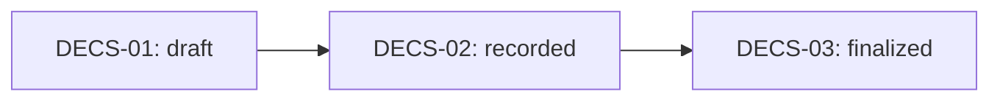

# Milestone 29 — Decision Workflow

> **Historical planning record.** The implemented authority and formal-number behavior are
> superseded by [REV-DECISION-CODE-01](./REV_DECISION_CODE_01.md). Current behavior is:
> only an active same-campus Admin may mutate Decisions; Super Admin is metadata-only;
> `decision_number` is server-issued on `recorded -> finalized`; finalization advances the
> Case to `decided`; Reporter has no Decision access. Statements below that allow Super Admin
> mutation, client-authored numbers, full sensitive oversight, or no Case transition describe
> the original M29 proposal and are retained only as historical context.

> Phase: M29  
> Status: PLANNING  
> Date: 2026-06-23  
> Depends on: M28 (Recommendation Workflow) ✅ Complete

---

## 1. Objectives

Activate the Decision Workflow end-to-end, matching **SOP Tahap 6 — Keputusan Institusi**:

1. Enable Admin and Super Admin (representing **Pimpinan Kampus**) to create, update, and finalize decisions for submitted recommendations.
2. Add a `status-options` endpoint for decisions (following M27/M28 pattern).
3. Add audit logging for all decision mutations.
4. Add notifications for decision creation and status changes.
5. When a decision is created, update the parent recommendation status to reflect the decision outcome (`accepted`, `partially_accepted`, or `rejected`).
6. Activate the decision creation and status transition UI in the frontend.
7. Ensure Satgas remains read-only for decisions.
8. Ensure Reporter has zero decision access.
9. Do not introduce any M30 Recovery Workflow logic.

---

## 2. Business Workflow

Per SOP Tahap 6 — Keputusan Institusi:

```
Recommendation (submitted_to_leader)
    ↓
Decision Created by Pimpinan Kampus (Super Admin) or Admin
    ↓
Decision Draft → Recorded → Finalized
    ↓
On finalization: recommendation status updated, Satgas notified
    ↓
Case ready for Recovery (M30 — out of scope)
```

### Business Rules

1. A decision can only be created when:
   - Recommendation status = `submitted_to_leader`
   - Case status = `decision`
   - No existing decision for that recommendation
2. Decision records an institutional outcome: `accepted`, `partially_accepted`, `rejected`, or `deferred`.
3. Decision includes: `decision_number` (SK number, nullable), `decision_date`, `decision_summary`, `decision_content`.
4. Decision content is institutional output — both Admin and Super Admin may read full content.
5. On decision creation, the recommendation status should be updated to the corresponding decision-only status (`accepted`, `partially_accepted`, `rejected`).
6. `finalized` is terminal — no further transitions allowed.
7. Decision does NOT mutate case status or close the case.

---

## 3. Actors Involved

| Actor | Capabilities |
|---|---|
| **Super Admin** (Pimpinan Kampus) | Create, update, finalize decisions. Full read access. |
| **Admin** | Create, update, finalize decisions. Full read access. |
| **Satgas PPKS** | Read-only for decisions on assigned cases. Cannot create, update, or transition. |
| **Reporter** | No access to decisions. |

> [!IMPORTANT]
> "Pimpinan Kampus" is represented by the existing **Super Admin** role. No new role is introduced.

---

## 4. State/Status Transitions

Decision statuses are already seeded in master data:



| Code | Name | Valid Transitions | Terminal? |
|---|---|---|---|
| `DECS-01` | `draft` | → `recorded` | No |
| `DECS-02` | `recorded` | → `finalized` | No |
| `DECS-03` | `finalized` | (none) | **Yes** |

### Side Effects

| Event | Side Effect |
|---|---|
| Decision created | Recommendation status updated to decision-only status (`accepted`/`partially_accepted`/`rejected`) based on `outcome_code`. Audit log recorded. Notification dispatched. |
| Decision updated | Audit log recorded. |
| Decision status → `finalized` | `finalized_at` timestamp set. Existing `decisionFinalized` notification dispatched (NOTIF-15). Audit log recorded. |

---

## 5. Backend Scope

### M29-A: Backend Changes

#### [MODIFY] `DecisionService.php`

- Add audit logging to `createForRecommendation()`, `update()`, and `updateStatus()`.
- On `createForRecommendation()`: update recommendation status to the corresponding decision-only value based on `outcome_code`.
- Add `statusOptions()` method following M27/M28 pattern.
- Add notification dispatch for `decisionCreated` and `decisionStatusChanged`.

#### [MODIFY] `DecisionController.php`

- Add `statusOptions()` action.

#### [MODIFY] `NotificationService.php`

- Add `decisionCreated()` method → notify assigned Satgas (NOTIF-18).
- Add `decisionStatusChanged()` method → notify assigned Satgas (NOTIF-19).
- Existing `decisionFinalized()` already notifies Satgas via NOTIF-15.

#### [MODIFY] `MasterDataSeeder.php`

- Add `NOTIF-18` (Decision created) and `NOTIF-19` (Decision status changed) notification types.

#### [MODIFY] `AuditLogService.php`

- Add `decision_summary` and `decision_body` to `sensitiveKeyFragments` if not already present.
  - `decision_summary` → already covered by existing fragment `decision_summary`.
  - `decision_content` → check if covered by `content` fragment.

#### [MODIFY] `routes/api.php`

- Add `GET /api/v1/decisions/{decision}/status-options` route.

#### [MODIFY] `RecommendationService.php`

- On decision creation, the recommendation status must be updated to the decision-only value. This can be triggered from `DecisionService` calling into `RecommendationService`, or done directly in `DecisionService`.

---

## 6. Frontend Scope

### M29-B: Frontend Changes

#### [NEW] `frontend/src/components/workflow-actions/decision-create-action.tsx`

- Dialog form for creating a decision.
- Fields: `outcome_code` (select from `DecisionOutcome` values), `decision_number` (optional), `decision_date`, `decision_summary`, `decision_content`.
- Only visible when `canManageInstitutionalActions` is true.

#### [NEW] `frontend/src/components/workflow-actions/decision-status-action.tsx`

- Dialog for decision status transitions.
- Fetches valid transitions from `GET /decisions/{id}/status-options`.
- Only visible when `canManageInstitutionalActions` is true.

#### [MODIFY] `frontend/src/routes/dashboard.cases.$id.tsx`

- Replace `DisabledWorkflowAction` for decision status with `DecisionStatusAction`.
- Add `DecisionCreateAction` button in the Actions sidebar (when case status = `decision`, recommendation = `submitted_to_leader`, no existing decision).
- Wire `canManageInstitutionalActions` to decision create/status actions.

#### [MODIFY] `frontend/src/lib/operations-api.ts`

- Add `getDecisionStatusOptions()` function.
- Add `createDecision()` function (already exists as stub — verify).
- Add `updateDecisionStatus()` function (already exists as stub — verify).
- Add `operationsQueryKeys.decisionStatusOptions()`.

#### [MODIFY] `frontend/src/lib/operations-types.ts`

- Add `DecisionCreatePayload` interface.
- Add `DecisionStatusPayload` interface (verify if exists).
- Add `DecisionStatusOption` and `DecisionStatusOptions` interfaces.

---

## 7. Database Changes

**None.** All tables and master data already exist from M9 foundation:

- `decisions` ✅
- `decision_statuses` ✅ (with `valid_transitions`)
- `decision_status_histories` ✅
- Permission `cases.record_decision` ✅ (assigned to `admin` and `super_admin`)

Only seeder additions: `NOTIF-18` and `NOTIF-19` notification types.

---

## 8. API Endpoints

| Method | Endpoint | Status | Actor |
|---|---|---|---|
| `POST /api/v1/recommendations/{recommendation}/decisions` | **Existing** | Admin, Super Admin |
| `GET /api/v1/recommendations/{recommendation}/decisions` | **Existing** | Admin, Super Admin, Assigned Satgas |
| `GET /api/v1/decisions/{decision}` | **Existing** | Admin, Super Admin, Assigned Satgas |
| `PATCH /api/v1/decisions/{decision}` | **Existing** | Admin, Super Admin |
| `PATCH /api/v1/decisions/{decision}/status` | **Existing** | Admin, Super Admin |
| `GET /api/v1/decisions/{decision}/status-options` | **New** | Admin, Super Admin (via `view` policy) |

---

## 9. Permissions Required

| Permission | Roles | Purpose |
|---|---|---|
| `cases.record_decision` | `admin`, `super_admin` | Create, update, finalize decisions |
| `cases.read.assigned` | `satgas_ppks` | Read-only decision detail for assigned cases |

No new permissions needed.

---

## 10. Notifications

| Event | Type Code | Recipients | Payload |
|---|---|---|---|
| Decision created | `NOTIF-18` | Assigned Satgas | `case_id`, `recommendation_id`, `decision_id`, `status_code`, `outcome_code` |
| Decision status changed | `NOTIF-19` | Assigned Satgas | `case_id`, `recommendation_id`, `decision_id`, `status_code`, `outcome_code` |
| Decision finalized | `NOTIF-15` | Assigned Satgas (existing) | Already implemented in M17 |

> [!NOTE]
> `NOTIF-15` (`decisionFinalized`) already exists and works. M29 adds `NOTIF-18` and `NOTIF-19` for non-finalized decision events.

---

## 11. Audit Requirements

| Action | Audit Event | Category | Sensitive Fields Redacted |
|---|---|---|---|
| Decision created | `decision.created` | `recommendation` | `decision_summary`, `decision_content` |
| Decision updated | `decision.updated` | `recommendation` | `decision_summary`, `decision_content` |
| Decision status changed | `decision.status_changed` | `recommendation` | — (status-only) |

> [!IMPORTANT]
> `AuditAction::DecisionCreated`, `AuditAction::DecisionUpdated`, and `AuditAction::DecisionStatusChanged` already exist in the enum. Audit logging just needs to be wired in `DecisionService`.

---

## 12. Acceptance Criteria

### Backend

1. `GET /decisions/{decision}/status-options` returns current status and valid transitions for actors with `view` policy.
2. Admin/Super Admin see valid transitions; Satgas sees current status only with empty `valid_transitions`.
3. Decision creation requires: recommendation = `submitted_to_leader`, case = `decision`, no existing decision.
4. On decision creation, recommendation status updated to `accepted`/`partially_accepted`/`rejected` based on `outcome_code`.
5. Decision update restricted to `draft` status only.
6. `finalized` is terminal — no further transitions.
7. Audit logs recorded for all three mutation events with narrative redaction.
8. `NOTIF-18` dispatched on creation to assigned Satgas.
9. `NOTIF-19` dispatched on status change to assigned Satgas (excluding finalized which uses existing NOTIF-15).
10. Reporter receives 403 on all decision endpoints.
11. Satgas receives 403 on create/update/status-change.
12. No case status mutation or case closing.
13. No recovery workflow introduced.
14. Full test suite passes.

### Frontend

15. `DecisionCreateAction` visible only to Admin/Super Admin when preconditions met.
16. `DecisionStatusAction` replaces disabled placeholder, fetches from status-options endpoint.
17. Satgas sees decisions read-only without create/status buttons.
18. Reporter gains no decision access.
19. `npm run build` passes.

---

## 13. Risks

| Risk | Severity | Mitigation |
|---|---|---|
| Recommendation status update on decision creation may break M28 status-options logic | Medium | `decisionOnlyValues()` guard in M28 already prevents Satgas from transitioning to decision-only statuses. Only `DecisionService` may set these. |
| `outcome_code = deferred` has no corresponding recommendation status | Low | `deferred` does not map to `accepted`/`partially_accepted`/`rejected`. Recommendation status stays at `submitted_to_leader` when deferred. |
| Decision content is not encrypted at rest | Low | Decision model already uses Laravel encrypted casts for `decision_summary` and `decision_content` (implemented in M9). |
| Dual notification on finalize (NOTIF-19 + NOTIF-15) | Low | Short-circuit: skip NOTIF-19 when status is `finalized`, rely on existing NOTIF-15. Same pattern as M28 recommendation `submitted_to_leader` short-circuit. |
| Frontend `DecisionUpdateAction` already exists but has no status-options | Low | M29 adds the missing status-options endpoint. Existing update action remains for draft edits. |

---

## 14. Frozen Decisions

All open questions have been resolved. No open questions remain.

| # | Question | Decision | Rationale |
|---|---|---|---|
| **Q1** | Recommendation status update on decision creation | **Auto-update** | On decision creation, recommendation status is automatically updated from `submitted_to_leader` to the corresponding decision-only value (`accepted`, `partially_accepted`, `rejected`) based on `outcome_code`. `deferred` does not update recommendation status. |
| **Q2** | Decision creation notification recipients | **Assigned Satgas only** | Satgas needs to know a decision was recorded for their case. Admin/Super Admin do not need self-notification. |
| **Q3** | Decision status change notification recipients | **Assigned Satgas only** | Consistent with Q2. Satgas informed of status changes. Admin/Super Admin do not need self-notification. |
| **Q4** | Status-options access for Satgas | **View policy pattern** | Follow M27/M28 pattern. Assigned Satgas sees current status with empty `valid_transitions`. Unassigned Satgas and Reporter get 403. |
| **Q5** | Notification type codes | **NOTIF-18 / NOTIF-19** | Sequential numbering consistent with M28 pattern. `NOTIF-18` = decision created, `NOTIF-19` = decision status changed. |

### Additional Frozen Context

- **"Pimpinan Kampus"** is represented by the existing **Super Admin** role. No new role is introduced.
- Existing roles remain unchanged: `reporter`, `satgas_ppks`, `admin`, `super_admin`.

---

## Verification Plan

### Automated Tests

```bash
# Backend
cd backend/api
php artisan test

# Frontend
cd frontend
npm run build
```

### Manual Verification

- QA review of backend changes (M29-A) using 15-point checklist.
- QA review of frontend changes (M29-B) using 15-point checklist.
