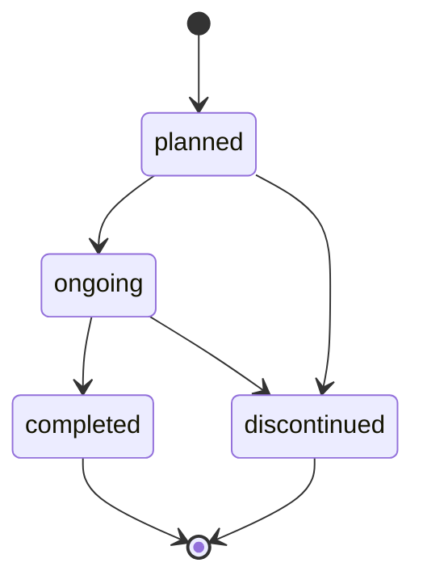

# Milestone 30 — Recovery Workflow

> Phase: M30  
> Status: ✅ FROZEN  
> Last Updated: 2026-06-23  
> Prerequisite: M29 Decision Workflow ✅  
> Approved: 2026-06-23 — All open questions resolved

---

## 1. Phase Name

**Recovery & Monitoring Workflow Activation**

---

## 2. Objectives

1. Activate recovery creation, update, and status transition in both backend and frontend.
2. Add `status-options` endpoint for recoveries (following M27/M28/M29 pattern).
3. Add audit logging for recovery CRUD and monitoring operations.
4. Add notification dispatch for recovery lifecycle events.
5. Activate frontend `RecoveryCreateAction`, `RecoveryUpdateAction`, and `RecoveryStatusAction` components.
6. Replace the existing `DisabledWorkflowAction` placeholder in RecoveriesSection.
7. Recovery completion does NOT auto-close cases (manual closure preserved).
8. Show soft UI warning if attempting to complete recovery before 3 months of monitoring (SOP advisory).

---

## 3. Business Workflow

Per the SOP (Tahap 7: Pemulihan dan Monitoring):

```
Decision (finalized)
  → Recovery Plan Created (planned)
    → Recovery Started (ongoing)
      → Monitoring Entries (3–6 months per SOP)
        → Recovery Completed / Discontinued
          → Case Closure (manual — Admin/Super Admin via CaseStatusAction)
```

> [!NOTE]
> **Frozen decision:** Recovery completion ≠ Case closure. Case closure remains a separate manual action by Admin/Super Admin through the existing `CaseStatusAction`.

### SOP Recovery Activities
- **Pendampingan psikologis** — Psychological accompaniment
- **Pendampingan hukum** — Legal accompaniment
- **Pendampingan akademik** — Academic accompaniment
- **Monitoring pasca kasus** — Post-case monitoring (SLA: 3–6 months)

### Recovery Type Master Data (existing)
Recovery types are already seeded via `recovery_types` master data table. No new migration needed.

### Recovery Status Flow (existing from M10)



- `planned` → `ongoing`, `discontinued`
- `ongoing` → `completed`, `discontinued`
- `completed` → terminal
- `discontinued` → terminal

---

## 4. Actors Involved

| Actor | Role Code | Recovery Permissions |
|---|---|---|
| Super Admin | `super_admin` | Create, update, transition status, add monitoring, view |
| Admin | `admin` | Create, update, transition status, add monitoring, view |
| Satgas PPKS (assigned) | `satgas_ppks` | View, add monitoring (only for assigned cases) |
| Reporter | `reporter` | No access |

> [!IMPORTANT]
> **Existing M10 policy** already grants recovery create/update/status authority to both `admin` AND `super_admin` with `cases.monitor` permission. Satgas can view + add monitoring only.
>
> This is different from M29 Decision where the latest product decision restricted mutation to Super Admin only. For M30, we follow the existing M10 backend policy unless overridden.

---

## 5. State/Status Transitions

### Recovery Statuses (existing)

| Status | Terminal? | Timestamp Set |
|---|---|---|
| `planned` | No | — |
| `ongoing` | No | `started_at` |
| `completed` | Yes | `completed_at` |
| `discontinued` | Yes | `discontinued_at` |

### Valid Transitions (from master data)

| From | Valid To |
|---|---|
| `planned` | `ongoing`, `discontinued` |
| `ongoing` | `completed`, `discontinued` |
| `completed` | (none — terminal) |
| `discontinued` | (none — terminal) |

### Monitoring Rules (existing)
- Monitoring entries can only be created when recovery is `ongoing`.
- Monitoring creation does NOT auto-advance recovery status.
- Monitoring is append-only (no update/delete).

---

## 6. Backend Scope (M30-A)

### 6.1 New Endpoint: `GET /api/v1/recoveries/{recovery}/status-options`

Following the M27/M28/M29 pattern:

```json
{
  "success": true,
  "data": {
    "current_status": { "code": "RS-02", "name": "ongoing" },
    "valid_transitions": [
      { "code": "RS-03", "name": "completed" },
      { "code": "RS-04", "name": "discontinued" }
    ]
  }
}
```

**Access policy:**
- Admin / Super Admin → current status + valid transitions
- Assigned Satgas → current status only (no transitions, Satgas cannot change recovery status)
- Reporter → 403

### 6.2 Audit Logging

Dispatch audit logs for recovery lifecycle events using existing `AuditAction` enum values:

| Event | AuditAction | Already Defined? |
|---|---|---|
| `recovery.created` | `RecoveryCreated` | ✅ Yes |
| `recovery.updated` | `RecoveryUpdated` | ✅ Yes |
| `recovery.status_changed` | `RecoveryStatusChanged` | ✅ Yes |
| `recovery.monitoring_created` | `RecoveryMonitoringCreated` | ✅ Yes |

**Audit payload rules:**
- Redact `recovery_plan`, `support_needs`, `notes` narrative fields
- Redact `condition_summary`, `follow_up_plan`, `notes` monitoring fields
- Include safe metadata: `recovery_id`, `status_code`, `recovery_type_code`, `decision_id`

### 6.3 Notifications

| Code | Event | Recipients | Body |
|---|---|---|---|
| `NOTIF-20` | `recovery_created` | Assigned Satgas | "A recovery plan has been created for an assigned case." |
| `NOTIF-21` | `recovery_status_changed` | Assigned Satgas | "A recovery for an assigned case has a status update." |

**Notification rules:**
- `NOTIF-20` dispatched on recovery creation → assigned Satgas only
- `NOTIF-21` dispatched on recovery status change → assigned Satgas only
- No notification for monitoring creation (low-noise per M17 principle)
- No notification for recovery content updates (low-noise)
- Metadata-only payloads (no narrative content)

### 6.4 Recovery Creation — Case Stage Validation

Currently, M10 blocks recovery creation if `case.status === closed` but does NOT enforce `case.status === recovery` or `case.status === decided`. The service only checks:
1. Decision is `finalized`
2. Case is not `closed`
3. Case is not soft-deleted

> [!NOTE]
> No additional case-stage validation is proposed for M30. The existing M10 rules are sufficient. Recovery creation is gated by having a `finalized` decision.

---

## 7. Frontend Scope (M30-B)

### 7.1 New Components

| Component | File | Purpose |
|---|---|---|
| `RecoveryCreateAction` | `recovery-create-action.tsx` | Create recovery for a finalized decision |
| `RecoveryStatusAction` | `recovery-status-action.tsx` | Transition recovery status using status-options |

### 7.2 Modified Components

| Component | File | Change |
|---|---|---|
| `RecoveriesSection` | `dashboard.cases.$id.tsx` | Replace `DisabledWorkflowAction` with active edit/status buttons |
| `workflow-action-dialogs.tsx` | (existing) | Already has `RecoveryMonitoringAction` — no changes needed |
| `operations-api.ts` | (existing) | Add `getRecoveryStatusOptions`, `createRecovery` |
| `operations-types.ts` | (existing) | Add `RecoveryCreatePayload`, `RecoveryStatusOptions`, `RecoveryStatusPayload` |

### 7.3 Permission Guards

| Action | Frontend Guard | Backend Guard |
|---|---|---|
| Create recovery | `canManageInstitutionalActions` (admin \|\| super_admin) | `RecoveryPolicy::create` (admin \|\| super_admin + `cases.monitor`) |
| Update recovery | `canManageInstitutionalActions` | `RecoveryPolicy::update` |
| Transition status | `canManageInstitutionalActions` | `RecoveryPolicy::updateStatus` |
| Add monitoring | `canAddRecoveryMonitoring` (admin \|\| super_admin \|\| assigned Satgas) | `RecoveryPolicy::createMonitoring` |

### 7.4 RecoveryCreateAction Preconditions

The "Create Recovery" button should be visible when:
1. `canManageInstitutionalActions` = true (admin or super_admin)
2. Case status is `recovery` or `decided` (case stage allows recovery)
3. At least one finalized decision exists
4. The decision doesn't already have a completed/discontinued recovery chain

### 7.5 RecoveriesSection Changes

Replace the existing `DisabledWorkflowAction` placeholder:

```diff
- <DisabledWorkflowAction
-   title="Recovery update/status"
-   description="Recovery edit and status actions remain deferred in M16..."
- />
+ {canUpdate && canEditRecovery(item) && <RecoveryUpdateAction recovery={item} />}
+ {canTransitionStatus && item.status !== "completed" && item.status !== "discontinued" && (
+   <RecoveryStatusAction recovery={item} caseId={caseId} />
+ )}
```

---

## 8. Database Changes

**No new migrations required.**

All tables are already created in M10:
- `recovery_statuses` ✅
- `recoveries` ✅
- `recovery_status_histories` ✅
- `recovery_monitorings` ✅

Notification type seed additions for `NOTIF-20` and `NOTIF-21` in `MasterDataSeeder`.

---

## 9. API Endpoints

### Existing (M10 — already implemented)

| Method | Endpoint | Purpose |
|---|---|---|
| `POST` | `/api/v1/decisions/{decision}/recoveries` | Create recovery |
| `GET` | `/api/v1/decisions/{decision}/recoveries` | List recoveries for decision |
| `GET` | `/api/v1/recoveries/{recovery}` | Get recovery detail |
| `PATCH` | `/api/v1/recoveries/{recovery}` | Update recovery content |
| `PATCH` | `/api/v1/recoveries/{recovery}/status` | Transition recovery status |
| `POST` | `/api/v1/recoveries/{recovery}/monitoring` | Create monitoring entry |
| `GET` | `/api/v1/recoveries/{recovery}/monitoring` | List monitoring entries |

### New (M30-A)

| Method | Endpoint | Purpose |
|---|---|---|
| `GET` | `/api/v1/recoveries/{recovery}/status-options` | Get current status + valid transitions |

---

## 10. Permissions Required

| Permission | Roles | Purpose |
|---|---|---|
| `cases.monitor` | `admin`, `super_admin`, `satgas_ppks` | Recovery view, create, update, status, monitoring |

**Existing RBAC (no changes):**
- Admin + `cases.monitor` → full recovery lifecycle management
- Super Admin + `cases.monitor` → full recovery lifecycle management
- Satgas + `cases.monitor` + active assignment → view + create monitoring only
- Reporter → no access (403)

---

## 11. Notifications

| Code | Event | Recipients | Payload Keys |
|---|---|---|---|
| `NOTIF-20` | `recovery_created` | Assigned Satgas | `notification_type_code`, `event`, `title`, `body`, `subject_type=recovery`, `subject_id`, `case_id`, `decision_id`, `recovery_id`, `status_code` |
| `NOTIF-21` | `recovery_status_changed` | Assigned Satgas | Same as above + `recovery_type_code` |

**Not notified (low-noise):**
- Recovery content updates
- Monitoring creation
- Recovery completed/discontinued (covered by status change notification)

---

## 12. Audit Requirements

| Event | AuditAction Enum | Redacted Fields |
|---|---|---|
| Recovery created | `recovery.created` | `recovery_plan`, `support_needs`, `notes` |
| Recovery updated | `recovery.updated` | `recovery_plan`, `support_needs`, `notes` |
| Recovery status changed | `recovery.status_changed` | None (status transitions are safe metadata) |
| Monitoring created | `recovery.monitoring_created` | `condition_summary`, `follow_up_plan`, `notes` |

**Safe metadata included in audit:**
- `recovery_id`, `decision_id`, `case_id` (derived)
- `status_code`, `recovery_type_code`
- `from_status_code`, `to_status_code` (for status changes)

---

## 13. Acceptance Criteria

### M30-A Backend

1. `GET /api/v1/recoveries/{recovery}/status-options` returns current status + valid transitions for Admin/Super Admin.
2. Status-options returns current status only (empty transitions) for assigned Satgas.
3. Status-options returns 403 for Reporter.
4. Audit logs dispatched for `recovery.created`, `recovery.updated`, `recovery.status_changed`, `recovery.monitoring_created`.
5. Audit logs redact narrative fields (`recovery_plan`, `support_needs`, `notes`, `condition_summary`, `follow_up_plan`).
6. `NOTIF-20` dispatched to assigned Satgas on recovery creation.
7. `NOTIF-21` dispatched to assigned Satgas on recovery status change.
8. Notification payloads are metadata-only (no narrative content).
9. Existing M10 tests still pass.
10. New tests cover status-options, audit, and notification behavior.
11. `php artisan test` PASS.

### M30-B Frontend

1. `RecoveryCreateAction` visible for Admin/Super Admin when finalized decision exists.
2. `RecoveryStatusAction` visible for Admin/Super Admin on non-terminal recoveries.
3. `RecoveryStatusAction` shows soft UI warning if recovery `started_at` is less than 3 months ago when user attempts to transition to `completed`.
4. `RecoveryUpdateAction` (existing in workflow-action-dialogs.tsx — if not already present, or existing edit in `DisabledWorkflowAction` replaced).
5. `RecoveryMonitoringAction` remains functional (existing).
6. `DisabledWorkflowAction` placeholder removed from RecoveriesSection.
7. Satgas sees read-only recovery + monitoring add (existing behavior preserved).
8. Reporter has no access.
9. `npm run build` PASS.

---

## 14. Risks

| Risk | Mitigation |
|---|---|
| Recovery completion accidentally closing case | M10 explicitly isolates recovery from case status. M30 preserves this. Case closure is a separate deliberate action. |
| Audit log leaking recovery narratives | Redaction service strips `recovery_plan`, `support_needs`, `notes`, `condition_summary`, `follow_up_plan`. |
| Notification noise from monitoring | No notification for monitoring creation per M17 low-noise principle. |
| Frontend RBAC drift between Admin/Super Admin | Frontend uses existing `canManageInstitutionalActions` (admin \|\| super_admin), matching M10 backend policy. |
| Orphaned recoveries if decision is un-finalized | Backend prevents un-finalizing decisions (terminal status). |

---

## 15. Resolved Questions

> [!NOTE]
> ### Q1: Case Closure Rules — ✅ RESOLVED → A) Manual Closure
> Recovery completion does **NOT** auto-close the case. Admin/Super Admin must explicitly close the case through the existing `CaseStatusAction`. **Recovery Completion ≠ Case Closure.**

> [!NOTE]
> ### Q2: Who Can Close a Case? — ✅ RESOLVED → C) Keep Existing
> Case closure remains through the existing `CaseStatusAction` by Admin/Super Admin. No changes to case closure logic in M30.

> [!NOTE]
> ### Q3: Monitoring Duration Enforcement — ✅ RESOLVED → B) Soft Warning
> Frontend shows a **soft UI warning** if user attempts to transition recovery to `completed` when `started_at` is less than 3 months ago. No backend enforcement. The warning is advisory only and does not block the action.

> [!NOTE]
> ### Q4: Recovery Create — Who Can Create? — ✅ RESOLVED → A) Admin + Super Admin
> Both Admin and Super Admin can create recoveries, matching the existing M10 backend policy. No restriction to Super Admin only.

> [!NOTE]
> ### Q5: Notification Recipients — ✅ RESOLVED → A) Assigned Satgas Only
> `NOTIF-20` (recovery created) and `NOTIF-21` (recovery status changed) are dispatched to assigned Satgas only. Consistent with M29 notification pattern.

---

## Proposed Phases

| Phase | Scope | Deliverables |
|---|---|---|
| **M30-A** | Backend | `status-options` endpoint, audit logging, notifications, tests |
| **M30-B** | Frontend | `RecoveryCreateAction`, `RecoveryStatusAction`, `RecoveriesSection` activation, build verification |

---

## Implementation Not Included

- Case closure automation (manual closure per Q1)
- Hard monitoring duration enforcement (soft warning only per Q3)
- Recovery reporting/analytics
- Recovery attachment/file upload
- Recovery notification to Reporter
- Flutter/mobile recovery UI
- WhatsApp recovery notifications

---

## Frozen Decision Summary

| Question | Decision | Impact |
|---|---|---|
| Q1 Case Closure | **A) Manual Closure** | Recovery completion ≠ case closure. No auto-close logic. |
| Q2 Who Closes Case | **C) Keep Existing** | Admin + Super Admin via CaseStatusAction. No M30 changes. |
| Q3 Monitoring Duration | **B) Soft Warning** | UI warning if recovery < 3 months. No backend block. |
| Q4 Recovery Create | **A) Admin + Super Admin** | Both roles can create. Matches M10 policy. |
| Q5 Notifications | **A) Assigned Satgas Only** | NOTIF-20/21 to assigned Satgas only. |

---

## REV-WF-03 R3 Executable Override

This section supersedes the legacy closure and ownership statements above where they conflict with current routes, policies, services, and tests.

- Same-campus Admin manages Recovery. Super Admin is read-only; it does not create, update, complete, or discontinue Recovery.
- Active assigned Satgas records Monitoring while the latest Recovery is `ongoing`. Admin and Super Admin see Monitoring read-only.
- Admin cannot complete Recovery until at least one Monitoring exists.
- Transition to `discontinued` requires an encrypted reason and is terminal.
- Recovery completion does not close a Case. Satgas first advances a completed Recovery Case to `monitoring`, then uses the dedicated closure action after the final summary is published.
- A discontinued Recovery Case closes directly from Case `recovery` through the same dedicated closure action after its compatible final summary is published; Monitoring is not required.
- Generic Case transition to `closed` is rejected. Super Admin and Admin do not own Case closure.
- Historical closed Cases without a final summary remain readable and are identified as `legacy_completion`; they are not reopened or backfilled.

R3 implementation is local repository state only until the normal migration, release, and deployment workflow is completed.
